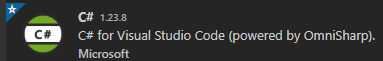
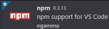

# FsInfoCat

Filesystem content information cataloging and analysis tool

Written for WGU Software Development Capstone – C868

## Links

- [C868 Google Site](https://sites.google.com/wgu.edu/soft-dev-capstone-site/home)
- [Project Page](https://github.com/lerwine/FsInfoCat/projects/1)
- [New Issue](https://github.com/lerwine/FsInfoCat/issues/new)
- Instructions and Documentation
  - [Task 1](https://github.com/lerwine/FsInfoCat/blob/main/WGU/Task1)
    - [C768 Google Support Site](https://sites.google.com/wgu.edu/c768-techcomm-version2/home)
  - [Task 2](https://github.com/lerwine/FsInfoCat/blob/main/WGU/Task2)
- References
  - [GDI+ Property Item Descriptions](https://docs.microsoft.com/en-us/windows/win32/gdiplus/-gdiplus-constant-property-item-descriptions)
  - [Configuration Manager Client WMI Programming](https://msdn.microsoft.com/en-us/library/cc144081.aspx)
  - [Routing to controller actions in ASP.NET Core](https://docs.microsoft.com/en-us/aspnet/core/mvc/controllers/routing?view=aspnetcore-5.0)
  - Gists
    - [Get volume information for desktop app](https://gist.github.com/lerwine/37745116cc8366f58b13f1713927a9bd)
    - [Struct objects which contain 64, 128, 256 and 384-bit hashes](https://gist.github.com/lerwine/b953694061acb834984dce238834c3f5)
  - Old Projects
    - [FS Dedunderator](https://github.com/lerwine/FsDedunderator)
    - [RIMSS - Raster Image Manipulation and Storage Service](https://github.com/lerwine/RIMSS)
    - [File Comparison Project](https://github.com/lerwine/FileDataView)
    - [Powershell-Modules](https://github.com/lerwine/PowerShell-Modules)
    - [DotNetProgrammersToolbox](https://github.com/lerwine/DotNetProgrammersToolbox)
    - [LErwineExample](https://github.com/lerwine/LErwineExamples)
    - [LTEControls](https://github.com/lerwine/LTEControls)
    - [WebConfigTool](https://github.com/lerwine/WebConfigTool)
    - [JsTypeCommander](https://github.com/lerwine/JsTypeCommander) - Validate, detect and convert JavaScript types and classes.
    - [JSCookbook](https://github.com/lerwine/JSCookbook)
    - [PsSolutionManager](https://github.com/lerwine/PsSolutionManager)
    - [Visual Studio Code Toolkit](https://github.com/lerwine/LTEToolkit)
    - [WGU Software 2 Project](https://github.com/lerwine/WguScheduler356334)

## Dev Environment Configuration

### Basic Setup

1. Download and run the [Visual Studio Code installer for Windows](https://go.microsoft.com/fwlink/?LinkID=534107).
   - [Reference Page](https://code.visualstudio.com/docs/setup/setup-overview)
2. Download and install [.NET Core 3.1 SDK](https://dotnet.microsoft.com/download)
   - If Visual Studio Code was running, you should restart it after intalling the .NET Core SDK.
   - [Reference Page](https://code.visualstudio.com/docs/languages/dotnet)
3. Open Visual Studio Code and Install C# Extension from Microsoft:
   1. Click on Extensions Listing button 
   2. Look for the C# extension and click 'Install' button if it is shown .
    - [Reference Page](https://marketplace.visualstudio.com/items?itemName=ms-dotnettools.csharp)
4. Restart Visual Studio Code.
5. Click on alert icon on the lower left .
   - If there are alerts for missing dependencies, click on the link to add missing dependencies.

### Optional Setup

1. Click on Extensions Listing button  and install recommended extensions.
2. Install Library Manager:
   1. Open Terminal (Ctrl+``)
   2. Run command `dotnet tool install -g Microsoft.Web.LibraryManager.Cli`.
3. Install NPM support for VS Code:
    - From Extensions Listing, Look for the npm extesion and click 'Install' button if it is shown .
    - [Reference Page](https://marketplace.visualstudio.com/items?itemName=eg2.vscode-npm-script)
4. Install TypeScript Compiler
   1. Open Terminal (Ctrl+``)
   2. Run command `npm install -g typescript`
5. Restart Visual Studio Code.

### Manage JavaScript Libraries

Restore All Libraries
: `libman restore`
Update Library to latest Version
: `libman update [library.name]`
