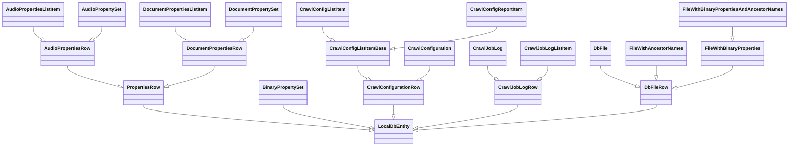

# Entity Models

## Inheritance Diagram

__________________________________________________________________________
References

- [Class Diagrams in Mermaid](https://mermaid.js.org/syntax/classDiagram.html)
- [Entity Diagrams in Mermaid](https://mermaid.js.org/syntax/entityRelationshipDiagram.html)
