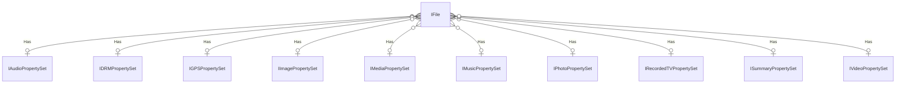
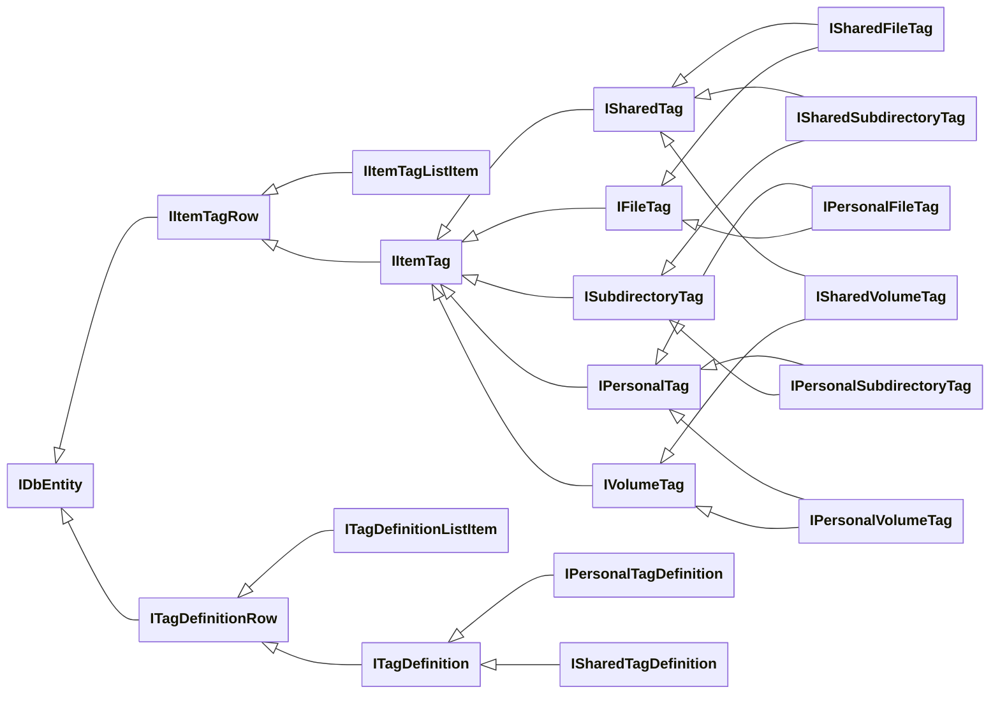
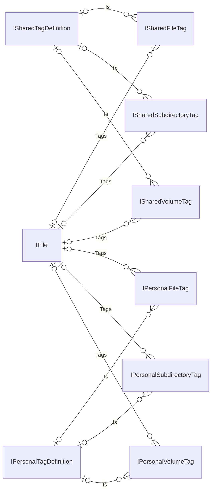
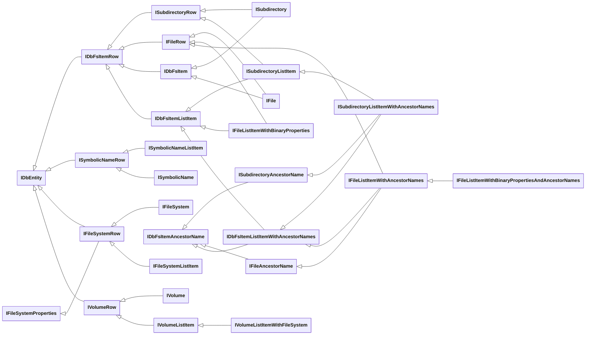
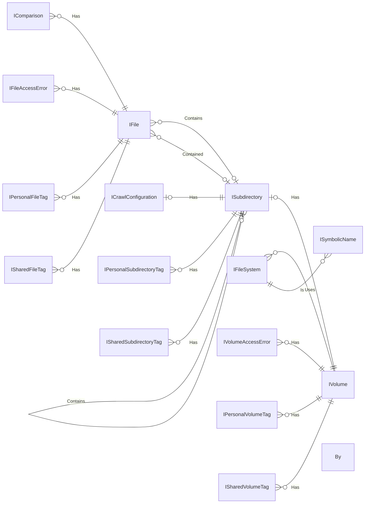
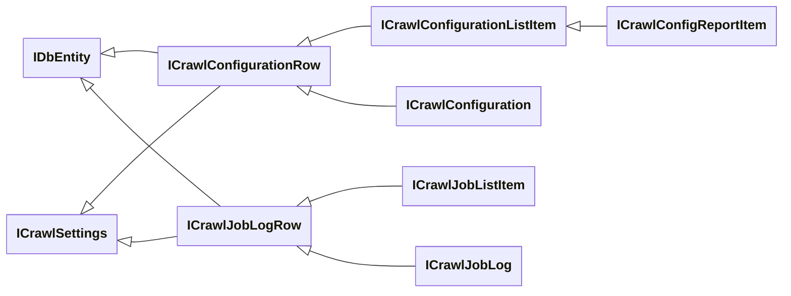
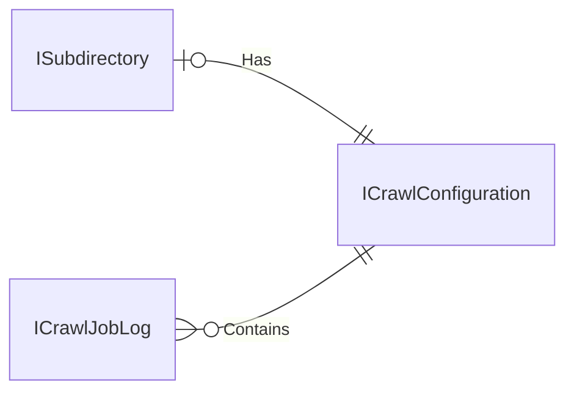
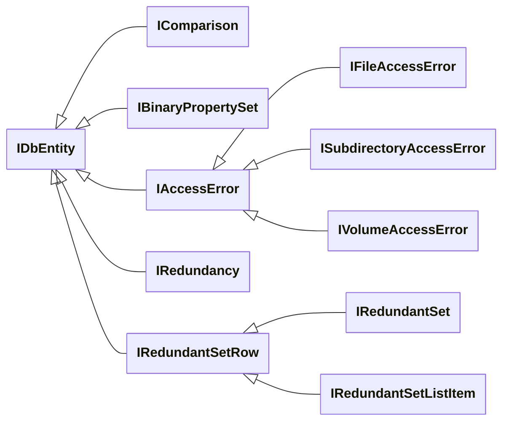
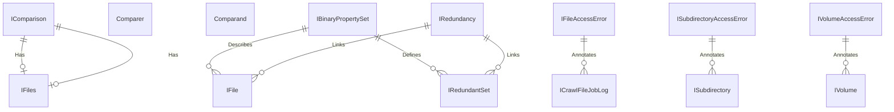

# Base Entity Interfaces

- [File Properties Interfaces](#file-properties-interfaces)
- [Tag Interfaces](#tag-interfaces)
- [File System Interfaces](#file-system-interfaces)
- [Crawl Interfaces](#crawl-interfaces)
- [Other Interfaces](#other-interfaces)

See Also:

- [Local Entity Interfaces](./Local/Entity-Interfaces.md)
- [Upstream Entity Interfaces](./Upstream/Entity-Interfaces.md)

## File Properties Interfaces

```mermaid
---
  config:
    class:
      hideEmptyMembersBox: true
---
classDiagram
  direction RL
    class IDbEntity

    class IPropertiesRow
    IPropertiesRow --|> IDbEntity

    class IPropertiesListItem
    IPropertiesListItem --|> IPropertiesRow

    class IPropertySet
    IPropertySet --|> IPropertiesRow

    class ISummaryProperties

    class ISummaryPropertiesRow
    ISummaryPropertiesRow --|> ISummaryProperties
    ISummaryPropertiesRow --|> IPropertiesRow

    class ISummaryPropertiesListItem
    ISummaryPropertiesListItem --|> IPropertiesListItem
    ISummaryPropertiesListItem --|> ISummaryPropertiesRow

    class ISummaryPropertySet
    ISummaryPropertySet --|> IPropertySet
    ISummaryPropertySet --|> ISummaryPropertiesRow

    class IAudioProperties

    class IAudioPropertiesRow
    IAudioPropertiesRow --|> IAudioProperties
    IAudioPropertiesRow --|> IPropertiesRow

    class IAudioPropertiesListItem
    IAudioPropertiesListItem --|> IPropertiesListItem
    IAudioPropertiesListItem --|> IAudioPropertiesRow

    class IAudioPropertySet
    IAudioPropertySet --|> IPropertySet
    IAudioPropertySet --|> IAudioPropertiesRow

    class IDocumentProperties

    class IDocumentPropertiesRow
    IDocumentPropertiesRow --|> IDocumentProperties
    IDocumentPropertiesRow --|> IPropertiesRow

    class IDocumentPropertiesListItem
    IDocumentPropertiesListItem --|> IPropertiesListItem
    IDocumentPropertiesListItem --|> IDocumentPropertiesRow

    class IDocumentPropertySet
    IDocumentPropertySet --|> IPropertySet
    IDocumentPropertySet --|> IDocumentPropertiesRow

    class IDRMProperties

    class IDRMPropertiesRow
    IDRMPropertiesRow --|> IDRMProperties
    IDRMPropertiesRow --|> IPropertiesRow

    class IDRMPropertiesListItem
    IDRMPropertiesListItem --|> IPropertiesListItem
    IDRMPropertiesListItem --|> IDRMPropertiesRow

    class IDRMPropertySet
    IDRMPropertySet --|> IPropertySet
    IDRMPropertySet --|> IDRMPropertiesRow

    class IGPSProperties

    class IGPSPropertiesRow
    IGPSPropertiesRow --|> IGPSProperties
    IGPSPropertiesRow --|> IPropertiesRow

    class IGPSPropertiesListItem
    IGPSPropertiesListItem --|> IPropertiesListItem
    IGPSPropertiesListItem --|> IGPSPropertiesRow

    class IGPSPropertySet
    IGPSPropertySet --|> IPropertySet
    IGPSPropertySet --|> IGPSPropertiesRow

    class IImageProperties

    class IImagePropertiesRow
    IImagePropertiesRow --|> IImageProperties
    IImagePropertiesRow --|> IPropertiesRow

    class IImagePropertiesListItem
    IImagePropertiesListItem --|> IPropertiesListItem
    IImagePropertiesListItem --|> IImagePropertiesRow

    class IImagePropertySet
    IImagePropertySet --|> IPropertySet
    IImagePropertySet --|> IImagePropertiesRow

    class IMediaProperties

    class IMediaPropertiesRow
    IMediaPropertiesRow --|> IMediaProperties
    IMediaPropertiesRow --|> IPropertiesRow

    class IMediaPropertiesListItem
    IMediaPropertiesListItem --|> IPropertiesListItem
    IMediaPropertiesListItem --|> IMediaPropertiesRow

    class IMediaPropertySet
    IMediaPropertySet --|> IPropertySet
    IMediaPropertySet --|> IMediaPropertiesRow

    class IMusicProperties

    class IMusicPropertiesRow
    IMusicPropertiesRow --|> IMusicProperties
    IMusicPropertiesRow --|> IPropertiesRow

    class IMusicPropertiesListItem
    IMusicPropertiesListItem --|> IPropertiesListItem
    IMusicPropertiesListItem --|> IMusicPropertiesRow

    class IMusicPropertySet
    IMusicPropertySet --|> IPropertySet
    IMusicPropertySet --|> IMusicPropertiesRow

    class IPhotoProperties

    class IPhotoPropertiesRow
    IPhotoPropertiesRow --|> IPhotoProperties
    IPhotoPropertiesRow --|> IPropertiesRow

    class IPhotoPropertiesListItem
    IPhotoPropertiesListItem --|> IPropertiesListItem
    IPhotoPropertiesListItem --|> IPhotoPropertiesRow

    class IPhotoPropertySet
    IPhotoPropertySet --|> IPropertySet
    IPhotoPropertySet --|> IPhotoPropertiesRow

    class IRecordedTVProperties

    class IRecordedTVPropertiesRow
    IRecordedTVPropertiesRow --|> IRecordedTVProperties
    IRecordedTVPropertiesRow --|> IPropertiesRow

    class IRecordedTVPropertiesListItem
    IRecordedTVPropertiesListItem --|> IPropertiesListItem
    IRecordedTVPropertiesListItem --|> IRecordedTVPropertiesRow

    class IRecordedTVPropertySet
    IRecordedTVPropertySet --|> IPropertySet
    IRecordedTVPropertySet --|> IRecordedTVPropertiesRow

    class IVideoProperties

    class IVideoPropertiesRow
    IVideoPropertiesRow --|> IVideoProperties
    IVideoPropertiesRow --|> IPropertiesRow

    class IVideoPropertiesListItem
    IVideoPropertiesListItem --|> IPropertiesListItem
    IVideoPropertiesListItem --|> IVideoPropertiesRow

    class IVideoPropertySet
    IVideoPropertySet --|> IPropertySet
    IVideoPropertySet --|> IVideoPropertiesRow
```

| Base Interface                                          | Row Interface                                                 | List Item Interface                                                     | Record Interface                                          |
| ------------------------------------------------------- | ------------------------------------------------------------- | ----------------------------------------------------------------------- | --------------------------------------------------------- |
| [IDbEntity](Model/IDbEntity.cs)                         | [IPropertiesRow](Model/IPropertiesRow.cs)                     | [IPropertiesListItem](Model/IPropertiesListItem.cs)                     | [IPropertySet](Model/IPropertySet.cs)                     |
| [ISummaryProperties](Model/ISummaryProperties.cs)       | [ISummaryPropertiesRow](Model/ISummaryPropertiesRow.cs)       | [ISummaryPropertiesListItem](Model/ISummaryPropertiesListItem.cs)       | [ISummaryPropertySet](Model/ISummaryPropertySet.cs)       |
| [IAudioProperties](Model/IAudioProperties.cs)           | [IAudioPropertiesRow](Model/IAudioPropertiesRow.cs)           | [IAudioPropertiesListItem](Model/IAudioPropertiesListItem.cs)           | [IAudioPropertySet](Model/IAudioPropertySet.cs)           |
| [IDRMProperties](Model/IDRMProperties.cs)               | [IDRMPropertiesRow](Model/IDRMPropertiesRow.cs)               | [IDRMPropertiesListItem](Model/IDRMPropertiesListItem.cs)               | [IDRMPropertySet](Model/IDRMPropertySet.cs)               |
| [IGPSProperties](Model/IGPSProperties.cs)               | [IGPSPropertiesRow](Model/IGPSPropertiesRow.cs)               | [IGPSPropertiesListItem](Model/IGPSPropertiesListItem.cs)               | [IGPSPropertySet](Model/IGPSPropertySet.cs)               |
| [IImageProperties](Model/IImageProperties.cs)           | [IImagePropertiesRow](Model/IImagePropertiesRow.cs)           | [IImagePropertiesListItem](Model/IImagePropertiesListItem.cs)           | [IImagePropertySet](Model/IImagePropertySet.cs)           |
| [IMediaProperties](Model/IMediaProperties.cs)           | [IMediaPropertiesRow](Model/IMediaPropertiesRow.cs)           | [IMediaPropertiesListItem](Model/IMediaPropertiesListItem.cs)           | [IMediaPropertySet](Model/IMediaPropertySet.cs)           |
| [IMusicProperties](Model/IMusicProperties.cs)           | [IMusicPropertiesRow](Model/IMusicPropertiesRow.cs)           | [IMusicPropertiesListItem](Model/IMusicPropertiesListItem.cs)           | [IMusicPropertySet](Model/IMusicPropertySet.cs)           |
| [IPhotoProperties](Model/IPhotoProperties.cs)           | [IPhotoPropertiesRow](Model/IPhotoPropertiesRow.cs)           | [IPhotoPropertiesListItem](Model/IPhotoPropertiesListItem.cs)           | [IPhotoPropertySet](Model/IPhotoPropertySet.cs)           |
| [IRecordedTVProperties](Model/IRecordedTVProperties.cs) | [IRecordedTVPropertiesRow](Model/IRecordedTVPropertiesRow.cs) | [IRecordedTVPropertiesListItem](Model/IRecordedTVPropertiesListItem.cs) | [IRecordedTVPropertySet](Model/IRecordedTVPropertySet.cs) |
| [IVideoProperties](Model/IVideoProperties.cs)           | [IVideoPropertiesRow](Model/IVideoPropertiesRow.cs)           | [IVideoPropertiesListItem](Model/IVideoPropertiesListItem.cs)           | [IVideoPropertySet](Model/IVideoPropertySet.cs)           |

- **[IPropertiesRow](Model/IPropertiesRow.cs)** : [IDbEntity](Model/IDbEntity.cs), [IHasSimpleIdentifier](Model/IHasSimpleIdentifier.cs)
  - **[IPropertiesListItem](Model/IPropertiesListItem.cs)**
  - **[IPropertySet](Model/IPropertySet.cs)**
- **[ISummaryProperties](Model/ISummaryProperties.cs)**
  - **[ISummaryPropertiesRow](Model/ISummaryPropertiesRow.cs)** : [IPropertiesRow](Model/IPropertiesRow.cs)
    - **[ISummaryPropertiesListItem](Model/ISummaryPropertiesListItem.cs)** : [IPropertiesListItem](Model/IPropertiesListItem.cs)
    - **[ISummaryPropertySet](Model/ISummaryPropertySet.cs)** : [IPropertySet](Model/IPropertySet.cs)
- **[IAudioProperties](Model/IAudioProperties.cs)**
  - **[IAudioPropertiesRow](Model/IAudioPropertiesRow.cs)** : [IPropertiesRow](Model/IPropertiesRow.cs)
    - **[IAudioPropertiesListItem](Model/IAudioPropertiesListItem.cs)** : [IPropertiesListItem](Model/IPropertiesListItem.cs)
    - **[IAudioPropertySet](Model/IAudioPropertySet.cs)** : [IPropertySet](Model/IPropertySet.cs)
- **[IDRMProperties](Model/IDRMProperties.cs)**
  - **[IDRMPropertiesRow](Model/IDRMPropertiesRow.cs)** : [IPropertiesRow](Model/IPropertiesRow.cs)
    - **[IDRMPropertiesListItem](Model/IDRMPropertiesListItem.cs)** : [IPropertiesListItem](Model/IPropertiesListItem.cs)
    - **[IDRMPropertySet](Model/IDRMPropertySet.cs)** : [IPropertySet](Model/IPropertySet.cs)
- **[IGPSProperties](Model/IGPSProperties.cs)**
  - **[IGPSPropertiesRow](Model/IGPSPropertiesRow.cs)** : [IPropertiesRow](Model/IPropertiesRow.cs)
    - **[IGPSPropertiesListItem](Model/IGPSPropertiesListItem.cs)** : [IPropertiesListItem](Model/IPropertiesListItem.cs)
    - **[IGPSPropertySet](Model/IGPSPropertySet.cs)** : [IPropertySet](Model/IPropertySet.cs)
- **[IImageProperties](Model/IImageProperties.cs)**
  - **[IImagePropertiesRow](Model/IImagePropertiesRow.cs)** : [IPropertiesRow](Model/IPropertiesRow.cs)
    - **[IImagePropertiesListItem](Model/IImagePropertiesListItem.cs)** : [IPropertiesListItem](Model/IPropertiesListItem.cs)
    - **[IImagePropertySet](Model/IImagePropertySet.cs)** : [IPropertySet](Model/IPropertySet.cs)
- **[IMediaProperties](Model/IMediaProperties.cs)**
  - **[IMediaPropertiesRow](Model/IMediaPropertiesRow.cs)** : [IPropertiesRow](Model/IPropertiesRow.cs)
    - **[IMediaPropertiesListItem](Model/IMediaPropertiesListItem.cs)** : [IPropertiesListItem](Model/IPropertiesListItem.cs)
    - **[IMediaPropertySet](Model/IMediaPropertySet.cs)** : [IPropertySet](Model/IPropertySet.cs)
- **[IMusicProperties](Model/IMusicProperties.cs)**
  - **[IMusicPropertiesRow](Model/IMusicPropertiesRow.cs)** : [IPropertiesRow](Model/IPropertiesRow.cs)
    - **[IMusicPropertiesListItem](Model/IMusicPropertiesListItem.cs)** : [IPropertiesListItem](Model/IPropertiesListItem.cs)
    - **[IMusicPropertySet](Model/IMusicPropertySet.cs)** : [IPropertySet](Model/IPropertySet.cs)
- **[IPhotoProperties](Model/IPhotoProperties.cs)**
  - **[IPhotoPropertiesRow](Model/IPhotoPropertiesRow.cs)** : [IPropertiesRow](Model/IPropertiesRow.cs)
    - **[IPhotoPropertiesListItem](Model/IPhotoPropertiesListItem.cs)** : [IPropertiesListItem](Model/IPropertiesListItem.cs)
    - **[IPhotoPropertySet](Model/IPhotoPropertySet.cs)** : [IPropertySet](Model/IPropertySet.cs)
- **[IRecordedTVProperties](Model/IRecordedTVProperties.cs)**
  - **[IRecordedTVPropertiesRow](Model/IRecordedTVPropertiesRow.cs)** : [IPropertiesRow](Model/IPropertiesRow.cs)
    - **[IRecordedTVPropertiesListItem](Model/IRecordedTVPropertiesListItem.cs)** : [IPropertiesListItem](Model/IPropertiesListItem.cs)
    - **[IRecordedTVPropertySet](Model/IRecordedTVPropertySet.cs)** : [IPropertySet](Model/IPropertySet.cs)
- **[IVideoProperties](Model/IVideoProperties.cs)**
  - **[IVideoPropertiesRow](Model/IVideoPropertiesRow.cs)** : [IPropertiesRow](Model/IPropertiesRow.cs)
    - **[IVideoPropertiesListItem](Model/IVideoPropertiesListItem.cs)** : [IPropertiesListItem](Model/IPropertiesListItem.cs)
    - **[IVideoPropertySet](Model/IVideoPropertySet.cs)** : [IPropertySet](Model/IPropertySet.cs)

## Tag Interfaces

| Row Interface                                   | List Item Interface                                       | Base Record Interface                     | Shared Record Interface                               | Personal Record Interface                                 |
| ----------------------------------------------- | --------------------------------------------------------- | ----------------------------------------- | ----------------------------------------------------- | --------------------------------------------------------- |
| [ITagDefinitionRow](Model/ITagDefinitionRow.cs) | [ITagDefinitionListItem](Model/ITagDefinitionListItem.cs) | [ITagDefinition](Model/ITagDefinition.cs) | [ISharedTagDefinition](Model/ISharedTagDefinition.cs) | [IPersonalTagDefinition](Model/IPersonalTagDefinition.cs) |
| [IItemTagRow](Model/IItemTagRow.cs)             | [IItemTagListItem](Model/IItemTagListItem.cs)             | [IItemTag](Model/IItemTag.cs)             | [ISharedTag](Model/ISharedTag.cs)                     | [IPersonalTag](Model/IPersonalTag.cs)                     |
| [IFileTag](Model/IFileTag.cs)                   |                                                           |                                           | [ISharedFileTag](Model/ISharedFileTag.cs)             |                                                           |

| Base Interface                                | Shared Tag Interface                                      | Personal Tag Interface                                        |
| --------------------------------------------- | --------------------------------------------------------- | ------------------------------------------------------------- |
| [IItemTag](Model/IItemTag.cs)                 | [ISharedTag](Model/ISharedTag.cs)                         | [IPersonalTag](Model/IPersonalTag.cs)                         |
| [IFileTag](Model/IFileTag.cs)                 | [ISharedFileTag](Model/ISharedFileTag.cs)                 | [IPersonalFileTag](Model/IPersonalFileTag.cs)                 |
| [ISubdirectoryTag](Model/ISubdirectoryTag.cs) | [ISharedSubdirectoryTag](Model/ISharedSubdirectoryTag.cs) | [IPersonalSubdirectoryTag](Model/IPersonalSubdirectoryTag.cs) |
| [IVolumeTag](Model/IVolumeTag.cs)             | [ISharedVolumeTag](Model/ISharedVolumeTag.cs)             | [IPersonalVolumeTag](Model/IPersonalVolumeTag.cs)             |

- **[IItemTagRow](Model/IItemTagRow.cs)** : [IDbEntity](Model/IDbEntity.cs), [IHasIdentifierPair](Model/IHasIdentifierPair.cs)
  - **[IItemTagListItem](Model/IItemTagListItem.cs)**
  - **[IItemTag](Model/IItemTag.cs)**
    - **[ISharedTag](Model/ISharedTag.cs)**
      - **[ISharedFileTag](Model/ISharedFileTag.cs)** : [IFileTag](Model/IFileTag.cs), [IHasMembershipKeyReference](Model/IHasMembershipKeyReference.cs)
      - **[ISharedSubdirectoryTag](Model/ISharedSubdirectoryTag.cs)** : [ISubdirectoryTag](Model/ISubdirectoryTag.cs), [IHasMembershipKeyReference](Model/IHasMembershipKeyReference.cs)
      - **[ISharedVolumeTag](Model/ISharedVolumeTag.cs)** : [IVolumeTag](Model/IVolumeTag.cs), [IHasMembershipKeyReference](Model/IHasMembershipKeyReference.cs)
    - **[IPersonalTag](Model/IPersonalTag.cs)**
      - **[IPersonalFileTag](Model/IPersonalFileTag.cs)** : [IFileTag](Model/IFileTag.cs), [IHasMembershipKeyReference](Model/IHasMembershipKeyReference.cs)
      - **[IPersonalSubdirectoryTag](Model/IPersonalSubdirectoryTag.cs)** : [ISubdirectoryTag](Model/ISubdirectoryTag.cs), [IHasMembershipKeyReference](Model/IHasMembershipKeyReference.cs)
      - **[IPersonalVolumeTag](Model/IPersonalVolumeTag.cs)** : [IVolumeTag](Model/IVolumeTag.cs), [IHasMembershipKeyReference](Model/IHasMembershipKeyReference.cs)
    - **[IFileTag](Model/IFileTag.cs)**
    - **[ISubdirectoryTag](Model/ISubdirectoryTag.cs)**
    - **[IVolumeTag](Model/IVolumeTag.cs)**
- **[ITagDefinitionRow](Model/ITagDefinitionRow.cs)** : [IDbEntity](Model/IDbEntity.cs), [IHasSimpleIdentifier](Model/IHasSimpleIdentifier.cs)
  - **[ITagDefinitionListItem](Model/ITagDefinitionListItem.cs)**
  - **[ITagDefinition](Model/ITagDefinition.cs)**
    - **[IPersonalTagDefinition](Model/IPersonalTagDefinition.cs)**
    - **[ISharedTagDefinition](Model/ISharedTagDefinition.cs)**

## File System Interfaces

| Base Interface                                          | Row Interface                                 | List Item Interface(s)                                                                                               | Record Interface                        |
| ------------------------------------------------------- | --------------------------------------------- | -------------------------------------------------------------------------------------------------------------------- | --------------------------------------- |
| [IFileSystemProperties](Model/IFileSystemProperties.cs) | [IFileSystemRow](Model/IFileSystemRow.cs)     | [IFileSystemListItem](Model/IFileSystemListItem.cs)                                                                  | [IFileSystem](Model/IFileSystem.cs)     |
|                                                         | [ISymbolicNameRow](Model/ISymbolicNameRow.cs) | [ISymbolicNameListItem](Model/ISymbolicNameListItem.cs)                                                              | [ISymbolicName](Model/ISymbolicName.cs) |
|                                                         | [IVolumeRow](Model/IVolumeRow.cs)             | [IVolumeListItem](Model/IVolumeListItem.cs), [IVolumeListItemWithFileSystem](Model/IVolumeListItemWithFileSystem.cs) | [IVolume](Model/IVolume.cs)             |

| Row Interface                                 | List Item Interface(s)                                                                                                                                                                                                                                                      | Record Interface                        |
| --------------------------------------------- | --------------------------------------------------------------------------------------------------------------------------------------------------------------------------------------------------------------------------------------------------------------------------- | --------------------------------------- |
| [IDbFsItemRow](Model/IDbFsItemRow.cs)         | [IDbFsItemListItem](Model/IDbFsItemListItem.cs)                                                                                                                                                                                                                             | [IDbFsItem](Model/IDbFsItem.cs)         |
| [IFileRow](Model/IFileRow.cs)                 | [IFileListItemWithAncestorNames](Model/IFileListItemWithAncestorNames.cs), [IFileListItemWithBinaryProperties](Model/IFileListItemWithBinaryProperties.cs), [IFileListItemWithBinaryPropertiesAndAncestorNames](Model/IFileListItemWithBinaryPropertiesAndAncestorNames.cs) | [IFile](Model/IFile.cs)                 |
| [ISubdirectoryRow](Model/ISubdirectoryRow.cs) | [ISubdirectoryListItem](Model/ISubdirectoryListItem.cs), [ISubdirectoryListItemWithAncestorNames](Model/ISubdirectoryListItemWithAncestorNames.cs)                                                                                                                          | [ISubdirectory](Model/ISubdirectory.cs) |

| Row / Base Interface                                    | File Interface                                                                  | Subdirectory Interface                                                                    |
| ------------------------------------------------------- | ------------------------------------------------------------------------------- | ----------------------------------------------------------------------------------------- |
| [IDbFsItemRow](Model/IDbFsItemRow.cs)                   | [IFileRow](Model/IFileRow.cs)                                                   | [ISubdirectoryRow](Model/ISubdirectoryRow.cs)                                             |
| [IDbFsItemListItem](Model/IDbFsItemListItem.cs)         | [IFileListItemWithBinaryProperties](Model/IFileListItemWithBinaryProperties.cs) | [ISubdirectoryListItem](Model/ISubdirectoryListItem.cs)                                   |
| [IDbFsItemAncestorName](Model/IDbFsItemAncestorName.cs) | [IFileListItemWithAncestorNames](Model/IFileListItemWithAncestorNames.cs)       | [ISubdirectoryListItemWithAncestorNames](Model/ISubdirectoryListItemWithAncestorNames.cs) |
| [IDbFsItem](Model/IDbFsItem.cs)                         | [IFile](Model/IFile.cs)                                                         | [ISubdirectory](Model/ISubdirectory.cs)                                                   |

- **[IVolumeRow](Model/IVolumeRow.cs)** : [IDbEntity](Model/IDbEntity.cs), [IHasSimpleIdentifier](Model/IHasSimpleIdentifier.cs)
  - **[IVolumeListItem](Model/IVolumeListItem.cs)**
    - **[IVolumeListItemWithFileSystem](Model/IVolumeListItemWithFileSystem.cs)**
  - **[IVolume](Model/IVolume.cs)**
- **[IFileSystemProperties](Model/IFileSystemProperties.cs)**
  - **[IFileSystemRow](Model/IFileSystemRow.cs)** : [IDbEntity](Model/IDbEntity.cs), [IHasSimpleIdentifier](Model/IHasSimpleIdentifier.cs)
    - **[IFileSystemListItem](Model/IFileSystemListItem.cs)**
  - **[IFileSystem](Model/IFileSystem.cs)**
- **[ISymbolicNameRow](Model/ISymbolicNameRow.cs)** : [IDbEntity](Model/IDbEntity.cs), [IHasSimpleIdentifier](Model/IHasSimpleIdentifier.cs)
  - **[ISymbolicNameListItem](Model/ISymbolicNameListItem.cs)**
  - **[ISymbolicName](Model/ISymbolicName.cs)**
- **[IDbFsItemAncestorName](Model/IDbFsItemAncestorName.cs)** : [IHasSimpleIdentifier](Model/IHasSimpleIdentifier.cs)
  - **[IFileAncestorName](Model/IFileAncestorName.cs)**
  - **[ISubdirectoryAncestorName](Model/ISubdirectoryAncestorName.cs)**
- **[IDbFsItemRow](Model/IDbFsItemRow.cs)** : [IDbEntity](Model/IDbEntity.cs), [IHasSimpleIdentifier](Model/IHasSimpleIdentifier.cs)
  - **[IDbFsItemListItem](Model/IDbFsItemListItem.cs)**
    - **[IDbFsItemListItemWithAncestorNames](Model/IDbFsItemListItemWithAncestorNames.cs)** : [IDbFsItemAncestorName](Model/IDbFsItemAncestorName.cs)
  - **[IDbFsItem](Model/IDbFsItem.cs)**
  - **[IFileRow](Model/IFileRow.cs)**
    - **[IFileListItemWithAncestorNames](Model/IFileListItemWithAncestorNames.cs)** : [IDbFsItemListItemWithAncestorNames](Model/IDbFsItemListItemWithAncestorNames.cs), [IFileAncestorName](Model/IFileAncestorName.cs)
      - **[IFileListItemWithBinaryPropertiesAndAncestorNames](Model/IFileListItemWithBinaryPropertiesAndAncestorNames.cs)**
    - **[IFileListItemWithBinaryProperties](Model/IFileListItemWithBinaryProperties.cs)** : [IDbFsItemListItem](Model/IDbFsItemListItem.cs)
    - **[IFile](Model/IFile.cs) : [IDbFsItem](Model/IDbFsItem.cs)**
  - **[ISubdirectoryRow](Model/ISubdirectoryRow.cs)**
    - **[ISubdirectoryListItem](Model/ISubdirectoryListItem.cs)** : [IDbFsItemListItem](Model/IDbFsItemListItem.cs)
      - **[ISubdirectoryListItemWithAncestorNames](Model/ISubdirectoryListItemWithAncestorNames.cs)** : [IDbFsItemListItemWithAncestorNames](Model/IDbFsItemListItemWithAncestorNames.cs), [ISubdirectoryAncestorName](Model/ISubdirectoryAncestorName.cs)
    - **[ISubdirectory](Model/ISubdirectory.cs)** : [IDbFsItem](Model/IDbFsItem.cs)

## Crawl Interfaces

| Base Interface                            | Row Interface                                             | List Item Interface(s)                                              | Record Interface                                    |
| ----------------------------------------- | --------------------------------------------------------- | ------------------------------------------------------------------- | --------------------------------------------------- |
| [ICrawlSettings](Model/ICrawlSettings.cs) | [ICrawlConfigurationRow](Model/ICrawlConfigurationRow.cs) | [ICrawlConfigurationListItem](Model/ICrawlConfigurationListItem.cs) | [ICrawlConfiguration](Model/ICrawlConfiguration.cs) |
| [ICrawlSettings](Model/ICrawlSettings.cs) | [ICrawlJobLogRow](Model/ICrawlJobLogRow.cs)               | [ICrawlJobListItem](Model/ICrawlJobListItem.cs)                     | [ICrawlJobLog](Model/ICrawlJobLog.cs)               |

- **[ICrawlSettings](Model/ICrawlSettings.cs)**
  - **[ICrawlConfigurationRow](Model/ICrawlConfigurationRow.cs)** : [IDbEntity](Model/IDbEntity.cs), [IHasSimpleIdentifier](Model/IHasSimpleIdentifier.cs)
    - **[ICrawlConfigurationListItem](Model/ICrawlConfigurationListItem.cs)**
      - **[ICrawlConfigReportItem](Model/ICrawlConfigReportItem.cs)**
    - **[ICrawlConfiguration](Model/ICrawlConfiguration.cs)**
  - **[ICrawlJobLogRow](Model/ICrawlJobLogRow.cs)** : [IDbEntity](Model/IDbEntity.cs), [IHasSimpleIdentifier](Model/IHasSimpleIdentifier.cs)
    - **[ICrawlJobListItem](Model/ICrawlJobListItem.cs)**
    - **[ICrawlJobLog](Model/ICrawlJobLog.cs)**

## Other Interfaces

- **[IDbEntity](Model/IDbEntity.cs)**
  - **[IComparison](Model/IComparison.cs)** : [IHasMembershipKeyReference](Model/IHasMembershipKeyReference.cs)
  - **[IBinaryPropertySet](Model/IBinaryPropertySet.cs)** : [IHasSimpleIdentifier](Model/IHasSimpleIdentifier.cs)
  - **[IAccessError](Model/IAccessError.cs)** : [IHasSimpleIdentifier](Model/IHasSimpleIdentifier.cs)
    - **[IFileAccessError](Model/IFileAccessError.cs)**
    - **[ISubdirectoryAccessError](Model/ISubdirectoryAccessError.cs)**
    - **[IVolumeAccessError](Model/IVolumeAccessError.cs)**
  - **[IRedundancy](Model/IRedundancy.cs)** : [IHasMembershipKeyReference](Model/IHasMembershipKeyReference.cs)
  - **[IRedundantSetRow](Model/IRedundantSetRow.cs)** : [IHasSimpleIdentifier](Model/IHasSimpleIdentifier.cs)
    - **[IRedundantSetListItem](Model/IRedundantSetListItem.cs)**
    - **[IRedundantSet](Model/IRedundantSet.cs)**
- **[IHasCompoundIdentifier](Model/IHasCompoundIdentifier.cs)**
  - **[IHasIdentifierPair](Model/IHasIdentifierPair.cs)**
    - **[IHasMembershipKeyReference](Model/IHasMembershipKeyReference.cs)**
