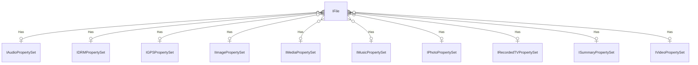
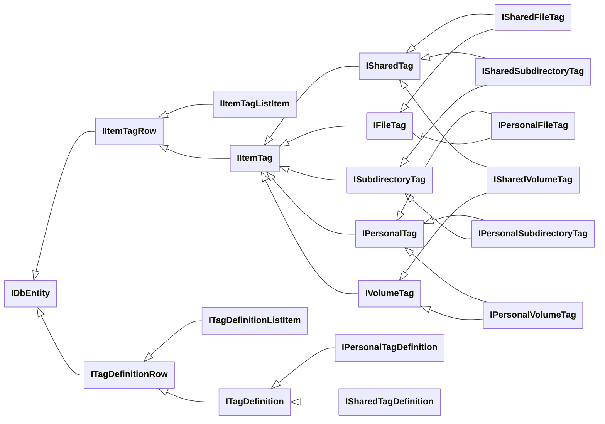
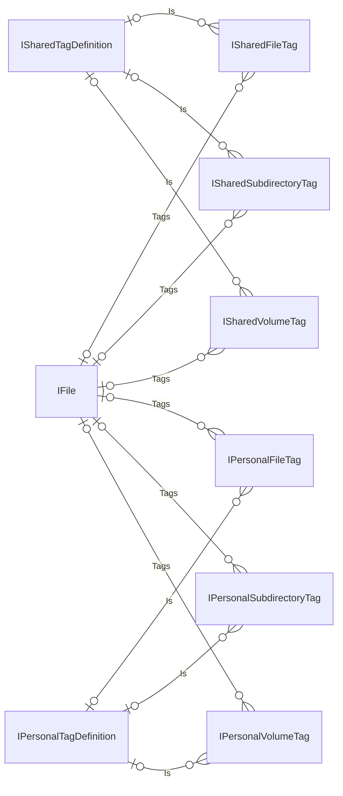
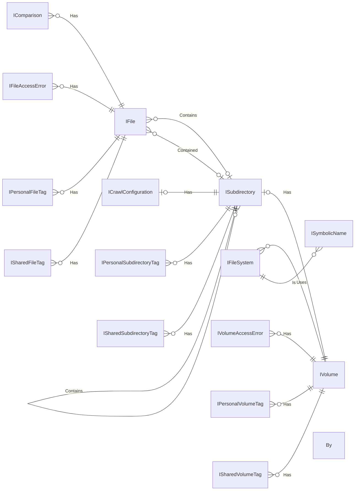
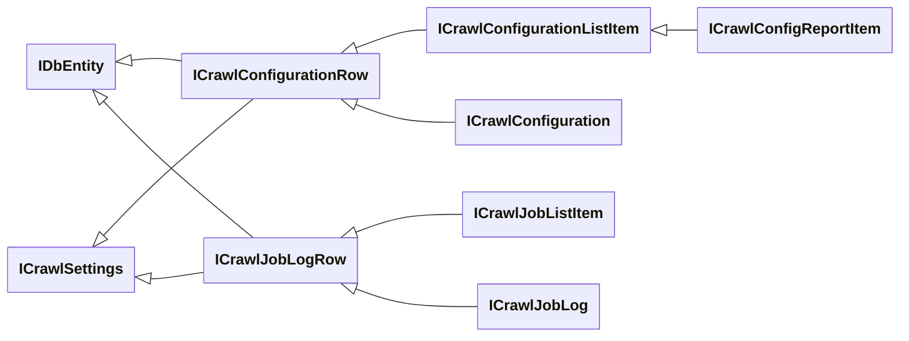
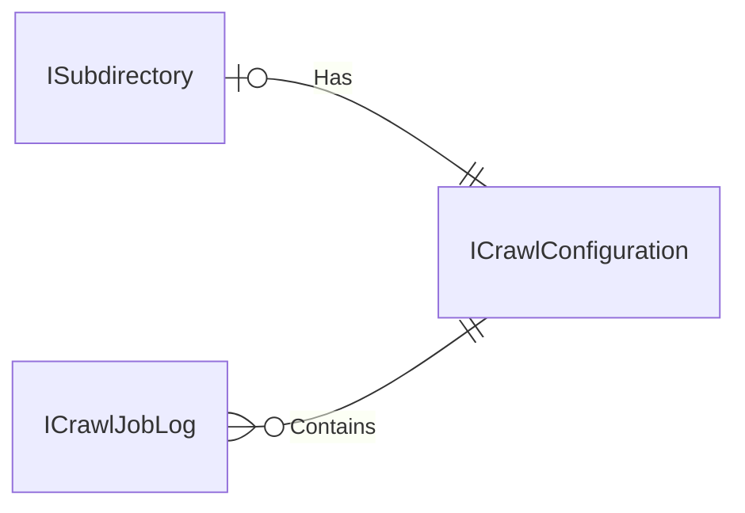
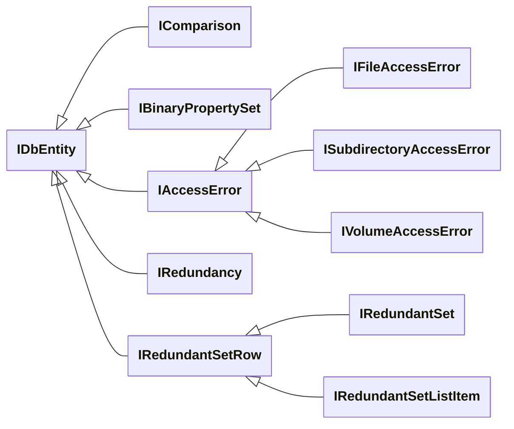
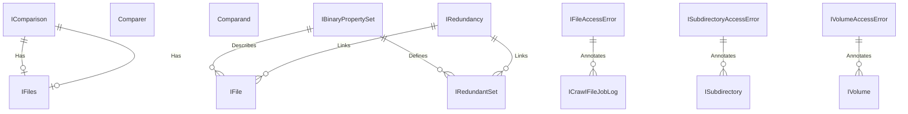

# Base Entity Interfaces

________

[Home](../../README.md)

________

- [File Properties Interfaces](#file-properties-interfaces)
- [Tag Interfaces](#tag-interfaces)
- [File System Interfaces](#file-system-interfaces)
- [Crawl Interfaces](#crawl-interfaces)
- [Other Interfaces](#other-interfaces)
- [Interface Model Equivalents](#interface-model-equivalents)

See Also:

- [Local Entity Interfaces](./Local/Entity-Interfaces.md)
- [Upstream Entity Interfaces](./Upstream/Entity-Interfaces.md)

## File Properties Interfaces

```mermaid
---
  config:
    class:
      hideEmptyMembersBox: true
---
classDiagram
  direction RL
    class IDbEntity

    class IPropertiesRow
    IPropertiesRow --|> IDbEntity

    class IPropertiesListItem
    IPropertiesListItem --|> IPropertiesRow

    class IPropertySet
    IPropertySet --|> IPropertiesRow

    class ISummaryProperties

    class ISummaryPropertiesRow
    ISummaryPropertiesRow --|> ISummaryProperties
    ISummaryPropertiesRow --|> IPropertiesRow

    class ISummaryPropertiesListItem
    ISummaryPropertiesListItem --|> IPropertiesListItem
    ISummaryPropertiesListItem --|> ISummaryPropertiesRow

    class ISummaryPropertySet
    ISummaryPropertySet --|> IPropertySet
    ISummaryPropertySet --|> ISummaryPropertiesRow

    class IAudioProperties

    class IAudioPropertiesRow
    IAudioPropertiesRow --|> IAudioProperties
    IAudioPropertiesRow --|> IPropertiesRow

    class IAudioPropertiesListItem
    IAudioPropertiesListItem --|> IPropertiesListItem
    IAudioPropertiesListItem --|> IAudioPropertiesRow

    class IAudioPropertySet
    IAudioPropertySet --|> IPropertySet
    IAudioPropertySet --|> IAudioPropertiesRow

    class IDocumentProperties

    class IDocumentPropertiesRow
    IDocumentPropertiesRow --|> IDocumentProperties
    IDocumentPropertiesRow --|> IPropertiesRow

    class IDocumentPropertiesListItem
    IDocumentPropertiesListItem --|> IPropertiesListItem
    IDocumentPropertiesListItem --|> IDocumentPropertiesRow

    class IDocumentPropertySet
    IDocumentPropertySet --|> IPropertySet
    IDocumentPropertySet --|> IDocumentPropertiesRow

    class IDRMProperties

    class IDRMPropertiesRow
    IDRMPropertiesRow --|> IDRMProperties
    IDRMPropertiesRow --|> IPropertiesRow

    class IDRMPropertiesListItem
    IDRMPropertiesListItem --|> IPropertiesListItem
    IDRMPropertiesListItem --|> IDRMPropertiesRow

    class IDRMPropertySet
    IDRMPropertySet --|> IPropertySet
    IDRMPropertySet --|> IDRMPropertiesRow

    class IGPSProperties

    class IGPSPropertiesRow
    IGPSPropertiesRow --|> IGPSProperties
    IGPSPropertiesRow --|> IPropertiesRow

    class IGPSPropertiesListItem
    IGPSPropertiesListItem --|> IPropertiesListItem
    IGPSPropertiesListItem --|> IGPSPropertiesRow

    class IGPSPropertySet
    IGPSPropertySet --|> IPropertySet
    IGPSPropertySet --|> IGPSPropertiesRow

    class IImageProperties

    class IImagePropertiesRow
    IImagePropertiesRow --|> IImageProperties
    IImagePropertiesRow --|> IPropertiesRow

    class IImagePropertiesListItem
    IImagePropertiesListItem --|> IPropertiesListItem
    IImagePropertiesListItem --|> IImagePropertiesRow

    class IImagePropertySet
    IImagePropertySet --|> IPropertySet
    IImagePropertySet --|> IImagePropertiesRow

    class IMediaProperties

    class IMediaPropertiesRow
    IMediaPropertiesRow --|> IMediaProperties
    IMediaPropertiesRow --|> IPropertiesRow

    class IMediaPropertiesListItem
    IMediaPropertiesListItem --|> IPropertiesListItem
    IMediaPropertiesListItem --|> IMediaPropertiesRow

    class IMediaPropertySet
    IMediaPropertySet --|> IPropertySet
    IMediaPropertySet --|> IMediaPropertiesRow

    class IMusicProperties

    class IMusicPropertiesRow
    IMusicPropertiesRow --|> IMusicProperties
    IMusicPropertiesRow --|> IPropertiesRow

    class IMusicPropertiesListItem
    IMusicPropertiesListItem --|> IPropertiesListItem
    IMusicPropertiesListItem --|> IMusicPropertiesRow

    class IMusicPropertySet
    IMusicPropertySet --|> IPropertySet
    IMusicPropertySet --|> IMusicPropertiesRow

    class IPhotoProperties

    class IPhotoPropertiesRow
    IPhotoPropertiesRow --|> IPhotoProperties
    IPhotoPropertiesRow --|> IPropertiesRow

    class IPhotoPropertiesListItem
    IPhotoPropertiesListItem --|> IPropertiesListItem
    IPhotoPropertiesListItem --|> IPhotoPropertiesRow

    class IPhotoPropertySet
    IPhotoPropertySet --|> IPropertySet
    IPhotoPropertySet --|> IPhotoPropertiesRow

    class IRecordedTVProperties

    class IRecordedTVPropertiesRow
    IRecordedTVPropertiesRow --|> IRecordedTVProperties
    IRecordedTVPropertiesRow --|> IPropertiesRow

    class IRecordedTVPropertiesListItem
    IRecordedTVPropertiesListItem --|> IPropertiesListItem
    IRecordedTVPropertiesListItem --|> IRecordedTVPropertiesRow

    class IRecordedTVPropertySet
    IRecordedTVPropertySet --|> IPropertySet
    IRecordedTVPropertySet --|> IRecordedTVPropertiesRow

    class IVideoProperties

    class IVideoPropertiesRow
    IVideoPropertiesRow --|> IVideoProperties
    IVideoPropertiesRow --|> IPropertiesRow

    class IVideoPropertiesListItem
    IVideoPropertiesListItem --|> IPropertiesListItem
    IVideoPropertiesListItem --|> IVideoPropertiesRow

    class IVideoPropertySet
    IVideoPropertySet --|> IPropertySet
    IVideoPropertySet --|> IVideoPropertiesRow
```

```mermaid
---
  config:
    class:
      hideEmptyMembersBox: true
---
erDiagram
    IFile }o--o| IAudioPropertySet : Has
    IFile }o--o| IDRMPropertySet : Has
    IFile }o--o| IGPSPropertySet : Has
    IFile }o--o| IImagePropertySet : Has
    IFile }o--o| IMediaPropertySet : Has
    IFile }o--o| IMusicPropertySet : Has
    IFile }o--o| IPhotoPropertySet : Has
    IFile }o--o| IRecordedTVPropertySet : Has
    IFile }o--o| ISummaryPropertySet : Has
    IFile }o--o| IVideoPropertySet : Has
```

| Base Interface                                          | Row Interface                                                 | List Item Interface                                                     | Record Interface                                          |
| ------------------------------------------------------- | ------------------------------------------------------------- | ----------------------------------------------------------------------- | --------------------------------------------------------- |
| [IDbEntity](Model/IDbEntity.cs)                         | [IPropertiesRow](Model/IPropertiesRow.cs)                     | [IPropertiesListItem](Model/IPropertiesListItem.cs)                     | [IPropertySet](Model/IPropertySet.cs)                     |
| [ISummaryProperties](Model/ISummaryProperties.cs)       | [ISummaryPropertiesRow](Model/ISummaryPropertiesRow.cs)       | [ISummaryPropertiesListItem](Model/ISummaryPropertiesListItem.cs)       | [ISummaryPropertySet](Model/ISummaryPropertySet.cs)       |
| [IAudioProperties](Model/IAudioProperties.cs)           | [IAudioPropertiesRow](Model/IAudioPropertiesRow.cs)           | [IAudioPropertiesListItem](Model/IAudioPropertiesListItem.cs)           | [IAudioPropertySet](Model/IAudioPropertySet.cs)           |
| [IDRMProperties](Model/IDRMProperties.cs)               | [IDRMPropertiesRow](Model/IDRMPropertiesRow.cs)               | [IDRMPropertiesListItem](Model/IDRMPropertiesListItem.cs)               | [IDRMPropertySet](Model/IDRMPropertySet.cs)               |
| [IGPSProperties](Model/IGPSProperties.cs)               | [IGPSPropertiesRow](Model/IGPSPropertiesRow.cs)               | [IGPSPropertiesListItem](Model/IGPSPropertiesListItem.cs)               | [IGPSPropertySet](Model/IGPSPropertySet.cs)               |
| [IImageProperties](Model/IImageProperties.cs)           | [IImagePropertiesRow](Model/IImagePropertiesRow.cs)           | [IImagePropertiesListItem](Model/IImagePropertiesListItem.cs)           | [IImagePropertySet](Model/IImagePropertySet.cs)           |
| [IMediaProperties](Model/IMediaProperties.cs)           | [IMediaPropertiesRow](Model/IMediaPropertiesRow.cs)           | [IMediaPropertiesListItem](Model/IMediaPropertiesListItem.cs)           | [IMediaPropertySet](Model/IMediaPropertySet.cs)           |
| [IMusicProperties](Model/IMusicProperties.cs)           | [IMusicPropertiesRow](Model/IMusicPropertiesRow.cs)           | [IMusicPropertiesListItem](Model/IMusicPropertiesListItem.cs)           | [IMusicPropertySet](Model/IMusicPropertySet.cs)           |
| [IPhotoProperties](Model/IPhotoProperties.cs)           | [IPhotoPropertiesRow](Model/IPhotoPropertiesRow.cs)           | [IPhotoPropertiesListItem](Model/IPhotoPropertiesListItem.cs)           | [IPhotoPropertySet](Model/IPhotoPropertySet.cs)           |
| [IRecordedTVProperties](Model/IRecordedTVProperties.cs) | [IRecordedTVPropertiesRow](Model/IRecordedTVPropertiesRow.cs) | [IRecordedTVPropertiesListItem](Model/IRecordedTVPropertiesListItem.cs) | [IRecordedTVPropertySet](Model/IRecordedTVPropertySet.cs) |
| [IVideoProperties](Model/IVideoProperties.cs)           | [IVideoPropertiesRow](Model/IVideoPropertiesRow.cs)           | [IVideoPropertiesListItem](Model/IVideoPropertiesListItem.cs)           | [IVideoPropertySet](Model/IVideoPropertySet.cs)           |

- **[IPropertiesRow](Model/IPropertiesRow.cs)** : [IDbEntity](Model/IDbEntity.cs), [IHasSimpleIdentifier](Model/IHasSimpleIdentifier.cs)
  - **[IPropertiesListItem](Model/IPropertiesListItem.cs)**
  - **[IPropertySet](Model/IPropertySet.cs)**
- **[ISummaryProperties](Model/ISummaryProperties.cs)**
  - **[ISummaryPropertiesRow](Model/ISummaryPropertiesRow.cs)** : [IPropertiesRow](Model/IPropertiesRow.cs)
    - **[ISummaryPropertiesListItem](Model/ISummaryPropertiesListItem.cs)** : [IPropertiesListItem](Model/IPropertiesListItem.cs)
    - **[ISummaryPropertySet](Model/ISummaryPropertySet.cs)** : [IPropertySet](Model/IPropertySet.cs)
- **[IAudioProperties](Model/IAudioProperties.cs)**
  - **[IAudioPropertiesRow](Model/IAudioPropertiesRow.cs)** : [IPropertiesRow](Model/IPropertiesRow.cs)
    - **[IAudioPropertiesListItem](Model/IAudioPropertiesListItem.cs)** : [IPropertiesListItem](Model/IPropertiesListItem.cs)
    - **[IAudioPropertySet](Model/IAudioPropertySet.cs)** : [IPropertySet](Model/IPropertySet.cs)
- **[IDRMProperties](Model/IDRMProperties.cs)**
  - **[IDRMPropertiesRow](Model/IDRMPropertiesRow.cs)** : [IPropertiesRow](Model/IPropertiesRow.cs)
    - **[IDRMPropertiesListItem](Model/IDRMPropertiesListItem.cs)** : [IPropertiesListItem](Model/IPropertiesListItem.cs)
    - **[IDRMPropertySet](Model/IDRMPropertySet.cs)** : [IPropertySet](Model/IPropertySet.cs)
- **[IGPSProperties](Model/IGPSProperties.cs)**
  - **[IGPSPropertiesRow](Model/IGPSPropertiesRow.cs)** : [IPropertiesRow](Model/IPropertiesRow.cs)
    - **[IGPSPropertiesListItem](Model/IGPSPropertiesListItem.cs)** : [IPropertiesListItem](Model/IPropertiesListItem.cs)
    - **[IGPSPropertySet](Model/IGPSPropertySet.cs)** : [IPropertySet](Model/IPropertySet.cs)
- **[IImageProperties](Model/IImageProperties.cs)**
  - **[IImagePropertiesRow](Model/IImagePropertiesRow.cs)** : [IPropertiesRow](Model/IPropertiesRow.cs)
    - **[IImagePropertiesListItem](Model/IImagePropertiesListItem.cs)** : [IPropertiesListItem](Model/IPropertiesListItem.cs)
    - **[IImagePropertySet](Model/IImagePropertySet.cs)** : [IPropertySet](Model/IPropertySet.cs)
- **[IMediaProperties](Model/IMediaProperties.cs)**
  - **[IMediaPropertiesRow](Model/IMediaPropertiesRow.cs)** : [IPropertiesRow](Model/IPropertiesRow.cs)
    - **[IMediaPropertiesListItem](Model/IMediaPropertiesListItem.cs)** : [IPropertiesListItem](Model/IPropertiesListItem.cs)
    - **[IMediaPropertySet](Model/IMediaPropertySet.cs)** : [IPropertySet](Model/IPropertySet.cs)
- **[IMusicProperties](Model/IMusicProperties.cs)**
  - **[IMusicPropertiesRow](Model/IMusicPropertiesRow.cs)** : [IPropertiesRow](Model/IPropertiesRow.cs)
    - **[IMusicPropertiesListItem](Model/IMusicPropertiesListItem.cs)** : [IPropertiesListItem](Model/IPropertiesListItem.cs)
    - **[IMusicPropertySet](Model/IMusicPropertySet.cs)** : [IPropertySet](Model/IPropertySet.cs)
- **[IPhotoProperties](Model/IPhotoProperties.cs)**
  - **[IPhotoPropertiesRow](Model/IPhotoPropertiesRow.cs)** : [IPropertiesRow](Model/IPropertiesRow.cs)
    - **[IPhotoPropertiesListItem](Model/IPhotoPropertiesListItem.cs)** : [IPropertiesListItem](Model/IPropertiesListItem.cs)
    - **[IPhotoPropertySet](Model/IPhotoPropertySet.cs)** : [IPropertySet](Model/IPropertySet.cs)
- **[IRecordedTVProperties](Model/IRecordedTVProperties.cs)**
  - **[IRecordedTVPropertiesRow](Model/IRecordedTVPropertiesRow.cs)** : [IPropertiesRow](Model/IPropertiesRow.cs)
    - **[IRecordedTVPropertiesListItem](Model/IRecordedTVPropertiesListItem.cs)** : [IPropertiesListItem](Model/IPropertiesListItem.cs)
    - **[IRecordedTVPropertySet](Model/IRecordedTVPropertySet.cs)** : [IPropertySet](Model/IPropertySet.cs)
- **[IVideoProperties](Model/IVideoProperties.cs)**
  - **[IVideoPropertiesRow](Model/IVideoPropertiesRow.cs)** : [IPropertiesRow](Model/IPropertiesRow.cs)
    - **[IVideoPropertiesListItem](Model/IVideoPropertiesListItem.cs)** : [IPropertiesListItem](Model/IPropertiesListItem.cs)
    - **[IVideoPropertySet](Model/IVideoPropertySet.cs)** : [IPropertySet](Model/IPropertySet.cs)

## Tag Interfaces

```mermaid
---
  config:
    class:
      hideEmptyMembersBox: true
---
classDiagram
  direction RL
    class IDbEntity

    class IItemTagRow
    IItemTagRow --|> IDbEntity

    class IItemTagListItem
    IItemTagListItem --|> IItemTagRow

    class IItemTag
    IItemTag --|> IItemTagRow

    class ISharedTag
    ISharedTag --|> IItemTag

    class IPersonalTag
    IPersonalTag --|> IItemTag

    class IFileTag
    IFileTag --|> IItemTag

    class ISubdirectoryTag
    ISubdirectoryTag --|> IItemTag

    class IVolumeTag
    IVolumeTag --|> IItemTag

    class ISharedFileTag
    ISharedFileTag --|> ISharedTag
    ISharedFileTag --|> IFileTag

    class ISharedSubdirectoryTag
    ISharedSubdirectoryTag --|> ISharedTag
    ISharedSubdirectoryTag --|> ISubdirectoryTag

    class ISharedVolumeTag
    ISharedVolumeTag --|> ISharedTag
    ISharedVolumeTag --|> IVolumeTag

    class IPersonalFileTag
    IPersonalFileTag --|> IPersonalTag
    IPersonalFileTag --|> IFileTag

    class IPersonalSubdirectoryTag
    IPersonalSubdirectoryTag --|> IPersonalTag
    IPersonalSubdirectoryTag --|> ISubdirectoryTag

    class IPersonalVolumeTag
    IPersonalVolumeTag --|> IPersonalTag
    IPersonalVolumeTag --|> IVolumeTag

    class ITagDefinitionRow
    ITagDefinitionRow --|> IDbEntity

    class ITagDefinitionListItem
    ITagDefinitionListItem --|> ITagDefinitionRow

    class ITagDefinition
    ITagDefinition --|> ITagDefinitionRow

    class IPersonalTagDefinition
    IPersonalTagDefinition --|> ITagDefinition

    class ISharedTagDefinition
    ISharedTagDefinition --|> ITagDefinition
```

```mermaid
---
  config:
    class:
      hideEmptyMembersBox: true
---
erDiagram
  direction RL
    ISharedFileTag }o--o| IFile : Tags
    ISharedFileTag }o--o| ISharedTagDefinition : Is
    
    ISharedSubdirectoryTag }o--o| IFile : Tags
    ISharedSubdirectoryTag }o--o| ISharedTagDefinition : Is
    
    ISharedVolumeTag }o--o| IFile : Tags
    ISharedVolumeTag }o--o| ISharedTagDefinition : Is
    
    IPersonalFileTag }o--o| IFile : Tags
    IPersonalFileTag }o--o| IPersonalTagDefinition : Is
    
    IPersonalSubdirectoryTag }o--o| IFile : Tags
    IPersonalSubdirectoryTag }o--o| IPersonalTagDefinition : Is
    
    IPersonalVolumeTag }o--o| IFile : Tags
    IPersonalVolumeTag }o--o| IPersonalTagDefinition : Is
```

| Row Interface                                   | List Item Interface                                       | Base Record Interface                     | Shared Record Interface                               | Personal Record Interface                                 |
| ----------------------------------------------- | --------------------------------------------------------- | ----------------------------------------- | ----------------------------------------------------- | --------------------------------------------------------- |
| [ITagDefinitionRow](Model/ITagDefinitionRow.cs) | [ITagDefinitionListItem](Model/ITagDefinitionListItem.cs) | [ITagDefinition](Model/ITagDefinition.cs) | [ISharedTagDefinition](Model/ISharedTagDefinition.cs) | [IPersonalTagDefinition](Model/IPersonalTagDefinition.cs) |
| [IItemTagRow](Model/IItemTagRow.cs)             | [IItemTagListItem](Model/IItemTagListItem.cs)             | [IItemTag](Model/IItemTag.cs)             | [ISharedTag](Model/ISharedTag.cs)                     | [IPersonalTag](Model/IPersonalTag.cs)                     |
| [IFileTag](Model/IFileTag.cs)                   |                                                           |                                           | [ISharedFileTag](Model/ISharedFileTag.cs)             |                                                           |

| Base Interface                                | Shared Tag Interface                                      | Personal Tag Interface                                        |
| --------------------------------------------- | --------------------------------------------------------- | ------------------------------------------------------------- |
| [IItemTag](Model/IItemTag.cs)                 | [ISharedTag](Model/ISharedTag.cs)                         | [IPersonalTag](Model/IPersonalTag.cs)                         |
| [IFileTag](Model/IFileTag.cs)                 | [ISharedFileTag](Model/ISharedFileTag.cs)                 | [IPersonalFileTag](Model/IPersonalFileTag.cs)                 |
| [ISubdirectoryTag](Model/ISubdirectoryTag.cs) | [ISharedSubdirectoryTag](Model/ISharedSubdirectoryTag.cs) | [IPersonalSubdirectoryTag](Model/IPersonalSubdirectoryTag.cs) |
| [IVolumeTag](Model/IVolumeTag.cs)             | [ISharedVolumeTag](Model/ISharedVolumeTag.cs)             | [IPersonalVolumeTag](Model/IPersonalVolumeTag.cs)             |

- **[IItemTagRow](Model/IItemTagRow.cs)** : [IDbEntity](Model/IDbEntity.cs), [IHasIdentifierPair](Model/IHasIdentifierPair.cs)
  - **[IItemTagListItem](Model/IItemTagListItem.cs)**
  - **[IItemTag](Model/IItemTag.cs)**
    - **[ISharedTag](Model/ISharedTag.cs)**
      - **[ISharedFileTag](Model/ISharedFileTag.cs)** : [IFileTag](Model/IFileTag.cs), [IHasMembershipKeyReference](Model/IHasMembershipKeyReference.cs)
      - **[ISharedSubdirectoryTag](Model/ISharedSubdirectoryTag.cs)** : [ISubdirectoryTag](Model/ISubdirectoryTag.cs), [IHasMembershipKeyReference](Model/IHasMembershipKeyReference.cs)
      - **[ISharedVolumeTag](Model/ISharedVolumeTag.cs)** : [IVolumeTag](Model/IVolumeTag.cs), [IHasMembershipKeyReference](Model/IHasMembershipKeyReference.cs)
    - **[IPersonalTag](Model/IPersonalTag.cs)**
      - **[IPersonalFileTag](Model/IPersonalFileTag.cs)** : [IFileTag](Model/IFileTag.cs), [IHasMembershipKeyReference](Model/IHasMembershipKeyReference.cs)
      - **[IPersonalSubdirectoryTag](Model/IPersonalSubdirectoryTag.cs)** : [ISubdirectoryTag](Model/ISubdirectoryTag.cs), [IHasMembershipKeyReference](Model/IHasMembershipKeyReference.cs)
      - **[IPersonalVolumeTag](Model/IPersonalVolumeTag.cs)** : [IVolumeTag](Model/IVolumeTag.cs), [IHasMembershipKeyReference](Model/IHasMembershipKeyReference.cs)
    - **[IFileTag](Model/IFileTag.cs)**
    - **[ISubdirectoryTag](Model/ISubdirectoryTag.cs)**
    - **[IVolumeTag](Model/IVolumeTag.cs)**
- **[ITagDefinitionRow](Model/ITagDefinitionRow.cs)** : [IDbEntity](Model/IDbEntity.cs), [IHasSimpleIdentifier](Model/IHasSimpleIdentifier.cs)
  - **[ITagDefinitionListItem](Model/ITagDefinitionListItem.cs)**
  - **[ITagDefinition](Model/ITagDefinition.cs)**
    - **[IPersonalTagDefinition](Model/IPersonalTagDefinition.cs)**
    - **[ISharedTagDefinition](Model/ISharedTagDefinition.cs)**

## File System Interfaces

```mermaid
---
  config:
    class:
      hideEmptyMembersBox: true
---
classDiagram
  direction RL
    class IDbEntity

    class IVolumeRow
    IVolumeRow --|> IDbEntity

    class IVolumeListItem
    IVolumeListItem --|> IVolumeRow

    class IVolumeListItemWithFileSystem
    IVolumeListItemWithFileSystem --|> IVolumeListItem

    class IVolume
    IVolume --|> IVolumeRow

    class IFileSystemProperties

    class IFileSystemRow
    IFileSystemRow --|> IDbEntity
    IFileSystemRow --|> IFileSystemProperties

    class IFileSystemListItem
    IFileSystemListItem --|> IFileSystemRow

    class IFileSystem
    IFileSystem --|> IFileSystemRow

    class ISymbolicNameRow
    ISymbolicNameRow --|> IDbEntity

    class ISymbolicName
    ISymbolicName --|> ISymbolicNameRow

    class ISymbolicNameListItem
    ISymbolicNameListItem --|> ISymbolicNameRow

    class IDbFsItemRow
    IDbFsItemRow --|> IDbEntity

    class IDbFsItemListItem
    IDbFsItemListItem --|> IDbFsItemRow

    class IDbFsItemAncestorName

    class IDbFsItemListItemWithAncestorNames
    IDbFsItemListItemWithAncestorNames --|> IDbFsItemAncestorName
    IDbFsItemListItemWithAncestorNames --|> IDbFsItemListItem

    class IDbFsItem
    IDbFsItem --|> IDbFsItemRow

    class IFileRow
    IFileRow --|> IDbFsItemRow

    class IFileAncestorName
    IFileAncestorName --|> IDbFsItemAncestorName

    class IFileListItemWithAncestorNames
    IFileListItemWithAncestorNames --|> IDbFsItemListItemWithAncestorNames
    IFileListItemWithAncestorNames --|> IFileRow
    IFileListItemWithAncestorNames --|> IFileAncestorName

    class IFileListItemWithBinaryProperties
    IFileListItemWithBinaryProperties --|> IDbFsItemListItem
    IFileListItemWithBinaryProperties --|> IFileRow

    class IFileListItemWithBinaryPropertiesAndAncestorNames
    IFileListItemWithBinaryPropertiesAndAncestorNames --|> IFileListItemWithAncestorNames

    class IFile
    IFile --|> IDbFsItem
    IFile --|> IFileRow

    class ISubdirectoryRow
    ISubdirectoryRow --|> IDbFsItemRow

    class ISubdirectoryAncestorName
    ISubdirectoryAncestorName --|> IDbFsItemAncestorName

    class ISubdirectoryListItem
    ISubdirectoryListItem --|> IDbFsItemListItem
    ISubdirectoryListItem --|> ISubdirectoryRow

    class ISubdirectoryListItemWithAncestorNames
    ISubdirectoryListItemWithAncestorNames --|> ISubdirectoryAncestorName
    ISubdirectoryListItemWithAncestorNames --|> ISubdirectoryListItem
    ISubdirectoryListItemWithAncestorNames --|> IDbFsItemListItemWithAncestorNames

    class ISubdirectory
    ISubdirectory --|> IDbFsItem
    ISubdirectory --|> ISubdirectoryRow
```

```mermaid
---
  config:
    class:
      hideEmptyMembersBox: true
---
erDiagram
  direction RL
    IVolume ||--o| ISubdirectory : Has
    IVolume ||--o{ IFileSystem : Uses
    IVolume ||--o{ IVolumeAccessError : Has
    IVolume ||--o{ IPersonalVolumeTag : Has
    IVolume ||--o{ ISharedVolumeTag : Has
    ISymbolicName }o--|| IFileSystem : Is
    IFile ||--o{ IComparison : Has
    IFile ||--o{ IFileAccessError : Has
    IFile ||--o{ IPersonalFileTag : Has
    IFile ||--o{ ISharedFileTag : Has
    IFile }o--o| ISubdirectory : Contained By
    ISubdirectory |o--o{ IFile : Contains
    ISubdirectory |o--o{ ISubdirectory : Contains
    ISubdirectory ||--o| ICrawlConfiguration : Has
    ISubdirectory ||--o{ IPersonalSubdirectoryTag : Has
    ISubdirectory ||--o{ ISharedSubdirectoryTag : Has
```

| Base Interface                                          | Row Interface                                 | List Item Interface(s)                                                                                               | Record Interface                        |
| ------------------------------------------------------- | --------------------------------------------- | -------------------------------------------------------------------------------------------------------------------- | --------------------------------------- |
| [IFileSystemProperties](Model/IFileSystemProperties.cs) | [IFileSystemRow](Model/IFileSystemRow.cs)     | [IFileSystemListItem](Model/IFileSystemListItem.cs)                                                                  | [IFileSystem](Model/IFileSystem.cs)     |
|                                                         | [ISymbolicNameRow](Model/ISymbolicNameRow.cs) | [ISymbolicNameListItem](Model/ISymbolicNameListItem.cs)                                                              | [ISymbolicName](Model/ISymbolicName.cs) |
|                                                         | [IVolumeRow](Model/IVolumeRow.cs)             | [IVolumeListItem](Model/IVolumeListItem.cs), [IVolumeListItemWithFileSystem](Model/IVolumeListItemWithFileSystem.cs) | [IVolume](Model/IVolume.cs)             |

| Row Interface                                 | List Item Interface(s)                                                                                                                                                                                                                                                      | Record Interface                        |
| --------------------------------------------- | --------------------------------------------------------------------------------------------------------------------------------------------------------------------------------------------------------------------------------------------------------------------------- | --------------------------------------- |
| [IDbFsItemRow](Model/IDbFsItemRow.cs)         | [IDbFsItemListItem](Model/IDbFsItemListItem.cs)                                                                                                                                                                                                                             | [IDbFsItem](Model/IDbFsItem.cs)         |
| [IFileRow](Model/IFileRow.cs)                 | [IFileListItemWithAncestorNames](Model/IFileListItemWithAncestorNames.cs), [IFileListItemWithBinaryProperties](Model/IFileListItemWithBinaryProperties.cs), [IFileListItemWithBinaryPropertiesAndAncestorNames](Model/IFileListItemWithBinaryPropertiesAndAncestorNames.cs) | [IFile](Model/IFile.cs)                 |
| [ISubdirectoryRow](Model/ISubdirectoryRow.cs) | [ISubdirectoryListItem](Model/ISubdirectoryListItem.cs), [ISubdirectoryListItemWithAncestorNames](Model/ISubdirectoryListItemWithAncestorNames.cs)                                                                                                                          | [ISubdirectory](Model/ISubdirectory.cs) |

| Row / Base Interface                                    | File Interface                                                                  | Subdirectory Interface                                                                    |
| ------------------------------------------------------- | ------------------------------------------------------------------------------- | ----------------------------------------------------------------------------------------- |
| [IDbFsItemRow](Model/IDbFsItemRow.cs)                   | [IFileRow](Model/IFileRow.cs)                                                   | [ISubdirectoryRow](Model/ISubdirectoryRow.cs)                                             |
| [IDbFsItemListItem](Model/IDbFsItemListItem.cs)         | [IFileListItemWithBinaryProperties](Model/IFileListItemWithBinaryProperties.cs) | [ISubdirectoryListItem](Model/ISubdirectoryListItem.cs)                                   |
| [IDbFsItemAncestorName](Model/IDbFsItemAncestorName.cs) | [IFileListItemWithAncestorNames](Model/IFileListItemWithAncestorNames.cs)       | [ISubdirectoryListItemWithAncestorNames](Model/ISubdirectoryListItemWithAncestorNames.cs) |
| [IDbFsItem](Model/IDbFsItem.cs)                         | [IFile](Model/IFile.cs)                                                         | [ISubdirectory](Model/ISubdirectory.cs)                                                   |

- **[IVolumeRow](Model/IVolumeRow.cs)** : [IDbEntity](Model/IDbEntity.cs), [IHasSimpleIdentifier](Model/IHasSimpleIdentifier.cs)
  - **[IVolumeListItem](Model/IVolumeListItem.cs)**
    - **[IVolumeListItemWithFileSystem](Model/IVolumeListItemWithFileSystem.cs)**
  - **[IVolume](Model/IVolume.cs)**
- **[IFileSystemProperties](Model/IFileSystemProperties.cs)**
  - **[IFileSystemRow](Model/IFileSystemRow.cs)** : [IDbEntity](Model/IDbEntity.cs), [IHasSimpleIdentifier](Model/IHasSimpleIdentifier.cs)
    - **[IFileSystemListItem](Model/IFileSystemListItem.cs)**
  - **[IFileSystem](Model/IFileSystem.cs)**
- **[ISymbolicNameRow](Model/ISymbolicNameRow.cs)** : [IDbEntity](Model/IDbEntity.cs), [IHasSimpleIdentifier](Model/IHasSimpleIdentifier.cs)
  - **[ISymbolicNameListItem](Model/ISymbolicNameListItem.cs)**
  - **[ISymbolicName](Model/ISymbolicName.cs)**
- **[IDbFsItemAncestorName](Model/IDbFsItemAncestorName.cs)** : [IHasSimpleIdentifier](Model/IHasSimpleIdentifier.cs)
  - **[IFileAncestorName](Model/IFileAncestorName.cs)**
  - **[ISubdirectoryAncestorName](Model/ISubdirectoryAncestorName.cs)**
- **[IDbFsItemRow](Model/IDbFsItemRow.cs)** : [IDbEntity](Model/IDbEntity.cs), [IHasSimpleIdentifier](Model/IHasSimpleIdentifier.cs)
  - **[IDbFsItemListItem](Model/IDbFsItemListItem.cs)**
    - **[IDbFsItemListItemWithAncestorNames](Model/IDbFsItemListItemWithAncestorNames.cs)** : [IDbFsItemAncestorName](Model/IDbFsItemAncestorName.cs)
  - **[IDbFsItem](Model/IDbFsItem.cs)**
  - **[IFileRow](Model/IFileRow.cs)**
    - **[IFileListItemWithAncestorNames](Model/IFileListItemWithAncestorNames.cs)** : [IDbFsItemListItemWithAncestorNames](Model/IDbFsItemListItemWithAncestorNames.cs), [IFileAncestorName](Model/IFileAncestorName.cs)
      - **[IFileListItemWithBinaryPropertiesAndAncestorNames](Model/IFileListItemWithBinaryPropertiesAndAncestorNames.cs)**
    - **[IFileListItemWithBinaryProperties](Model/IFileListItemWithBinaryProperties.cs)** : [IDbFsItemListItem](Model/IDbFsItemListItem.cs)
    - **[IFile](Model/IFile.cs) : [IDbFsItem](Model/IDbFsItem.cs)**
  - **[ISubdirectoryRow](Model/ISubdirectoryRow.cs)**
    - **[ISubdirectoryListItem](Model/ISubdirectoryListItem.cs)** : [IDbFsItemListItem](Model/IDbFsItemListItem.cs)
      - **[ISubdirectoryListItemWithAncestorNames](Model/ISubdirectoryListItemWithAncestorNames.cs)** : [IDbFsItemListItemWithAncestorNames](Model/IDbFsItemListItemWithAncestorNames.cs), [ISubdirectoryAncestorName](Model/ISubdirectoryAncestorName.cs)
    - **[ISubdirectory](Model/ISubdirectory.cs)** : [IDbFsItem](Model/IDbFsItem.cs)

## Crawl Interfaces

```mermaid
---
  config:
    class:
      hideEmptyMembersBox: true
---
classDiagram
  direction RL
    class IDbEntity

    class ICrawlSettings

    class ICrawlConfigurationRow
    ICrawlConfigurationRow --|> IDbEntity
    ICrawlConfigurationRow --|> ICrawlSettings

    class ICrawlConfigurationListItem
    ICrawlConfigurationListItem --|> ICrawlConfigurationRow

    class ICrawlConfigReportItem
    ICrawlConfigReportItem --|> ICrawlConfigurationListItem

    class ICrawlConfiguration
    ICrawlConfiguration --|> ICrawlConfigurationRow

    class ICrawlJobLogRow
    ICrawlJobLogRow --|> IDbEntity
    ICrawlJobLogRow --|> ICrawlSettings

    class ICrawlJobListItem
    ICrawlJobListItem --|> ICrawlJobLogRow

    class ICrawlJobLog
    ICrawlJobLog --|> ICrawlJobLogRow
```

```mermaid
---
  config:
    class:
      hideEmptyMembersBox: true
---
erDiagram
  direction RL
    ICrawlConfiguration ||--o| ISubdirectory : Has
    ICrawlConfiguration ||--o{ ICrawlJobLog : Contains
```

| Base Interface                            | Row Interface                                             | List Item Interface(s)                                              | Record Interface                                    |
| ----------------------------------------- | --------------------------------------------------------- | ------------------------------------------------------------------- | --------------------------------------------------- |
| [ICrawlSettings](Model/ICrawlSettings.cs) | [ICrawlConfigurationRow](Model/ICrawlConfigurationRow.cs) | [ICrawlConfigurationListItem](Model/ICrawlConfigurationListItem.cs) | [ICrawlConfiguration](Model/ICrawlConfiguration.cs) |
| [ICrawlSettings](Model/ICrawlSettings.cs) | [ICrawlJobLogRow](Model/ICrawlJobLogRow.cs)               | [ICrawlJobListItem](Model/ICrawlJobListItem.cs)                     | [ICrawlJobLog](Model/ICrawlJobLog.cs)               |

- **[ICrawlSettings](Model/ICrawlSettings.cs)**
  - **[ICrawlConfigurationRow](Model/ICrawlConfigurationRow.cs)** : [IDbEntity](Model/IDbEntity.cs), [IHasSimpleIdentifier](Model/IHasSimpleIdentifier.cs)
    - **[ICrawlConfigurationListItem](Model/ICrawlConfigurationListItem.cs)**
      - **[ICrawlConfigReportItem](Model/ICrawlConfigReportItem.cs)**
    - **[ICrawlConfiguration](Model/ICrawlConfiguration.cs)**
  - **[ICrawlJobLogRow](Model/ICrawlJobLogRow.cs)** : [IDbEntity](Model/IDbEntity.cs), [IHasSimpleIdentifier](Model/IHasSimpleIdentifier.cs)
    - **[ICrawlJobListItem](Model/ICrawlJobListItem.cs)**
    - **[ICrawlJobLog](Model/ICrawlJobLog.cs)**

## Other Interfaces

```mermaid
---
  config:
    class:
      hideEmptyMembersBox: true
---
classDiagram
  direction RL
    class IDbEntity

    class IComparison
    IComparison --|> IDbEntity

    class IBinaryPropertySet
    IBinaryPropertySet --|> IDbEntity

    class IAccessError
    IAccessError --|> IDbEntity

    class IFileAccessError
    IFileAccessError --|> IAccessError

    class ISubdirectoryAccessError
    ISubdirectoryAccessError --|> IAccessError

    class IVolumeAccessError
    IVolumeAccessError --|> IAccessError

    class IRedundancy
    IRedundancy --|> IDbEntity

    class IRedundantSetRow
    IRedundantSetRow --|> IDbEntity

    class IRedundantSet
    IRedundantSet --|> IRedundantSetRow

    class IRedundantSetListItem
    IRedundantSetListItem --|> IRedundantSetRow
```

```mermaid
---
  config:
    class:
      hideEmptyMembersBox: true
---
erDiagram
    IComparison ||--o| IFiles : Has Comparer
    IComparison ||--o| IFiles : Has Comparand
    IBinaryPropertySet ||--o{ IFile : Describes
    IBinaryPropertySet ||--o{ IRedundantSet : Defines
    IFileAccessError ||--o{ ICrawIFileJobLog : Annotates
    ISubdirectoryAccessError ||--o{ ISubdirectory : Annotates
    IVolumeAccessError ||--o{ IVolume : Annotates
    IRedundancy ||--o{ IFile : Links
    IRedundancy ||--o{ IRedundantSet : Links
```

- **[IDbEntity](Model/IDbEntity.cs)**
  - **[IComparison](Model/IComparison.cs)** : [IHasMembershipKeyReference](Model/IHasMembershipKeyReference.cs)
  - **[IBinaryPropertySet](Model/IBinaryPropertySet.cs)** : [IHasSimpleIdentifier](Model/IHasSimpleIdentifier.cs)
  - **[IAccessError](Model/IAccessError.cs)** : [IHasSimpleIdentifier](Model/IHasSimpleIdentifier.cs)
    - **[IFileAccessError](Model/IFileAccessError.cs)**
    - **[ISubdirectoryAccessError](Model/ISubdirectoryAccessError.cs)**
    - **[IVolumeAccessError](Model/IVolumeAccessError.cs)**
  - **[IRedundancy](Model/IRedundancy.cs)** : [IHasMembershipKeyReference](Model/IHasMembershipKeyReference.cs)
  - **[IRedundantSetRow](Model/IRedundantSetRow.cs)** : [IHasSimpleIdentifier](Model/IHasSimpleIdentifier.cs)
    - **[IRedundantSetListItem](Model/IRedundantSetListItem.cs)**
    - **[IRedundantSet](Model/IRedundantSet.cs)**
- **[IHasCompoundIdentifier](Model/IHasCompoundIdentifier.cs)**
  - **[IHasIdentifierPair](Model/IHasIdentifierPair.cs)**
    - **[IHasMembershipKeyReference](Model/IHasMembershipKeyReference.cs)**

## Interface Model Equivalents

| `FsInfoCat.Model` Namespace                                                                                     | `FsInfoCat.Local.Model` Namespace                                                                                               | `FsInfoCat.Upstream.Model` Namespace                                                                                                     |
| --------------------------------------------------------------------------------------------------------------- | ------------------------------------------------------------------------------------------------------------------------------- | ---------------------------------------------------------------------------------------------------------------------------------------- |
| [IDbEntity](Model/IDbEntity.cs)                                                                                 | [ILocalDbEntity](Local/Model/ILocalDbEntity.cs)                                                                                 | [IUpstreamDbEntity](Upstream/Model/IUpstreamDbEntity.cs)                                                                                 |
| [IDbContext](Model/IDbContext.cs)                                                                               | [ILocalDbContext](Local/Model/ILocalDbContext.cs)                                                                               | [IUpstreamDbContext](Upstream/Model/IUpstreamDbContext.cs)                                                                               |
| [IVolumeRow](Model/IVolumeRow.cs)                                                                               | [ILocalVolumeRow](Local/Model/ILocalVolumeRow.cs)                                                                               | [IUpstreamVolumeRow](Upstream/Model/IUpstreamVolumeRow.cs)                                                                               |
| [IVolumeListItem](Model/IVolumeListItem.cs)                                                                     | [ILocalVolumeListItem](Local/Model/ILocalVolumeListItem.cs)                                                                     | [IUpstreamVolumeListItem](Upstream/Model/IUpstreamVolumeListItem.cs)                                                                     |
| [IVolumeListItemWithFileSystem](Model/IVolumeListItemWithFileSystem.cs)                                         | [ILocalVolumeListItemWithFileSystem](Local/Model/ILocalVolumeListItemWithFileSystem.cs)                                         | [IUpstreamVolumeListItemWithFileSystem](Upstream/Model/IUpstreamVolumeListItemWithFileSystem.cs)                                         |
| [IVolume](Model/IVolume.cs)                                                                                     | [ILocalVolume](Local/Model/ILocalVolume.cs)                                                                                     | [IUpstreamVolume](Upstream/Model/IUpstreamVolume.cs)                                                                                     |
| [IFileSystemRow](Model/IFileSystemRow.cs)                                                                       | [ILocalFileSystemRow](Local/Model/ILocalFileSystemRow.cs)                                                                       | [IUpstreamFileSystemRow](Upstream/Model/IUpstreamFileSystemRow.cs)                                                                       |
| [IFileSystemListItem](Model/IFileSystemListItem.cs)                                                             | [ILocalFileSystemListItem](Local/Model/ILocalFileSystemListItem.cs)                                                             | [IUpstreamFileSystemListItem](Upstream/Model/IUpstreamFileSystemListItem.cs)                                                             |
| [IFileSystem](Model/IFileSystem.cs)                                                                             | [ILocalFileSystem](Local/Model/ILocalFileSystem.cs)                                                                             | [IUpstreamFileSystem](Upstream/Model/IUpstreamFileSystem.cs)                                                                             |
| [ISymbolicNameRow](Model/ISymbolicNameRow.cs)                                                                   | [ILocalSymbolicNameRow](Local/Model/ILocalSymbolicNameRow.cs)                                                                   | [IUpstreamSymbolicNameRow](Upstream/Model/IUpstreamSymbolicNameRow.cs)                                                                   |
| [ISymbolicNameListItem](Model/ISymbolicNameListItem.cs)                                                         | [ILocalSymbolicNameListItem](Local/Model/ILocalSymbolicNameListItem.cs)                                                         | [IUpstreamSymbolicNameListItem](Upstream/Model/IUpstreamSymbolicNameListItem.cs)                                                         |
| [ISymbolicName](Model/ISymbolicName.cs)                                                                         | [ILocalSymbolicName](Local/Model/ILocalSymbolicName.cs)                                                                         | [IUpstreamSymbolicName](Upstream/Model/IUpstreamSymbolicName.cs)                                                                         |
| [IDbFsItemRow](Model/IDbFsItemRow.cs)                                                                           | [ILocalDbFsItemRow](Local/Model/ILocalDbFsItemRow.cs)                                                                           | [IUpstreamDbFsItemRow](Upstream/Model/IUpstreamDbFsItemRow.cs)                                                                           |
| [IDbFsItemListItem](Model/IDbFsItemListItem.cs)                                                                 | [ILocalDbFsItemListItem](Local/Model/ILocalDbFsItemListItem.cs)                                                                 | [IUpstreamDbFsItemListItem](Upstream/Model/IUpstreamDbFsItemListItem.cs)                                                                 |
| [IDbFsItemListItemWithAncestorNames](Model/IDbFsItemListItemWithAncestorNames.cs)                               | [ILocalDbFsItemListItemWithAncestorNames](Local/Model/ILocalDbFsItemListItemWithAncestorNames.cs)                               | [IUpstreamDbFsItemListItemWithAncestorNames](Upstream/Model/IUpstreamDbFsItemListItemWithAncestorNames.cs)                               |
| [IDbFsItem](Model/IDbFsItem.cs)                                                                                 | [ILocalDbFsItem](Local/Model/ILocalDbFsItem.cs)                                                                                 | [IUpstreamDbFsItem](Upstream/Model/IUpstreamDbFsItem.cs)                                                                                 |
| [IFileRow](Model/IFileRow.cs)                                                                                   | [ILocalFileRow](Local/Model/ILocalFileRow.cs)                                                                                   | [IUpstreamFileRow](Upstream/Model/IUpstreamFileRow.cs)                                                                                   |
| [IFileListItemWithBinaryProperties](Model/IFileListItemWithBinaryProperties.cs)                                 | [ILocalFileListItemWithBinaryProperties](Local/Model/ILocalFileListItemWithBinaryProperties.cs)                                 | [IUpstreamFileListItemWithBinaryProperties](Upstream/Model/IUpstreamFileListItemWithBinaryProperties.cs)                                 |
| [IFileListItemWithAncestorNames](Model/IFileListItemWithAncestorNames.cs)                                       | [ILocalFileListItemWithAncestorNames](Local/Model/ILocalFileListItemWithAncestorNames.cs)                                       | [IUpstreamFileListItemWithAncestorNames](Upstream/Model/IUpstreamFileListItemWithAncestorNames.cs)                                       |
| [IFileListItemWithBinaryPropertiesAndAncestorNames](Model/IFileListItemWithBinaryPropertiesAndAncestorNames.cs) | [ILocalFileListItemWithBinaryPropertiesAndAncestorNames](Local/Model/ILocalFileListItemWithBinaryPropertiesAndAncestorNames.cs) | [IUpstreamFileListItemWithBinaryPropertiesAndAncestorNames](Upstream/Model/IUpstreamFileListItemWithBinaryPropertiesAndAncestorNames.cs) |
| [IFile](Model/IFile.cs)                                                                                         | [ILocalFile](Local/Model/ILocalFile.cs)                                                                                         | [IUpstreamFile](Upstream/Model/IUpstreamFile.cs)                                                                                         |
| [ISubdirectoryRow](Model/ISubdirectoryRow.cs)                                                                   | [ILocalSubdirectoryRow](Local/Model/ILocalSubdirectoryRow.cs)                                                                   | [IUpstreamSubdirectoryRow](Upstream/Model/IUpstreamSubdirectoryRow.cs)                                                                   |
| [ISubdirectoryListItem](Model/ISubdirectoryListItem.cs)                                                         | [ILocalSubdirectoryListItem](Local/Model/ILocalSubdirectoryListItem.cs)                                                         | [IUpstreamSubdirectoryListItem](Upstream/Model/IUpstreamSubdirectoryListItem.cs)                                                         |
| [ISubdirectoryListItemWithAncestorNames](Model/ISubdirectoryListItemWithAncestorNames.cs)                       | [ILocalSubdirectoryListItemWithAncestorNames](Local/Model/ILocalSubdirectoryListItemWithAncestorNames.cs)                       | [IUpstreamSubdirectoryListItemWithAncestorNames](Upstream/Model/IUpstreamSubdirectoryListItemWithAncestorNames.cs)                       |
| [ISubdirectory](Model/ISubdirectory.cs)                                                                         | [ILocalSubdirectory](Local/Model/ILocalSubdirectory.cs)                                                                         | [IUpstreamSubdirectory](Upstream/Model/IUpstreamSubdirectory.cs)                                                                         |
| [IPropertiesRow](Model/IPropertiesRow.cs)                                                                       | [ILocalPropertiesRow](Local/Model/ILocalPropertiesRow.cs)                                                                       | [IUpstreamPropertiesRow](Upstream/Model/IUpstreamPropertiesRow.cs)                                                                       |
| [IPropertiesListItem](Model/IPropertiesListItem.cs)                                                             | [ILocalPropertiesListItem](Local/Model/ILocalPropertiesListItem.cs)                                                             | [IUpstreamPropertiesListItem](Upstream/Model/IUpstreamPropertiesListItem.cs)                                                             |
| [IPropertySet](Model/IPropertySet.cs)                                                                           | [ILocalPropertySet](Local/Model/ILocalPropertySet.cs)                                                                           | [IUpstreamPropertySet](Upstream/Model/IUpstreamPropertySet.cs)                                                                           |
| [ISummaryPropertiesRow](Model/ISummaryPropertiesRow.cs)                                                         | [ILocalSummaryPropertiesRow](Local/Model/ILocalSummaryPropertiesRow.cs)                                                         | [IUpstreamSummaryPropertiesRow](Upstream/Model/IUpstreamSummaryPropertiesRow.cs)                                                         |
| [ISummaryPropertiesListItem](Model/ISummaryPropertiesListItem.cs)                                               | [ILocalSummaryPropertiesListItem](Local/Model/ILocalSummaryPropertiesListItem.cs)                                               | [IUpstreamSummaryPropertiesListItem](Upstream/Model/IUpstreamSummaryPropertiesListItem.cs)                                               |
| [ISummaryPropertySet](Model/ISummaryPropertySet.cs)                                                             | [ILocalSummaryPropertySet](Local/Model/ILocalSummaryPropertySet.cs)                                                             | [IUpstreamSummaryPropertySet](Upstream/Model/IUpstreamSummaryPropertySet.cs)                                                             |
| [IAudioPropertiesRow](Model/IAudioPropertiesRow.cs)                                                             | [ILocalAudioPropertiesRow](Local/Model/ILocalAudioPropertiesRow.cs)                                                             | [IUpstreamAudioPropertiesRow](Upstream/Model/IUpstreamAudioPropertiesRow.cs)                                                             |
| [IAudioPropertiesListItem](Model/IAudioPropertiesListItem.cs)                                                   | [ILocalAudioPropertiesListItem](Local/Model/ILocalAudioPropertiesListItem.cs)                                                   | [IUpstreamAudioPropertiesListItem](Upstream/Model/IUpstreamAudioPropertiesListItem.cs)                                                   |
| [IAudioPropertySet](Model/IAudioPropertySet.cs)                                                                 | [ILocalAudioPropertySet](Local/Model/ILocalAudioPropertySet.cs)                                                                 | [IUpstreamAudioPropertySet](Upstream/Model/IUpstreamAudioPropertySet.cs)                                                                 |
| [IDocumentPropertiesRow](Model/IDocumentPropertiesRow.cs)                                                       | [ILocalDocumentPropertiesRow](Local/Model/ILocalDocumentPropertiesRow.cs)                                                       | [IUpstreamDocumentPropertiesRow](Upstream/Model/IUpstreamDocumentPropertiesRow.cs)                                                       |
| [IDocumentPropertiesListItem](Model/IDocumentPropertiesListItem.cs)                                             | [ILocalDocumentPropertiesListItem](Local/Model/ILocalDocumentPropertiesListItem.cs)                                             | [IUpstreamDocumentPropertiesListItem](Upstream/Model/IUpstreamDocumentPropertiesListItem.cs)                                             |
| [IDocumentPropertySet](Model/IDocumentPropertySet.cs)                                                           | [ILocalDocumentPropertySet](Local/Model/ILocalDocumentPropertySet.cs)                                                           | [IUpstreamDocumentPropertySet](Upstream/Model/IUpstreamDocumentPropertySet.cs)                                                           |
| [IDRMPropertiesRow](Model/IDRMPropertiesRow.cs)                                                                 | [ILocalDRMPropertiesRow](Local/Model/ILocalDRMPropertiesRow.cs)                                                                 | [IUpstreamDRMPropertiesRow](Upstream/Model/IUpstreamDRMPropertiesRow.cs)                                                                 |
| [IDRMPropertiesListItem](Model/IDRMPropertiesListItem.cs)                                                       | [ILocalDRMPropertiesListItem](Local/Model/ILocalDRMPropertiesListItem.cs)                                                       | [IUpstreamDRMPropertiesListItem](Upstream/Model/IUpstreamDRMPropertiesListItem.cs)                                                       |
| [IDRMPropertySet](Model/IDRMPropertySet.cs)                                                                     | [ILocalDRMPropertySet](Local/Model/ILocalDRMPropertySet.cs)                                                                     | [IUpstreamDRMPropertySet](Upstream/Model/IUpstreamDRMPropertySet.cs)                                                                     |
| [IGPSPropertiesRow](Model/IGPSPropertiesRow.cs)                                                                 | [ILocalGPSPropertiesRow](Local/Model/ILocalGPSPropertiesRow.cs)                                                                 | [IUpstreamGPSPropertiesRow](Upstream/Model/IUpstreamGPSPropertiesRow.cs)                                                                 |
| [IGPSPropertiesListItem](Model/IGPSPropertiesListItem.cs)                                                       | [ILocalGPSPropertiesListItem](Local/Model/ILocalGPSPropertiesListItem.cs)                                                       | [IUpstreamGPSPropertiesListItem](Upstream/Model/IUpstreamGPSPropertiesListItem.cs)                                                       |
| [IGPSPropertySet](Model/IGPSPropertySet.cs)                                                                     | [ILocalGPSPropertySet](Local/Model/ILocalGPSPropertySet.cs)                                                                     | [IUpstreamGPSPropertySet](Upstream/Model/IUpstreamGPSPropertySet.cs)                                                                     |
| [IImagePropertiesRow](Model/IImagePropertiesRow.cs)                                                             | [ILocalImagePropertiesRow](Local/Model/ILocalImagePropertiesRow.cs)                                                             | [IUpstreamImagePropertiesRow](Upstream/Model/IUpstreamImagePropertiesRow.cs)                                                             |
| [IImagePropertiesListItem](Model/IImagePropertiesListItem.cs)                                                   | [ILocalImagePropertiesListItem](Local/Model/ILocalImagePropertiesListItem.cs)                                                   | [IUpstreamImagePropertiesListItem](Upstream/Model/IUpstreamImagePropertiesListItem.cs)                                                   |
| [IImagePropertySet](Model/IImagePropertySet.cs)                                                                 | [ILocalImagePropertySet](Local/Model/ILocalImagePropertySet.cs)                                                                 | [IUpstreamImagePropertySet](Upstream/Model/IUpstreamImagePropertySet.cs)                                                                 |
| [IMediaPropertiesRow](Model/IMediaPropertiesRow.cs)                                                             | [ILocalMediaPropertiesRow](Local/Model/ILocalMediaPropertiesRow.cs)                                                             | [IUpstreamMediaPropertiesRow](Upstream/Model/IUpstreamMediaPropertiesRow.cs)                                                             |
| [IMediaPropertiesListItem](Model/IMediaPropertiesListItem.cs)                                                   | [ILocalMediaPropertiesListItem](Local/Model/ILocalMediaPropertiesListItem.cs)                                                   | [IUpstreamMediaPropertiesListItem](Upstream/Model/IUpstreamMediaPropertiesListItem.cs)                                                   |
| [IMediaPropertySet](Model/IMediaPropertySet.cs)                                                                 | [ILocalMediaPropertySet](Local/Model/ILocalMediaPropertySet.cs)                                                                 | [IUpstreamMediaPropertySet](Upstream/Model/IUpstreamMediaPropertySet.cs)                                                                 |
| [IMusicPropertiesRow](Model/IMusicPropertiesRow.cs)                                                             | [ILocalMusicPropertiesRow](Local/Model/ILocalMusicPropertiesRow.cs)                                                             | [IUpstreamMusicPropertiesRow](Upstream/Model/IUpstreamMusicPropertiesRow.cs)                                                             |
| [IMusicPropertiesListItem](Model/IMusicPropertiesListItem.cs)                                                   | [ILocalMusicPropertiesListItem](Local/Model/ILocalMusicPropertiesListItem.cs)                                                   | [IUpstreamMusicPropertiesListItem](Upstream/Model/IUpstreamMusicPropertiesListItem.cs)                                                   |
| [IMusicPropertySet](Model/IMusicPropertySet.cs)                                                                 | [ILocalMusicPropertySet](Local/Model/ILocalMusicPropertySet.cs)                                                                 | [IUpstreamMusicPropertySet](Upstream/Model/IUpstreamMusicPropertySet.cs)                                                                 |
| [IPhotoPropertiesRow](Model/IPhotoPropertiesRow.cs)                                                             | [ILocalPhotoPropertiesRow](Local/Model/ILocalPhotoPropertiesRow.cs)                                                             | [IUpstreamPhotoPropertiesRow](Upstream/Model/IUpstreamPhotoPropertiesRow.cs)                                                             |
| [IPhotoPropertiesListItem](Model/IPhotoPropertiesListItem.cs)                                                   | [ILocalPhotoPropertiesListItem](Local/Model/ILocalPhotoPropertiesListItem.cs)                                                   | [IUpstreamPhotoPropertiesListItem](Upstream/Model/IUpstreamPhotoPropertiesListItem.cs)                                                   |
| [IPhotoPropertySet](Model/IPhotoPropertySet.cs)                                                                 | [ILocalPhotoPropertySet](Local/Model/ILocalPhotoPropertySet.cs)                                                                 | [IUpstreamPhotoPropertySet](Upstream/Model/IUpstreamPhotoPropertySet.cs)                                                                 |
| [IRecordedTVPropertiesRow](Model/IRecordedTVPropertiesRow.cs)                                                   | [ILocalRecordedTVPropertiesRow](Local/Model/ILocalRecordedTVPropertiesRow.cs)                                                   | [IUpstreamRecordedTVPropertiesRow](Upstream/Model/IUpstreamRecordedTVPropertiesRow.cs)                                                   |
| [IRecordedTVPropertiesListItem](Model/IRecordedTVPropertiesListItem.cs)                                         | [ILocalRecordedTVPropertiesListItem](Local/Model/ILocalRecordedTVPropertiesListItem.cs)                                         | [IUpstreamRecordedTVPropertiesListItem](Upstream/Model/IUpstreamRecordedTVPropertiesListItem.cs)                                         |
| [IRecordedTVPropertySet](Model/IRecordedTVPropertySet.cs)                                                       | [ILocalRecordedTVPropertySet](Local/Model/ILocalRecordedTVPropertySet.cs)                                                       | [IUpstreamRecordedTVPropertySet](Upstream/Model/IUpstreamRecordedTVPropertySet.cs)                                                       |
| [IVideoPropertiesRow](Model/IVideoPropertiesRow.cs)                                                             | [ILocalVideoPropertiesRow](Local/Model/ILocalVideoPropertiesRow.cs)                                                             | [IUpstreamVideoPropertiesRow](Upstream/Model/IUpstreamVideoPropertiesRow.cs)                                                             |
| [IVideoPropertiesListItem](Model/IVideoPropertiesListItem.cs)                                                   | [ILocalVideoPropertiesListItem](Local/Model/ILocalVideoPropertiesListItem.cs)                                                   | [IUpstreamVideoPropertiesListItem](Upstream/Model/IUpstreamVideoPropertiesListItem.cs)                                                   |
| [IVideoPropertySet](Model/IVideoPropertySet.cs)                                                                 | [ILocalVideoPropertySet](Local/Model/ILocalVideoPropertySet.cs)                                                                 | [IUpstreamVideoPropertySet](Upstream/Model/IUpstreamVideoPropertySet.cs)                                                                 |
| [IAccessError](Model/IAccessError.cs)                                                                           | [ILocalAccessError](Local/Model/ILocalAccessError.cs)                                                                           | [IUpstreamAccessError](Upstream/Model/IUpstreamAccessError.cs)                                                                           |
| [IFileAccessError](Model/IFileAccessError.cs)                                                                   | [ILocalFileAccessError](Local/Model/ILocalFileAccessError.cs)                                                                   | [IUpstreamFileAccessError](Upstream/Model/IUpstreamFileAccessError.cs)                                                                   |
| [ISubdirectoryAccessError](Model/ISubdirectoryAccessError.cs)                                                   | [ILocalSubdirectoryAccessError](Local/Model/ILocalSubdirectoryAccessError.cs)                                                   | [IUpstreamSubdirectoryAccessError](Upstream/Model/IUpstreamSubdirectoryAccessError.cs)                                                   |
| [IVolumeAccessError](Model/IVolumeAccessError.cs)                                                               | [ILocalVolumeAccessError](Local/Model/ILocalVolumeAccessError.cs)                                                               | [IUpstreamVolumeAccessError](Upstream/Model/IUpstreamVolumeAccessError.cs)                                                               |
| [ITagDefinitionRow](Model/ITagDefinitionRow.cs)                                                                 | [ILocalTagDefinitionRow](Local/Model/ILocalTagDefinitionRow.cs)                                                                 | [IUpstreamTagDefinitionRow](Upstream/Model/IUpstreamTagDefinitionRow.cs)                                                                 |
| [ITagDefinitionListItem](Model/ITagDefinitionListItem.cs)                                                       | [ILocalTagDefinitionListItem](Local/Model/ILocalTagDefinitionListItem.cs)                                                       | [IUpstreamTagDefinitionListItem](Upstream/Model/IUpstreamTagDefinitionListItem.cs)                                                       |
| [ITagDefinition](Model/ITagDefinition.cs)                                                                       | [ILocalTagDefinition](Local/Model/ILocalTagDefinition.cs)                                                                       | [IUpstreamTagDefinition](Upstream/Model/IUpstreamTagDefinition.cs)                                                                       |
| [ISharedTagDefinition](Model/ISharedTagDefinition.cs)                                                           | [ILocalSharedTagDefinition](Local/Model/ILocalSharedTagDefinition.cs)                                                           | [IUpstreamSharedTagDefinition](Upstream/Model/IUpstreamSharedTagDefinition.cs)                                                           |
| [IPersonalTagDefinition](Model/IPersonalTagDefinition.cs)                                                       | [ILocalPersonalTagDefinition](Local/Model/ILocalPersonalTagDefinition.cs)                                                       | [IUpstreamPersonalTagDefinition](Upstream/Model/IUpstreamPersonalTagDefinition.cs)                                                       |
| [IItemTagRow](Model/IItemTagRow.cs)                                                                             | [ILocalItemTagRow](Local/Model/ILocalItemTagRow.cs)                                                                             | [IUpstreamItemTagRow](Upstream/Model/IUpstreamItemTagRow.cs)                                                                             |
| [IItemTagListItem](Model/IItemTagListItem.cs)                                                                   | [ILocalItemTagListItem](Local/Model/ILocalItemTagListItem.cs)                                                                   | [IUpstreamItemTagListItem](Upstream/Model/IUpstreamItemTagListItem.cs)                                                                   |
| [IItemTag](Model/IItemTag.cs)                                                                                   | [ILocalItemTag](Local/Model/ILocalItemTag.cs)                                                                                   | [IUpstreamItemTag](Upstream/Model/IUpstreamItemTag.cs)                                                                                   |
| [ISharedTag](Model/ISharedTag.cs)                                                                               | [ILocalSharedTag](Local/Model/ILocalSharedTag.cs)                                                                               | [IUpstreamSharedTag](Upstream/Model/IUpstreamSharedTag.cs)                                                                               |
| [IPersonalTag](Model/IPersonalTag.cs)                                                                           | [ILocalPersonalTag](Local/Model/ILocalPersonalTag.cs)                                                                           | [IUpstreamPersonalTag](Upstream/Model/IUpstreamPersonalTag.cs)                                                                           |
| [IFileTag](Model/IFileTag.cs)                                                                                   | [ILocalFileTag](Local/Model/ILocalFileTag.cs)                                                                                   | [IUpstreamFileTag](Upstream/Model/IUpstreamFileTag.cs)                                                                                   |
| [ISubdirectoryTag](Model/ISubdirectoryTag.cs)                                                                   | [ILocalSubdirectoryTag](Local/Model/ILocalSubdirectoryTag.cs)                                                                   | [IUpstreamSubdirectoryTag](Upstream/Model/IUpstreamSubdirectoryTag.cs)                                                                   |
| [IVolumeTag](Model/IVolumeTag.cs)                                                                               | [ILocalVolumeTag](Local/Model/ILocalVolumeTag.cs)                                                                               | [IUpstreamVolumeTag](Upstream/Model/IUpstreamVolumeTag.cs)                                                                               |
| [ISharedFileTag](Model/ISharedFileTag.cs)                                                                       | [ILocalSharedFileTag](Local/Model/ILocalSharedFileTag.cs)                                                                       | [IUpstreamSharedFileTag](Upstream/Model/IUpstreamSharedFileTag.cs)                                                                       |
| [ISharedSubdirectoryTag](Model/ISharedSubdirectoryTag.cs)                                                       | [ILocalSharedSubdirectoryTag](Local/Model/ILocalSharedSubdirectoryTag.cs)                                                       | [IUpstreamSharedSubdirectoryTag](Upstream/Model/IUpstreamSharedSubdirectoryTag.cs)                                                       |
| [ISharedVolumeTag](Model/ISharedVolumeTag.cs)                                                                   | [ILocalSharedVolumeTag](Local/Model/ILocalSharedVolumeTag.cs)                                                                   | [IUpstreamSharedVolumeTag](Upstream/Model/IUpstreamSharedVolumeTag.cs)                                                                   |
| [IPersonalFileTag](Model/IPersonalFileTag.cs)                                                                   | [ILocalPersonalFileTag](Local/Model/ILocalPersonalFileTag.cs)                                                                   | [IUpstreamPersonalFileTag](Upstream/Model/IUpstreamPersonalFileTag.cs)                                                                   |
| [IPersonalSubdirectoryTag](Model/IPersonalSubdirectoryTag.cs)                                                   | [ILocalPersonalSubdirectoryTag](Local/Model/ILocalPersonalSubdirectoryTag.cs)                                                   | [IUpstreamPersonalSubdirectoryTag](Upstream/Model/IUpstreamPersonalSubdirectoryTag.cs)                                                   |
| [IPersonalVolumeTag](Model/IPersonalVolumeTag.cs)                                                               | [ILocalPersonalVolumeTag](Local/Model/ILocalPersonalVolumeTag.cs)                                                               | [IUpstreamPersonalVolumeTag](Upstream/Model/IUpstreamPersonalVolumeTag.cs)                                                               |
| [ICrawlConfigurationRow](Model/ICrawlConfigurationRow.cs)                                                       | [ILocalCrawlConfigurationRow](Local/Model/ILocalCrawlConfigurationRow.cs)                                                       | [IUpstreamCrawlConfigurationRow](Upstream/Model/IUpstreamCrawlConfigurationRow.cs)                                                       |
| [ICrawlConfigurationListItem](Model/ICrawlConfigurationListItem.cs)                                             | [ILocalCrawlConfigurationListItem](Local/Model/ILocalCrawlConfigurationListItem.cs)                                             | [IUpstreamCrawlConfigurationListItem](Upstream/Model/IUpstreamCrawlConfigurationListItem.cs)                                             |
| [ICrawlConfigReportItem](Model/ICrawlConfigReportItem.cs)                                                       | [ILocalCrawlConfigReportItem](Local/Model/ILocalCrawlConfigReportItem.cs)                                                       | [IUpstreamCrawlConfigReportItem](Upstream/Model/IUpstreamCrawlConfigReportItem.cs)                                                       |
| [ICrawlConfiguration](Model/ICrawlConfiguration.cs)                                                             | [ILocalCrawlConfiguration](Local/Model/ILocalCrawlConfiguration.cs)                                                             | [IUpstreamCrawlConfiguration](Upstream/Model/IUpstreamCrawlConfiguration.cs)                                                             |
| [ICrawlJobLogRow](Model/ICrawlJobLogRow.cs)                                                                     | [ILocalCrawlJobLogRow](Local/Model/ILocalCrawlJobLogRow.cs)                                                                     | [IUpstreamCrawlJobLogRow](Upstream/Model/IUpstreamCrawlJobLogRow.cs)                                                                     |
| [ICrawlJobListItem](Model/ICrawlJobListItem.cs)                                                                 | [ILocalCrawlJobListItem](Local/Model/ILocalCrawlJobListItem.cs)                                                                 | [IUpstreamCrawlJobListItem](Upstream/Model/IUpstreamCrawlJobListItem.cs)                                                                 |
| [ICrawlJobLog](Model/ICrawlJobLog.cs)                                                                           | [ILocalCrawlJobLog](Local/Model/ILocalCrawlJobLog.cs)                                                                           | [IUpstreamCrawlJobLog](Upstream/Model/IUpstreamCrawlJobLog.cs)                                                                           |
| [IBinaryPropertySet](Model/IBinaryPropertySet.cs)                                                               | [ILocalBinaryPropertySet](Local/Model/ILocalBinaryPropertySet.cs)                                                               | [IUpstreamBinaryPropertySet](Upstream/Model/IUpstreamBinaryPropertySet.cs)                                                               |
| [IComparison](Model/IComparison.cs)                                                                             | [ILocalComparison](Local/Model/ILocalComparison.cs)                                                                             | [IUpstreamComparison](Upstream/Model/IUpstreamComparison.cs)                                                                             |
| [IRedundancy](Model/IRedundancy.cs)                                                                             | [ILocalRedundancy](Local/Model/ILocalRedundancy.cs)                                                                             | [IUpstreamRedundancy](Upstream/Model/IUpstreamRedundancy.cs)                                                                             |
| [IRedundantSetRow](Model/IRedundantSetRow.cs)                                                                   | [ILocalRedundantSetRow](Local/Model/ILocalRedundantSetRow.cs)                                                                   | [IUpstreamRedundantSetRow](Upstream/Model/IUpstreamRedundantSetRow.cs)                                                                   |
| [IRedundantSetListItem](Model/IRedundantSetListItem.cs)                                                         | [ILocalRedundantSetListItem](Local/Model/ILocalRedundantSetListItem.cs)                                                         | [IUpstreamRedundantSetListItem](Upstream/Model/IUpstreamRedundantSetListItem.cs)                                                         |
| [IRedundantSet](Model/IRedundantSet.cs)                                                                         | [ILocalRedundantSet](Local/Model/ILocalRedundantSet.cs)                                                                         | [IUpstreamRedundantSet](Upstream/Model/IUpstreamRedundantSet.cs)                                                                         |

________

[Home](../../README.md)
