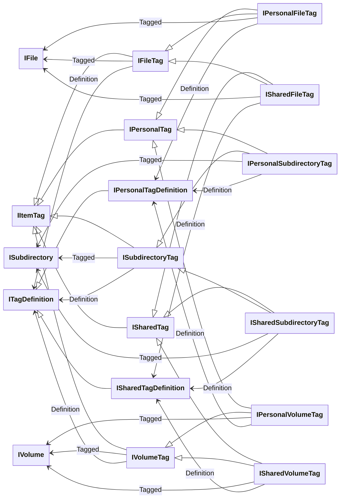
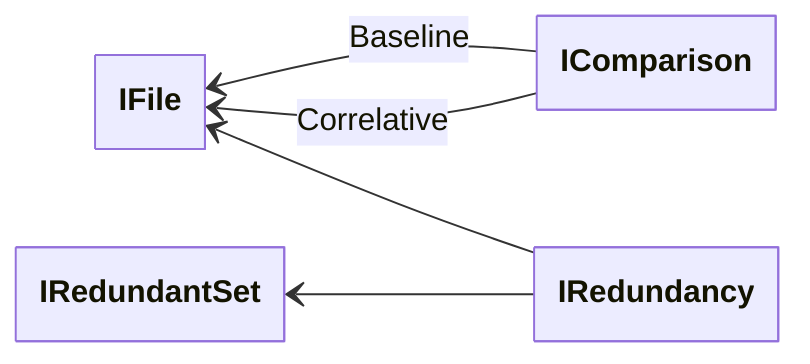

# Entity Diagrams

## Class Inheritance

```mermaid
---
  config:
    class:
      hideEmptyMembersBox: true
---
classDiagram
  direction RL
    class IDbEntity

    class IFileSystemProperties

    class IFileSystemRow
    IFileSystemRow --|> IDbEntity
    IFileSystemRow --|> IFileSystemProperties

    class IFileSystemListItem
    IFileSystemListItem --|> IFileSystemRow

    class IFileSystem
    IFileSystem --|> IFileSystemRow

    class IDbFsItemRow
    IDbFsItemRow --|> IDbEntity

    class IDbFsItemListItem
    IDbFsItemListItem --|> IDbFsItemRow

    class IDbFsItemAncestorName

    class IDbFsItemListItemWithAncestorNames
    IDbFsItemListItemWithAncestorNames --|> IDbFsItemAncestorName
    IDbFsItemListItemWithAncestorNames --|> IDbFsItemListItem

    class IDbFsItem
    IDbFsItem --|> IDbFsItemRow

    class IFileRow
    IFileRow --|> IDbFsItemRow

    class IFileListItemWithBinaryProperties
    IFileListItemWithBinaryProperties --|> IDbFsItemListItem
    IFileListItemWithBinaryProperties --|> IFileRow

    class IFileAncestorName
    IFileAncestorName --|> IDbFsItemAncestorName

    class IFileListItemWithAncestorNames
    IFileListItemWithAncestorNames --|> IDbFsItemListItemWithAncestorNames
    IFileListItemWithAncestorNames --|> IFileRow
    IFileListItemWithAncestorNames --|> IFileAncestorName

    class IFileListItemWithBinaryPropertiesAndAncestorNames
    IFileListItemWithBinaryPropertiesAndAncestorNames --|> IFileListItemWithAncestorNames

    class IFile
    IFile --|> IDbFsItem
    IFile --|> IFileRow

    class ISubdirectoryRow
    ISubdirectoryRow --|> IDbFsItemRow

    class ISubdirectoryAncestorName
    ISubdirectoryAncestorName --|> IDbFsItemAncestorName

    class ISubdirectoryListItem
    ISubdirectoryListItem --|> IDbFsItemListItem
    ISubdirectoryListItem --|> ISubdirectoryRow

    class ISubdirectoryListItemWithAncestorNames
    ISubdirectoryListItemWithAncestorNames --|> ISubdirectoryAncestorName
    ISubdirectoryListItemWithAncestorNames --|> ISubdirectoryListItem
    ISubdirectoryListItemWithAncestorNames --|> IDbFsItemListItemWithAncestorNames

    class ISubdirectory
    ISubdirectory --|> IDbFsItem
    ISubdirectory --|> ISubdirectoryRow

    class IVolumeRow
    IVolumeRow --|> IDbEntity

    class IVolumeListItem
    IVolumeListItem --|> IVolumeRow

    class IVolumeListItemWithFileSystem
    IVolumeListItemWithFileSystem --|> IVolumeListItem

    class IVolume
    IVolume --|> IVolumeRow

    class IAccessError
    IAccessError --|> IDbEntity

    class IFileAccessError
    IFileAccessError --|> IAccessError

    class ISubdirectoryAccessError
    ISubdirectoryAccessError --|> IAccessError

    class IVolumeAccessError
    IVolumeAccessError --|> IAccessError

    class IComparison
    IComparison --|> IDbEntity

    class IBinaryPropertySet
    IBinaryPropertySet --|> IDbEntity

    class IPropertiesRow
    IPropertiesRow --|> IDbEntity

    class IPropertiesListItem
    IPropertiesListItem --|> IPropertiesRow

    class IPropertySet
    IPropertySet --|> IPropertiesRow

    class IAudioProperties

    class IAudioPropertiesRow
    IAudioPropertiesRow --|> IAudioProperties
    IAudioPropertiesRow --|> IPropertiesRow

    class IAudioPropertiesListItem
    IAudioPropertiesListItem --|> IPropertiesListItem
    IAudioPropertiesListItem --|> IAudioPropertiesRow

    class IAudioPropertySet
    IAudioPropertySet --|> IPropertySet
    IAudioPropertySet --|> IAudioPropertiesRow

    class IDocumentProperties

    class IDocumentPropertiesRow
    IDocumentPropertiesRow --|> IDocumentProperties
    IDocumentPropertiesRow --|> IPropertiesRow

    class IDocumentPropertiesListItem
    IDocumentPropertiesListItem --|> IPropertiesListItem
    IDocumentPropertiesListItem --|> IDocumentPropertiesRow

    class IDocumentPropertySet
    IDocumentPropertySet --|> IPropertySet
    IDocumentPropertySet --|> IDocumentPropertiesRow

    class IDRMProperties

    class IDRMPropertiesRow
    IDRMPropertiesRow --|> IDRMProperties
    IDRMPropertiesRow --|> IPropertiesRow

    class IDRMPropertiesListItem
    IDRMPropertiesListItem --|> IPropertiesListItem
    IDRMPropertiesListItem --|> IDRMPropertiesRow

    class IDRMPropertySet
    IDRMPropertySet --|> IPropertySet
    IDRMPropertySet --|> IDRMPropertiesRow

    class IGPSProperties

    class IGPSPropertiesRow
    IGPSPropertiesRow --|> IGPSProperties
    IGPSPropertiesRow --|> IPropertiesRow

    class IGPSPropertiesListItem
    IGPSPropertiesListItem --|> IPropertiesListItem
    IGPSPropertiesListItem --|> IGPSPropertiesRow

    class IGPSPropertySet
    IGPSPropertySet --|> IPropertySet
    IGPSPropertySet --|> IGPSPropertiesRow

    class IImageProperties

    class IImagePropertiesRow
    IImagePropertiesRow --|> IImageProperties
    IImagePropertiesRow --|> IPropertiesRow

    class IImagePropertiesListItem
    IImagePropertiesListItem --|> IPropertiesListItem
    IImagePropertiesListItem --|> IImagePropertiesRow

    class IImagePropertySet
    IImagePropertySet --|> IPropertySet
    IImagePropertySet --|> IImagePropertiesRow

    class IMediaProperties

    class IMediaPropertiesRow
    IMediaPropertiesRow --|> IMediaProperties
    IMediaPropertiesRow --|> IPropertiesRow

    class IMediaPropertiesListItem
    IMediaPropertiesListItem --|> IPropertiesListItem
    IMediaPropertiesListItem --|> IMediaPropertiesRow

    class IMediaPropertySet
    IMediaPropertySet --|> IPropertySet
    IMediaPropertySet --|> IMediaPropertiesRow

    class IMusicProperties

    class IMusicPropertiesRow
    IMusicPropertiesRow --|> IMusicProperties
    IMusicPropertiesRow --|> IPropertiesRow

    class IMusicPropertiesListItem
    IMusicPropertiesListItem --|> IPropertiesListItem
    IMusicPropertiesListItem --|> IMusicPropertiesRow

    class IMusicPropertySet
    IMusicPropertySet --|> IPropertySet
    IMusicPropertySet --|> IMusicPropertiesRow

    class IPhotoProperties

    class IPhotoPropertiesRow
    IPhotoPropertiesRow --|> IPhotoProperties
    IPhotoPropertiesRow --|> IPropertiesRow

    class IPhotoPropertiesListItem
    IPhotoPropertiesListItem --|> IPropertiesListItem
    IPhotoPropertiesListItem --|> IPhotoPropertiesRow

    class IPhotoPropertySet
    IPhotoPropertySet --|> IPropertySet
    IPhotoPropertySet --|> IPhotoPropertiesRow

    class IRecordedTVProperties

    class IRecordedTVPropertiesRow
    IRecordedTVPropertiesRow --|> IRecordedTVProperties
    IRecordedTVPropertiesRow --|> IPropertiesRow

    class IRecordedTVPropertiesListItem
    IRecordedTVPropertiesListItem --|> IPropertiesListItem
    IRecordedTVPropertiesListItem --|> IRecordedTVPropertiesRow

    class IRecordedTVPropertySet
    IRecordedTVPropertySet --|> IPropertySet
    IRecordedTVPropertySet --|> IRecordedTVPropertiesRow

    class ISummaryProperties

    class ISummaryPropertiesRow
    ISummaryPropertiesRow --|> ISummaryProperties
    ISummaryPropertiesRow --|> IPropertiesRow

    class ISummaryPropertiesListItem
    ISummaryPropertiesListItem --|> IPropertiesListItem
    ISummaryPropertiesListItem --|> ISummaryPropertiesRow

    class ISummaryPropertySet
    ISummaryPropertySet --|> IPropertySet
    ISummaryPropertySet --|> ISummaryPropertiesRow

    class IVideoProperties

    class IVideoPropertiesRow
    IVideoPropertiesRow --|> IVideoProperties
    IVideoPropertiesRow --|> IPropertiesRow

    class IVideoPropertiesListItem
    IVideoPropertiesListItem --|> IPropertiesListItem
    IVideoPropertiesListItem --|> IVideoPropertiesRow

    class IVideoPropertySet
    IVideoPropertySet --|> IPropertySet
    IVideoPropertySet --|> IVideoPropertiesRow

    class ICrawlSettings

    class ICrawlConfigurationRow
    ICrawlConfigurationRow --|> IDbEntity
    ICrawlConfigurationRow --|> ICrawlSettings

    class ICrawlConfigurationListItem
    ICrawlConfigurationListItem --|> ICrawlConfigurationRow

    class ICrawlConfigReportItem
    ICrawlConfigReportItem --|> ICrawlConfigurationListItem

    class ICrawlConfiguration
    ICrawlConfiguration --|> ICrawlConfigurationRow

    class ICrawlJobLogRow
    ICrawlJobLogRow --|> IDbEntity
    ICrawlJobLogRow --|> ICrawlSettings

    class ICrawlJobListItem
    ICrawlJobListItem --|> ICrawlJobLogRow

    class ICrawlJobLog
    ICrawlJobLog --|> ICrawlJobLogRow

    class IItemTagRow
    IItemTagRow --|> IDbEntity

    class IItemTagListItem
    IItemTagListItem --|> IItemTagRow

    class IItemTag
    IItemTag --|> IItemTagRow

    class IPersonalTag
    IPersonalTag --|> IItemTag

    class ISharedTag
    ISharedTag --|> IItemTag

    class IFileTag
    IFileTag --|> IItemTag

    class ISubdirectoryTag
    ISubdirectoryTag --|> IItemTag

    class IVolumeTag
    IVolumeTag --|> IItemTag

    class IPersonalFileTag
    IPersonalFileTag --|> IPersonalTag
    IPersonalFileTag --|> IFileTag

    class IPersonalSubdirectoryTag
    IPersonalSubdirectoryTag --|> IPersonalTag
    IPersonalSubdirectoryTag --|> ISubdirectoryTag

    class IPersonalVolumeTag
    IPersonalVolumeTag --|> IPersonalTag
    IPersonalVolumeTag --|> IVolumeTag

    class ISharedFileTag
    ISharedFileTag --|> ISharedTag
    ISharedFileTag --|> IFileTag

    class ISharedSubdirectoryTag
    ISharedSubdirectoryTag --|> ISharedTag
    ISharedSubdirectoryTag --|> ISubdirectoryTag

    class ISharedVolumeTag
    ISharedVolumeTag --|> ISharedTag
    ISharedVolumeTag --|> IVolumeTag

    class ITagDefinitionRow
    ITagDefinitionRow --|> IDbEntity

    class ITagDefinitionListItem
    ITagDefinitionListItem --|> ITagDefinitionRow

    class ITagDefinition
    ITagDefinition --|> ITagDefinitionRow

    class IPersonalTagDefinition
    IPersonalTagDefinition --|> ITagDefinition

    class ISharedTagDefinition
    ISharedTagDefinition --|> ITagDefinition

    class IRedundancy
    IRedundancy --|> IDbEntity

    class IRedundantSetRow
    IRedundantSetRow --|> IDbEntity

    class IRedundantSetListItem
    IRedundantSetListItem --|> IRedundantSetRow

    class IRedundantSet
    IRedundantSet --|> IRedundantSetRow

    class ISymbolicNameRow
    ISymbolicNameRow --|> IDbEntity

    class ISymbolicNameListItem
    ISymbolicNameListItem --|> ISymbolicNameRow

    class ISymbolicName
    ISymbolicName --|> ISymbolicNameRow
```

## Key References

```mermaid
---
  config:
    class:
      hideEmptyMembersBox: true
---
classDiagram
  direction RL
    class ITagDefinition
    class IPersonalTagDefinition
    IPersonalTagDefinition --|> ITagDefinition

    class ISharedTagDefinition
    ISharedTagDefinition --|> ITagDefinition

    class IItemTag

    class ISharedTag
    ISharedTag --|> IItemTag
    
    class IPersonalTag
    IPersonalTag --|> IItemTag

    class IFile

    class IFileTag
    IFileTag --|> IItemTag
    IFileTag --> IFile : Tagged
    IFileTag --> ITagDefinition : Definition

    class ISubdirectory

    class ISubdirectoryTag
    ISubdirectoryTag --|> IItemTag
    ISubdirectoryTag --> ISubdirectory : Tagged
    ISubdirectoryTag --> ITagDefinition : Definition

    class IVolume

    class IVolumeTag
    IVolumeTag --|> IItemTag
    IVolumeTag --> IVolume : Tagged
    IVolumeTag --> ITagDefinition : Definition
    
    class IPersonalFileTag
    IPersonalFileTag --|> IPersonalTag
    IPersonalFileTag --|> IFileTag
    IPersonalFileTag --> IFile : Tagged
    IPersonalFileTag --> IPersonalTagDefinition : Definition

    class IPersonalSubdirectoryTag
    IPersonalSubdirectoryTag --|> IPersonalTag
    IPersonalSubdirectoryTag --|> ISubdirectoryTag
    IPersonalSubdirectoryTag --> ISubdirectory : Tagged
    IPersonalSubdirectoryTag --> IPersonalTagDefinition : Definition

    class IPersonalVolumeTag
    IPersonalVolumeTag --|> IPersonalTag
    IPersonalVolumeTag --|> IVolumeTag
    IPersonalVolumeTag --> IVolume : Tagged
    IPersonalVolumeTag --> IPersonalTagDefinition : Definition
    
    class ISharedFileTag
    ISharedFileTag --|> ISharedTag
    ISharedFileTag --|> IFileTag
    ISharedFileTag --> IFile : Tagged
    ISharedFileTag --> ISharedTagDefinition : Definition

    class ISharedSubdirectoryTag
    ISharedSubdirectoryTag --|> ISharedTag
    ISharedSubdirectoryTag --|> ISubdirectoryTag
    ISharedSubdirectoryTag --> ISubdirectory : Tagged
    ISharedSubdirectoryTag --> ISharedTagDefinition : Definition

    class ISharedVolumeTag
    ISharedVolumeTag --|> ISharedTag
    ISharedVolumeTag --|> IVolumeTag
    ISharedVolumeTag --> IVolume : Tagged
    ISharedVolumeTag --> ISharedTagDefinition : Definition
```

```mermaid
---
  config:
    class:
      hideEmptyMembersBox: true
---
classDiagram
  direction RL
    class IFile
  
    class IComparison
    IComparison --> IFile : Baseline
    IComparison --> IFile : Correlative

    class IRedundantSet
  
    class IRedundancy
    IRedundancy --> IRedundantSet
    IRedundancy --> IFile
```
