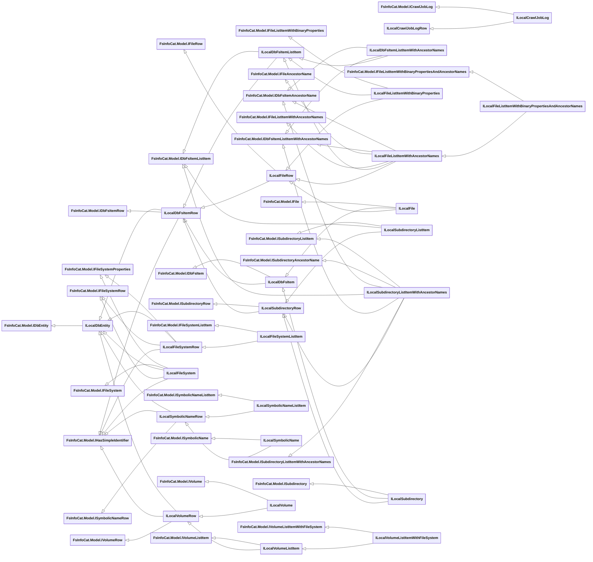
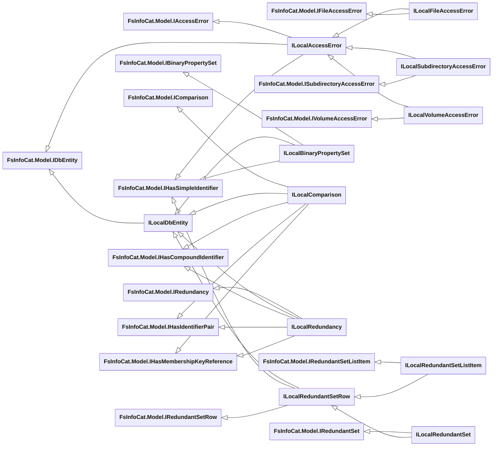

# Local Entity Interfaces

- [File Properties Interfaces](#file-properties-interfaces)
- [Tag Interfaces](#tag-interfaces)
- [File System Interfaces](#file-system-interfaces)
- [Crawl Interfaces](#crawl-interfaces)
- [Other Interfaces](#other-interfaces)

See Also:

- [Base Entity Interfaces](../Base-Entity-Interfaces.md)
- [Upstream Entity Interfaces](Upstream/Entity-Interfaces.md)

## File Properties Interfaces

```mermaid
---
  config:
    class:
      hideEmptyMembersBox: true
---
classDiagram
  direction RL
    class FsInfoCat.Model.IDbEntity

    class ILocalDbEntity
    ILocalDbEntity --|> FsInfoCat.Model.IDbEntity

    class FsInfoCat.Model.IPropertiesListItem

    class FsInfoCat.Model.IPropertiesRow

    class ILocalPropertiesRow
    ILocalPropertiesRow --|> ILocalDbEntity
    ILocalPropertiesRow --|> FsInfoCat.Model.IHasSimpleIdentifier
    ILocalPropertiesRow --|> FsInfoCat.Model.IPropertiesRow

    class ILocalPropertiesListItem
    ILocalPropertiesListItem --|> FsInfoCat.Model.IPropertiesListItem
    ILocalPropertiesListItem --|> ILocalPropertiesRow

    class FsInfoCat.Model.IPropertySet

    class ILocalPropertySet
    ILocalPropertySet --|> FsInfoCat.Model.IPropertySet
    ILocalPropertySet --|> ILocalPropertiesRow

    class FsInfoCat.Model.ISummaryProperties

    class FsInfoCat.Model.ISummaryPropertiesRow

    class ILocalSummaryPropertiesRow
    ILocalSummaryPropertiesRow --|> FsInfoCat.Model.ISummaryProperties
    ILocalSummaryPropertiesRow --|> FsInfoCat.Model.ISummaryPropertiesRow
    ILocalSummaryPropertiesRow --|> ILocalPropertiesRow

    class FsInfoCat.Model.ISummaryPropertiesListItem

    class ILocalSummaryPropertiesListItem
    ILocalSummaryPropertiesListItem --|> FsInfoCat.Model.ISummaryPropertiesListItem
    ILocalSummaryPropertiesListItem --|> ILocalPropertiesListItem
    ILocalSummaryPropertiesListItem --|> ILocalSummaryPropertiesRow

    class FsInfoCat.Model.ISummaryPropertySet

    class ILocalSummaryPropertySet
    ILocalSummaryPropertySet --|> ILocalPropertySet
    ILocalSummaryPropertySet --|> FsInfoCat.Model.ISummaryPropertySet
    ILocalSummaryPropertySet --|> ILocalSummaryPropertiesRow

    class FsInfoCat.Model.IAudioProperties

    class FsInfoCat.Model.IAudioPropertiesRow

    class ILocalAudioPropertiesRow
    ILocalAudioPropertiesRow --|> FsInfoCat.Model.IAudioProperties
    ILocalAudioPropertiesRow --|> FsInfoCat.Model.IAudioPropertiesRow
    ILocalAudioPropertiesRow --|> ILocalPropertiesRow

    class FsInfoCat.Model.IAudioPropertiesListItem

    class ILocalAudioPropertiesListItem
    ILocalAudioPropertiesListItem --|> FsInfoCat.Model.IAudioPropertiesListItem
    ILocalAudioPropertiesListItem --|> ILocalAudioPropertiesRow
    ILocalAudioPropertiesListItem --|> ILocalPropertiesListItem

    class FsInfoCat.Model.IAudioPropertySet

    class ILocalAudioPropertySet
    ILocalAudioPropertySet --|> ILocalPropertySet
    ILocalAudioPropertySet --|> FsInfoCat.Model.IAudioPropertySet
    ILocalAudioPropertySet --|> ILocalAudioPropertiesRow

    class FsInfoCat.Model.IDocumentProperties

    class FsInfoCat.Model.IDocumentPropertiesListItem

    class FsInfoCat.Model.IDocumentPropertiesRow

    class ILocalDocumentPropertiesRow
    ILocalDocumentPropertiesRow --|> FsInfoCat.Model.IDocumentProperties
    ILocalDocumentPropertiesRow --|> FsInfoCat.Model.IDocumentPropertiesRow
    ILocalDocumentPropertiesRow --|> ILocalPropertiesRow

    class ILocalDocumentPropertiesListItem
    ILocalDocumentPropertiesListItem --|> FsInfoCat.Model.IDocumentPropertiesListItem
    ILocalDocumentPropertiesListItem --|> ILocalDocumentPropertiesRow
    ILocalDocumentPropertiesListItem --|> ILocalPropertiesListItem

    class FsInfoCat.Model.IDocumentPropertySet

    class ILocalDocumentPropertySet
    ILocalDocumentPropertySet --|> ILocalPropertySet
    ILocalDocumentPropertySet --|> FsInfoCat.Model.IDocumentPropertySet
    ILocalDocumentPropertySet --|> ILocalDocumentPropertiesRow

    class FsInfoCat.Model.IDRMProperties

    class FsInfoCat.Model.IDRMPropertiesListItem

    class FsInfoCat.Model.IDRMPropertiesRow

    class ILocalDRMPropertiesRow
    ILocalDRMPropertiesRow --|> FsInfoCat.Model.IDRMProperties
    ILocalDRMPropertiesRow --|> FsInfoCat.Model.IDRMPropertiesRow
    ILocalDRMPropertiesRow --|> ILocalPropertiesRow

    class ILocalDRMPropertiesListItem
    ILocalDRMPropertiesListItem --|> FsInfoCat.Model.IDRMPropertiesListItem
    ILocalDRMPropertiesListItem --|> ILocalDRMPropertiesRow
    ILocalDRMPropertiesListItem --|> ILocalPropertiesListItem

    class FsInfoCat.Model.IDRMPropertySet

    class ILocalDRMPropertySet
    ILocalDRMPropertySet --|> ILocalPropertySet
    ILocalDRMPropertySet --|> FsInfoCat.Model.IDRMPropertySet
    ILocalDRMPropertySet --|> ILocalDRMPropertiesRow

    class FsInfoCat.Model.IGPSProperties

    class FsInfoCat.Model.IGPSPropertiesListItem

    class FsInfoCat.Model.IGPSPropertiesRow

    class ILocalGPSPropertiesRow
    ILocalGPSPropertiesRow --|> FsInfoCat.Model.IGPSProperties
    ILocalGPSPropertiesRow --|> FsInfoCat.Model.IGPSPropertiesRow
    ILocalGPSPropertiesRow --|> ILocalPropertiesRow

    class ILocalGPSPropertiesListItem
    ILocalGPSPropertiesListItem --|> FsInfoCat.Model.IGPSPropertiesListItem
    ILocalGPSPropertiesListItem --|> ILocalGPSPropertiesRow
    ILocalGPSPropertiesListItem --|> ILocalPropertiesListItem

    class FsInfoCat.Model.IGPSPropertySet

    class ILocalGPSPropertySet
    ILocalGPSPropertySet --|> ILocalPropertySet
    ILocalGPSPropertySet --|> FsInfoCat.Model.IGPSPropertySet
    ILocalGPSPropertySet --|> ILocalGPSPropertiesRow

    class FsInfoCat.Model.IImageProperties

    class FsInfoCat.Model.IImagePropertiesRow

    class ILocalImagePropertiesRow
    ILocalImagePropertiesRow --|> FsInfoCat.Model.IImageProperties
    ILocalImagePropertiesRow --|> FsInfoCat.Model.IImagePropertiesRow
    ILocalImagePropertiesRow --|> ILocalPropertiesRow

    class FsInfoCat.Model.IImagePropertiesListItem

    class ILocalImagePropertiesListItem
    ILocalImagePropertiesListItem --|> FsInfoCat.Model.IImagePropertiesListItem
    ILocalImagePropertiesListItem --|> ILocalImagePropertiesRow
    ILocalImagePropertiesListItem --|> ILocalPropertiesListItem

    class FsInfoCat.Model.IImagePropertySet

    class ILocalImagePropertySet
    ILocalImagePropertySet --|> ILocalPropertySet
    ILocalImagePropertySet --|> FsInfoCat.Model.IImagePropertySet
    ILocalImagePropertySet --|> ILocalImagePropertiesRow

    class FsInfoCat.Model.IMediaProperties

    class FsInfoCat.Model.IMediaPropertiesRow

    class ILocalMediaPropertiesRow
    ILocalMediaPropertiesRow --|> FsInfoCat.Model.IMediaProperties
    ILocalMediaPropertiesRow --|> FsInfoCat.Model.IMediaPropertiesRow
    ILocalMediaPropertiesRow --|> ILocalPropertiesRow

    class FsInfoCat.Model.IMediaPropertiesListItem

    class ILocalMediaPropertiesListItem
    ILocalMediaPropertiesListItem --|> FsInfoCat.Model.IMediaPropertiesListItem
    ILocalMediaPropertiesListItem --|> ILocalMediaPropertiesRow
    ILocalMediaPropertiesListItem --|> ILocalPropertiesListItem

    class FsInfoCat.Model.IMediaPropertySet

    class ILocalMediaPropertySet
    ILocalMediaPropertySet --|> ILocalPropertySet
    ILocalMediaPropertySet --|> FsInfoCat.Model.IMediaPropertySet
    ILocalMediaPropertySet --|> ILocalMediaPropertiesRow

    class FsInfoCat.Model.IMusicProperties

    class FsInfoCat.Model.IMusicPropertiesRow

    class ILocalMusicPropertiesRow
    ILocalMusicPropertiesRow --|> FsInfoCat.Model.IMusicProperties
    ILocalMusicPropertiesRow --|> FsInfoCat.Model.IMusicPropertiesRow
    ILocalMusicPropertiesRow --|> ILocalPropertiesRow

    class FsInfoCat.Model.IMusicPropertiesListItem

    class ILocalMusicPropertiesListItem
    ILocalMusicPropertiesListItem --|> FsInfoCat.Model.IMusicPropertiesListItem
    ILocalMusicPropertiesListItem --|> ILocalMusicPropertiesRow
    ILocalMusicPropertiesListItem --|> ILocalPropertiesListItem

    class FsInfoCat.Model.IMusicPropertySet

    class ILocalMusicPropertySet
    ILocalMusicPropertySet --|> ILocalPropertySet
    ILocalMusicPropertySet --|> FsInfoCat.Model.IMusicPropertySet
    ILocalMusicPropertySet --|> ILocalMusicPropertiesRow

    class FsInfoCat.Model.IPhotoProperties

    class FsInfoCat.Model.IPhotoPropertiesRow

    class ILocalPhotoPropertiesRow
    ILocalPhotoPropertiesRow --|> FsInfoCat.Model.IPhotoProperties
    ILocalPhotoPropertiesRow --|> FsInfoCat.Model.IPhotoPropertiesRow
    ILocalPhotoPropertiesRow --|> ILocalPropertiesRow

    class FsInfoCat.Model.IPhotoPropertiesListItem

    class ILocalPhotoPropertiesListItem
    ILocalPhotoPropertiesListItem --|> FsInfoCat.Model.IPhotoPropertiesListItem
    ILocalPhotoPropertiesListItem --|> ILocalPhotoPropertiesRow
    ILocalPhotoPropertiesListItem --|> ILocalPropertiesListItem

    class FsInfoCat.Model.IPhotoPropertySet

    class ILocalPhotoPropertySet
    ILocalPhotoPropertySet --|> ILocalPropertySet
    ILocalPhotoPropertySet --|> FsInfoCat.Model.IPhotoPropertySet
    ILocalPhotoPropertySet --|> ILocalPhotoPropertiesRow

    class FsInfoCat.Model.IRecordedTVProperties

    class FsInfoCat.Model.IRecordedTVPropertiesRow

    class ILocalRecordedTVPropertiesRow
    ILocalRecordedTVPropertiesRow --|> FsInfoCat.Model.IRecordedTVProperties
    ILocalRecordedTVPropertiesRow --|> FsInfoCat.Model.IRecordedTVPropertiesRow
    ILocalRecordedTVPropertiesRow --|> ILocalPropertiesRow

    class FsInfoCat.Model.IRecordedTVPropertiesListItem

    class ILocalRecordedTVPropertiesListItem
    ILocalRecordedTVPropertiesListItem --|> FsInfoCat.Model.IRecordedTVPropertiesListItem
    ILocalRecordedTVPropertiesListItem --|> ILocalPropertiesListItem
    ILocalRecordedTVPropertiesListItem --|> ILocalRecordedTVPropertiesRow

    class FsInfoCat.Model.IRecordedTVPropertySet

    class ILocalRecordedTVPropertySet
    ILocalRecordedTVPropertySet --|> ILocalPropertySet
    ILocalRecordedTVPropertySet --|> FsInfoCat.Model.IRecordedTVPropertySet
    ILocalRecordedTVPropertySet --|> ILocalRecordedTVPropertiesRow

    class FsInfoCat.Model.IVideoProperties

    class FsInfoCat.Model.IVideoPropertiesRow

    class ILocalVideoPropertiesRow
    ILocalVideoPropertiesRow --|> FsInfoCat.Model.IVideoProperties
    ILocalVideoPropertiesRow --|> FsInfoCat.Model.IVideoPropertiesRow
    ILocalVideoPropertiesRow --|> ILocalPropertiesRow

    class FsInfoCat.Model.IVideoPropertiesListItem

    class ILocalVideoPropertiesListItem
    ILocalVideoPropertiesListItem --|> FsInfoCat.Model.IVideoPropertiesListItem
    ILocalVideoPropertiesListItem --|> ILocalPropertiesListItem
    ILocalVideoPropertiesListItem --|> ILocalVideoPropertiesRow

    class FsInfoCat.Model.IVideoPropertySet

    class ILocalVideoPropertySet
    ILocalVideoPropertySet --|> ILocalPropertySet
    ILocalVideoPropertySet --|> FsInfoCat.Model.IVideoPropertySet
    ILocalVideoPropertySet --|> ILocalVideoPropertiesRow
```

- **[FsInfoCat.Model.IPropertiesRow](../Model/IPropertiesRow.cs)** : [FsInfoCat.Model.IHasSimpleIdentifier](../Model/IHasSimpleIdentifier.cs)
  - **[ILocalPropertiesRow](Model/ILocalPropertiesRow.cs)** : [ILocalDbEntity](Model/ILocalDbEntity.cs)
    - **[ILocalPropertiesListItem](Model/ILocalPropertiesListItem.cs)** : [FsInfoCat.Model.IPropertiesListItem](../Model/IPropertiesListItem.cs)
    - **[ILocalPropertySet](Model/ILocalPropertySet.cs)** : [FsInfoCat.Model.IPropertySet](../Model/IPropertySet.cs)
- **[FsInfoCat.Model.ISummaryProperties](../Model/ISummaryProperties.cs)**
  - **[FsInfoCat.Model.ISummaryPropertiesRow](../Model/ISummaryPropertiesRow.cs)**
    - **[ILocalSummaryPropertiesRow](Model/ILocalSummaryPropertiesRow.cs)**
      - **[ILocalSummaryPropertiesListItem](Model/ILocalSummaryPropertiesListItem.cs)** : [FsInfoCat.Model.ISummaryPropertiesListItem](../Model/ISummaryPropertiesListItem.cs), [FsInfoCat.Model.ISummaryPropertiesListItem](../Model/ISummaryPropertiesListItem.cs),
        [ILocalPropertiesListItem](Model/ILocalPropertiesListItem.cs)
      - **[ILocalSummaryPropertySet](Model/ILocalSummaryPropertySet.cs)** : [FsInfoCat.Model.ISummaryPropertySet](../Model/ISummaryPropertySet.cs), [ILocalPropertySet](Model/ILocalPropertySet.cs),
        [FsInfoCat.Model.ISummaryPropertySet](../Model/ISummaryPropertySet.cs)
- **[FsInfoCat.Model.IAudioProperties](../Model/IAudioProperties.cs)**
  - **[FsInfoCat.Model.IAudioPropertiesRow](../Model/IAudioPropertiesRow.cs)**
    - **[FsInfoCat.Model.IAudioPropertiesListItem](../Model/IAudioPropertiesListItem.cs)**
    - **[FsInfoCat.Model.IAudioPropertySet](../Model/IAudioPropertySet.cs)**
    - **[ILocalAudioPropertiesRow](Model/ILocalAudioPropertiesRow.cs)** : [ILocalPropertiesRow](Model/ILocalPropertiesRow.cs)
      - **[ILocalAudioPropertiesListItem](Model/ILocalAudioPropertiesListItem.cs)** : [FsInfoCat.Model.IAudioPropertiesListItem](../Model/IAudioPropertiesListItem.cs), [ILocalPropertiesListItem](Model/ILocalPropertiesListItem.cs)
      - **[ILocalAudioPropertySet](Model/ILocalAudioPropertySet.cs)** : [ILocalPropertySet](Model/ILocalPropertySet.cs), [FsInfoCat.Model.IAudioPropertySet](../Model/IAudioPropertySet.cs)
- **[FsInfoCat.Model.IDocumentProperties](../Model/IDocumentProperties.cs)**
  - **[FsInfoCat.Model.IDocumentPropertiesRow](../Model/IDocumentPropertiesRow.cs)**
    - **[FsInfoCat.Model.IDocumentPropertiesListItem](../Model/IDocumentPropertiesListItem.cs)**
    - **[FsInfoCat.Model.IDocumentPropertySet](../Model/IDocumentPropertySet.cs)**
    - **[ILocalDocumentPropertiesRow](Model/ILocalDocumentPropertiesRow.cs)** : [FsInfoCat.Model.IDocumentProperties](../Model/IDocumentProperties.cs), [ILocalPropertiesRow](Model/ILocalPropertiesRow.cs)
      - **[ILocalDocumentPropertiesListItem](Model/ILocalDocumentPropertiesListItem.cs)** : [FsInfoCat.Model.IDocumentPropertiesListItem](../Model/IDocumentPropertiesListItem.cs), [ILocalPropertiesListItem](Model/ILocalPropertiesListItem.cs)
      - **[ILocalDocumentPropertySet](Model/ILocalDocumentPropertySet.cs)** : [ILocalPropertySet](Model/ILocalPropertySet.cs), [FsInfoCat.Model.IDocumentPropertySet](../Model/IDocumentPropertySet.cs)
- **[FsInfoCat.Model.IDRMProperties](../Model/IDRMProperties.cs)**
  - **[FsInfoCat.Model.IDRMPropertiesRow](../Model/IDRMPropertiesRow.cs)**
    - **[FsInfoCat.Model.IDRMPropertiesListItem](../Model/IDRMPropertiesListItem.cs)**
    - **[FsInfoCat.Model.IDRMPropertySet](../Model/IDRMPropertySet.cs)**
    - **[ILocalDRMPropertiesRow](Model/ILocalDRMPropertiesRow.cs)** : [FsInfoCat.Model.IDRMProperties](../Model/IDRMProperties.cs), [ILocalPropertiesRow](Model/ILocalPropertiesRow.cs)
      - **[ILocalDRMPropertiesListItem](Model/ILocalDRMPropertiesListItem.cs)** : [FsInfoCat.Model.IDRMPropertiesListItem](../Model/IDRMPropertiesListItem.cs), [ILocalPropertiesListItem](Model/ILocalPropertiesListItem.cs)
      - **[ILocalDRMPropertySet](Model/ILocalDRMPropertySet.cs)** : [ILocalPropertySet](Model/ILocalPropertySet.cs), [FsInfoCat.Model.IDRMPropertySet](../Model/IDRMPropertySet.cs)
- **[FsInfoCat.Model.IGPSProperties](../Model/IGPSProperties.cs)**
  - **[FsInfoCat.Model.IGPSPropertiesRow](../Model/IGPSPropertiesRow.cs)**
    - **[FsInfoCat.Model.IGPSPropertiesListItem](../Model/IGPSPropertiesListItem.cs)**
    - **[FsInfoCat.Model.IGPSPropertySet](../Model/IGPSPropertySet.cs)**
    - **[ILocalGPSPropertiesRow](Model/ILocalGPSPropertiesRow.cs)** : [FsInfoCat.Model.IGPSProperties](../Model/IGPSProperties.cs),[ILocalPropertiesRow](Model/ILocalPropertiesRow.cs)
      - **[ILocalGPSPropertiesListItem](Model/ILocalGPSPropertiesListItem.cs)** : [FsInfoCat.Model.IGPSPropertiesListItem](../Model/IGPSPropertiesListItem.cs), [ILocalPropertiesListItem](Model/ILocalPropertiesListItem.cs)
      - **[ILocalGPSPropertySet](Model/ILocalGPSPropertySet.cs)** : [ILocalPropertySet](Model/ILocalPropertySet.cs), [FsInfoCat.Model.IGPSPropertySet](../Model/IGPSPropertySet.cs)
- **[FsInfoCat.Model.IImageProperties](../Model/IImageProperties.cs)**
  - **[FsInfoCat.Model.IImagePropertiesRow](../Model/IImagePropertiesRow.cs)**
    - **[FsInfoCat.Model.IImagePropertiesListItem](../Model/IImagePropertiesListItem.cs)**
    - **[FsInfoCat.Model.IImagePropertySet](../Model/IImagePropertySet.cs)**
    - **[ILocalImagePropertiesRow](Model/ILocalImagePropertiesRow.cs)** : [FsInfoCat.Model.IImageProperties](../Model/IImageProperties.cs), [ILocalPropertiesRow](Model/ILocalPropertiesRow.cs)
      - **[ILocalImagePropertiesListItem](Model/ILocalImagePropertiesListItem.cs)** : [FsInfoCat.Model.IImagePropertiesListItem](../Model/IImagePropertiesListItem.cs), [ILocalPropertiesListItem](Model/ILocalPropertiesListItem.cs)
      - **[ILocalImagePropertySet](Model/ILocalImagePropertySet.cs)** : [ILocalPropertySet](Model/ILocalPropertySet.cs), [FsInfoCat.Model.IImagePropertySet](../Model/IImagePropertySet.cs)
- **[FsInfoCat.Model.IMediaProperties](../Model/IMediaProperties.cs)**
  - **[FsInfoCat.Model.IMediaPropertiesRow](../Model/IMediaPropertiesRow.cs)**
    - **[FsInfoCat.Model.IMediaPropertiesListItem](../Model/IMediaPropertiesListItem.cs)**
    - **[FsInfoCat.Model.IMediaPropertySet](../Model/IMediaPropertySet.cs)**
    - **[ILocalMediaPropertiesRow](Model/ILocalMediaPropertiesRow.cs)** : [FsInfoCat.Model.IMediaProperties](../Model/IMediaProperties.cs), [ILocalPropertiesRow](Model/ILocalPropertiesRow.cs)
      - **[ILocalMediaPropertiesListItem](Model/ILocalMediaPropertiesListItem.cs)** : [FsInfoCat.Model.IMediaPropertiesListItem](../Model/IMediaPropertiesListItem.cs), [ILocalPropertiesListItem](Model/ILocalPropertiesListItem.cs)
      - **[ILocalMediaPropertySet](Model/ILocalMediaPropertySet.cs)** : [ILocalPropertySet](Model/ILocalPropertySet.cs), [FsInfoCat.Model.IMediaPropertySet](../Model/IMediaPropertySet.cs)
- **[FsInfoCat.Model.IMusicProperties](../Model/IMusicProperties.cs)**
  - **[FsInfoCat.Model.IMusicPropertiesRow](../Model/IMusicPropertiesRow.cs)**
    - **[FsInfoCat.Model.IMusicPropertiesListItem](../Model/IMusicPropertiesListItem.cs)**
    - **[FsInfoCat.Model.IMusicPropertySet](../Model/IMusicPropertySet.cs)**
    - **[ILocalMusicPropertiesRow](Model/ILocalMusicPropertiesRow.cs)** : [FsInfoCat.Model.IMusicProperties](../Model/IMusicProperties.cs), [ILocalPropertiesRow](Model/ILocalPropertiesRow.cs)
      - **[ILocalMusicPropertiesListItem](Model/ILocalMusicPropertiesListItem.cs)** : [FsInfoCat.Model.IMusicPropertiesListItem](../Model/IMusicPropertiesListItem.cs), [ILocalPropertiesListItem](Model/ILocalPropertiesListItem.cs)
      - **[ILocalMusicPropertySet](Model/ILocalMusicPropertySet.cs)** : [ILocalPropertySet](Model/ILocalPropertySet.cs), [FsInfoCat.Model.IMusicPropertySet](../Model/IMusicPropertySet.cs)
- **[FsInfoCat.Model.IPhotoProperties](../Model/IPhotoProperties.cs)**
  - **[FsInfoCat.Model.IPhotoPropertiesRow](../Model/IPhotoPropertiesRow.cs)**
    - **[FsInfoCat.Model.IPhotoPropertiesListItem](../Model/IPhotoPropertiesListItem.cs)**
    - **[FsInfoCat.Model.IPhotoPropertySet](../Model/IPhotoPropertySet.cs)**
    - **[ILocalPhotoPropertiesRow](Model/ILocalPhotoPropertiesRow.cs)** : [FsInfoCat.Model.IPhotoProperties](../Model/IPhotoProperties.cs), [ILocalPropertiesRow](Model/ILocalPropertiesRow.cs)
      - **[ILocalPhotoPropertiesListItem](Model/ILocalPhotoPropertiesListItem.cs)** : [FsInfoCat.Model.IPhotoPropertiesListItem](../Model/IPhotoPropertiesListItem.cs), [ILocalPropertiesListItem](Model/ILocalPropertiesListItem.cs)
      - **[ILocalPhotoPropertySet](Model/ILocalPhotoPropertySet.cs)** : [ILocalPropertySet](Model/ILocalPropertySet.cs), [FsInfoCat.Model.IPhotoPropertySet](../Model/IPhotoPropertySet.cs)
- **[FsInfoCat.Model.IRecordedTVProperties](../Model/IRecordedTVProperties.cs)**
  - **[FsInfoCat.Model.IRecordedTVPropertiesRow](../Model/IRecordedTVPropertiesRow.cs)**
    - **[FsInfoCat.Model.IRecordedTVPropertiesListItem](../Model/IRecordedTVPropertiesListItem.cs)**
    - **[FsInfoCat.Model.IRecordedTVPropertySet](../Model/IRecordedTVPropertySet.cs)**
    - **[ILocalRecordedTVPropertiesRow](Model/ILocalRecordedTVPropertiesRow.cs)** : [FsInfoCat.Model.IRecordedTVProperties](../Model/IRecordedTVProperties.cs), [ILocalPropertiesRow](Model/ILocalPropertiesRow.cs)
      - **[ILocalRecordedTVPropertiesListItem](Model/ILocalRecordedTVPropertiesListItem.cs)** : [FsInfoCat.Model.IRecordedTVPropertiesListItem](../Model/IRecordedTVPropertiesListItem.cs), [ILocalPropertiesListItem](Model/ILocalPropertiesListItem.cs)
      - **[ILocalRecordedTVPropertySet](Model/ILocalRecordedTVPropertySet.cs)** : [ILocalPropertySet](Model/ILocalPropertySet.cs), [FsInfoCat.Model.IRecordedTVPropertySet](../Model/IRecordedTVPropertySet.cs)
- **[FsInfoCat.Model.IVideoProperties](../Model/IVideoProperties.cs)**
  - **[FsInfoCat.Model.IVideoPropertiesRow](../Model/IVideoPropertiesRow.cs)**
    - **[FsInfoCat.Model.IVideoPropertiesListItem](../Model/IVideoPropertiesListItem.cs)**
    - **[FsInfoCat.Model.IVideoPropertySet](../Model/IVideoPropertySet.cs)**
    - **[ILocalVideoPropertiesRow](Model/ILocalVideoPropertiesRow.cs)** : [FsInfoCat.Model.IVideoProperties](../Model/IVideoProperties.cs), [ILocalPropertiesRow](Model/ILocalPropertiesRow.cs)
      - **[ILocalVideoPropertiesListItem](Model/ILocalVideoPropertiesListItem.cs)** : [FsInfoCat.Model.IVideoPropertiesListItem](../Model/IVideoPropertiesListItem.cs), [ILocalPropertiesListItem](Model/ILocalPropertiesListItem.cs)
      - **[ILocalVideoPropertySet](Model/ILocalVideoPropertySet.cs)** : [ILocalPropertySet](Model/ILocalPropertySet.cs), [FsInfoCat.Model.IVideoPropertySet](../Model/IVideoPropertySet.cs)

## Tag Interfaces

- **[FsInfoCat.Model.IItemTagRow](../Model/IItemTagRow.cs)** : [FsInfoCat.Model.IHasIdentifierPair](../Model/IHasCompoundIdentifier.cs)
  - **[ILocalItemTagRow](Model/ILocalItemTagRow.cs)** : [ILocalDbEntity](Model/ILocalDbEntity.cs)
    - **[ILocalItemTagListItem](Model/ILocalItemTagListItem.cs)** : [FsInfoCat.Model.IItemTagListItem](../Model/IItemTagListItem.cs)
    - **[ILocalItemTag](Model/ILocalItemTag.cs)** : [FsInfoCat.Model.IItemTag](../Model/IItemTag.cs)
      - **[ILocalSharedTag](Model/ILocalSharedTag.cs)** : [FsInfoCat.Model.ISharedTag](../Model/ISharedTag.cs)
        - **[ILocalSharedFileTag](Model/ILocalSharedFileTag.cs)** : [ILocalFileTag](Model/ILocalFileTag.cs), [FsInfoCat.Model.ISharedFileTag](../Model/ISharedFileTag.cs)
        - **[ILocalSharedSubdirectoryTag](Model/ILocalSharedSubdirectoryTag.cs)** : [ILocalSubdirectoryTag](Model/ILocalSubdirectoryTag.cs), [FsInfoCat.Model.ISharedSubdirectoryTag](../Model/ISharedSubdirectoryTag.cs)
        - **[ILocalSharedVolumeTag](Model/ILocalSharedVolumeTag.cs)** : [ILocalVolumeTag](Model/ILocalVolumeTag.cs), [FsInfoCat.Model.ISharedVolumeTag](../Model/ISharedVolumeTag.cs)
      - **[ILocalPersonalTag](Model/ILocalPersonalTag.cs)** : [FsInfoCat.Model.IPersonalTag](../Model/IPersonalTag.cs)
        - **[ILocalPersonalFileTag](Model/ILocalPersonalFileTag.cs)** : [ILocalFileTag](Model/ILocalFileTag.cs), [FsInfoCat.Model.IPersonalFileTag](../Model/IPersonalFileTag.cs)
        - **[ILocalPersonalSubdirectoryTag](Model/ILocalPersonalSubdirectoryTag.cs)** : [ILocalSubdirectoryTag](Model/ILocalSubdirectoryTag.cs), [FsInfoCat.Model.IPersonalSubdirectoryTag](../Model/IPersonalSubdirectoryTag.cs)
        - **[ILocalPersonalVolumeTag](Model/ILocalPersonalVolumeTag.cs)** : [ILocalVolumeTag](Model/ILocalVolumeTag.cs), [FsInfoCat.Model.IPersonalVolumeTag](../Model/IPersonalVolumeTag.cs)
      - **[ILocalFileTag](Model/ILocalFileTag.cs)** : [FsInfoCat.Model.IFileTag](../Model/IFileTag.cs), [FsInfoCat.Model.IHasMembershipKeyReference](../Model/IHasMembershipKeyReference.cs)
      - **[ILocalSubdirectoryTag](Model/ILocalSubdirectoryTag.cs)** : [FsInfoCat.Model.ISubdirectoryTag](../Model/ISubdirectoryTag.cs), [FsInfoCat.Model.IHasMembershipKeyReference](../Model/IHasMembershipKeyReference.cs)
      - **[ILocalVolumeTag](Model/ILocalVolumeTag.cs)** : [FsInfoCat.Model.IVolumeTag](../Model/IVolumeTag.cs), [FsInfoCat.Model.IHasMembershipKeyReference](../Model/IHasMembershipKeyReference.cs)
- **[FsInfoCat.Model.ITagDefinitionRow](../Model/ITagDefinitionRow.cs)** : [FsInfoCat.Model.IHasSimpleIdentifier](../Model/IHasSimpleIdentifier.cs)
  - **[ILocalTagDefinitionRow](Model/ILocalTagDefinitionRow.cs)** : [ILocalDbEntity](Model/ILocalDbEntity.cs)
    - **[ILocalTagDefinitionListItem](Model/ILocalTagDefinitionListItem.cs)** : [FsInfoCat.Model.ITagDefinitionListItem](../Model/ITagDefinitionListItem.cs), [ILocalTagDefinitionRow](Model/ILocalTagDefinitionRow.cs)
    - **[ILocalTagDefinition](Model/ILocalTagDefinition.cs)** : [FsInfoCat.Model.ITagDefinition](../Model/ITagDefinition.cs), [ILocalTagDefinitionRow](Model/ILocalTagDefinitionRow.cs)
      - **[ILocalPersonalTagDefinition](Model/ILocalPersonalTagDefinition.cs)** : [ILocalTagDefinition](Model/ILocalTagDefinition.cs), [FsInfoCat.Model.IPersonalTagDefinition](../Model/IPersonalTagDefinition.cs)
      - **[ILocalSharedTagDefinition](Model/ILocalSharedTagDefinition.cs)** : [ILocalTagDefinition](Model/ILocalTagDefinition.cs), [FsInfoCat.Model.ISharedTagDefinition](../Model/ISharedTagDefinition.cs)

## File System Interfaces

- **[FsInfoCat.Model.IVolumeRow](../Model/IVolumeRow.cs)** : [FsInfoCat.Model.IHasSimpleIdentifier](../Model/IHasSimpleIdentifier.cs)
  - **[ILocalVolumeRow](Model/ILocalVolumeRow.cs)** : [ILocalDbEntity](Model/ILocalDbEntity.cs)
    - **[ILocalVolumeListItem](Model/ILocalVolumeListItem.cs)** : [FsInfoCat.Model.IVolumeListItem](../Model/IVolumeListItem.cs)
      - **[ILocalVolumeListItemWithFileSystem](Model/ILocalVolumeListItemWithFileSystem.cs)** : [FsInfoCat.Model.IVolumeListItemWithFileSystem](../Model/IVolumeListItemWithFileSystem.cs)
    - **[ILocalVolume](Model/ILocalVolume.cs)** : [FsInfoCat.Model.IVolume](../Model/IVolume.cs)
- **[FsInfoCat.Model.IFileSystemProperties](../Model/IFileSystemProperties.cs)**
  - **[FsInfoCat.Model.IFileSystemRow](../Model/IFileSystemRow.cs)** : [FsInfoCat.Model.IHasSimpleIdentifier](../Model/IHasSimpleIdentifier.cs)
    - **[ILocalFileSystemRow](Model/ILocalFileSystemRow.cs)** : [ILocalDbEntity](Model/ILocalDbEntity.cs), [FsInfoCat.Model.IFileSystemRow](../Model/IFileSystemRow.cs)
      - **[ILocalFileSystemListItem](Model/ILocalFileSystemListItem.cs)** : [FsInfoCat.Model.IFileSystemListItem](../Model/IFileSystemListItem.cs)
      - **[ILocalFileSystem](Model/ILocalFileSystem.cs)** : [FsInfoCat.Model.IFileSystem](../Model/IFileSystem.cs), [ILocalDbEntity](Model/ILocalDbEntity.cs), [FsInfoCat.Model.IFileSystemRow](../Model/IFileSystemRow.cs)
- **[FsInfoCat.Model.ISymbolicNameRow](../Model/ISymbolicNameRow.cs)** : [FsInfoCat.Model.IHasSimpleIdentifier](../Model/IHasSimpleIdentifier.cs)
  - **[ILocalSymbolicNameRow](Model/ILocalSymbolicNameRow.cs)** : [ILocalDbEntity](Model/ILocalDbEntity.cs)
    - **[ILocalSymbolicNameListItem](Model/ILocalSymbolicNameListItem.cs)** : [FsInfoCat.Model.ISymbolicNameListItem](../Model/ISymbolicNameListItem.cs)
    - **[ILocalSymbolicName](Model/ILocalSymbolicName.cs)** : [FsInfoCat.Model.ISymbolicName](../Model/ISymbolicName.cs)
- **[FsInfoCat.Model.IDbFsItemRow](../Model/IDbFsItemRow.cs)** : [FsInfoCat.Model.IHasSimpleIdentifier](../Model/IHasSimpleIdentifier.cs)
  - **[ILocalDbFsItemRow](Model/ILocalDbFsItemRow.cs)** : [ILocalDbEntity](Model/ILocalDbEntity.cs)
    - **[ILocalDbFsItemListItem](Model/ILocalDbFsItemListItem.cs)** : [FsInfoCat.Model.IDbFsItemListItem](../Model/IDbFsItemListItem.cs)
      - **[ILocalDbFsItemListItemWithAncestorNames](Model/ILocalDbFsItemListItemWithAncestorNames.cs)** : [FsInfoCat.Model.IDbFsItemAncestorName](../Model/IDbFsItemAncestorName.cs), [FsInfoCat.Model.IDbFsItemListItemWithAncestorNames](../Model/IDbFsItemListItemWithAncestorNames.cs), [ILocalDbFsItemListItem](Model/ILocalDbFsItemListItem.cs)
    - **[ILocalDbFsItem](Model/ILocalDbFsItem.cs)** : [FsInfoCat.Model.IDbFsItem](../Model/IDbFsItem.cs)
    - **[ILocalFileRow](Model/ILocalFileRow.cs)** : [FsInfoCat.Model.IFileRow](../Model/IFileRow.cs)
      - **[ILocalFileListItemWithBinaryProperties](Model/ILocalFileListItemWithBinaryProperties.cs)** : [FsInfoCat.Model.IFileListItemWithBinaryProperties](../Model/IFileListItemWithBinaryProperties.cs), [ILocalDbFsItemListItem](Model/ILocalDbFsItemListItem.cs)
      - **[ILocalFileListItemWithAncestorNames](Model/ILocalFileListItemWithAncestorNames.cs)** : [FsInfoCat.Model.IDbFsItemAncestorName](../Model/IDbFsItemAncestorName.cs), [FsInfoCat.Model.IDbFsItemListItemWithAncestorNames](../Model/IDbFsItemListItemWithAncestorNames.cs), [FsInfoCat.Model.IFileAncestorName](../Model/IFileAncestorName.cs), [FsInfoCat.Model.IFileListItemWithAncestorNames](../Model/IFileListItemWithAncestorNames.cs), [ILocalDbFsItemListItem](Model/ILocalDbFsItemListItem.cs)
        - **[ILocalFileListItemWithBinaryPropertiesAndAncestorNames](Model/ILocalFileListItemWithBinaryPropertiesAndAncestorNames.cs)** : [FsInfoCat.Model.IFileListItemWithBinaryPropertiesAndAncestorNames](../Model/IFileListItemWithBinaryPropertiesAndAncestorNames.cs)
      - **[ILocalFile](Model/ILocalFile.cs)** : [FsInfoCat.Model.IFile](../Model/IFile.cs), [ILocalDbFsItem](Model/ILocalDbFsItem.cs)
    - **[ILocalSubdirectoryRow](Model/ILocalSubdirectoryRow.cs)** : [FsInfoCat.Model.ISubdirectoryRow](../Model/ISubdirectoryRow.cs)
      - **[ILocalSubdirectoryListItem](Model/ILocalSubdirectoryListItem.cs)** : [FsInfoCat.Model.ISubdirectoryListItem](../Model/ISubdirectoryListItem.cs), [FsInfoCat.Model.IDbFsItemListItem](../Model/IDbFsItemListItem.cs)
        - **[ILocalSubdirectoryListItemWithAncestorNames](Model/ILocalSubdirectoryListItemWithAncestorNames.cs)** : [FsInfoCat.Model.ISubdirectoryListItem](../Model/ISubdirectoryListItem.cs), [FsInfoCat.Model.ISubdirectoryAncestorName](../Model/ISubdirectoryAncestorName.cs), [FsInfoCat.Model.IDbFsItemAncestorName](../Model/IDbFsItemAncestorName.cs), [FsInfoCat.Model.IDbFsItemListItem](../Model/IDbFsItemListItem.cs), [FsInfoCat.Model.IDbFsItemListItemWithAncestorNames](../Model/IDbFsItemListItemWithAncestorNames.cs), [FsInfoCat.Model.ISubdirectoryListItemWithAncestorNames](../Model/ISubdirectoryListItemWithAncestorNames.cs)
      - **[ILocalSubdirectory](Model/ILocalSubdirectory.cs)** : [FsInfoCat.Model.ISubdirectory](../Model/ISubdirectory.cs), [ILocalDbFsItem](Model/ILocalDbFsItem.cs)
  
## Crawl Interfaces

- **[FsInfoCat.Model.ICrawlSettings](../Model/ICrawlSettings.cs)**
  - **[FsInfoCat.Model.ICrawlConfigurationRow](../Model/ICrawlConfigurationRow.cs)** : [FsInfoCat.Model.IHasSimpleIdentifier](../Model/IHasSimpleIdentifier.cs)
    - **[FsInfoCat.Model.ICrawlConfiguration](../Model/ICrawlConfiguration.cs)**
    - **[ILocalCrawlConfigurationRow](Model/ILocalCrawlConfigurationRow.cs)** : [ILocalDbEntity](Model/ILocalDbEntity.cs), [FsInfoCat.Model.ICrawlSettings](../Model/ICrawlSettings.cs)
      - **[ILocalCrawlConfigurationListItem](Model/ILocalCrawlConfigurationListItem.cs)** : [FsInfoCat.Model.ICrawlConfigurationListItem](../Model/ICrawlConfigurationListItem.cs)
        - **[ILocalCrawlConfigReportItem](Model/ILocalCrawlConfigReportItem.cs)** : [FsInfoCat.Model.ICrawlConfigReportItem](../Model/ICrawlConfigReportItem.cs)
      - **[ILocalCrawlConfiguration](Model/ILocalCrawlConfiguration.cs)**
  - **[FsInfoCat.Model.ICrawlJobLogRow](../Model/ICrawlJobLogRow.cs)** : [FsInfoCat.Model.IHasSimpleIdentifier](../Model/IHasSimpleIdentifier.cs)
    - **[ILocalCrawlJobLogRow](Model/ILocalCrawlJobLogRow.cs)** : [ILocalDbEntity](Model/ILocalDbEntity.cs), [FsInfoCat.Model.ICrawlSettings](../Model/ICrawlSettings.cs)
      - **[ILocalCrawlJobListItem](Model/ILocalCrawlJobListItem.cs)** : [FsInfoCat.Model.ICrawlJobListItem](../Model/ICrawlJobListItem.cs)
      - **[ILocalCrawlJobLog](Model/ILocalCrawlJobLog.cs)** : [FsInfoCat.Model.ICrawlJobLog](../Model/ICrawlJobLog.cs), [FsInfoCat.Model.ICrawlSettings](../Model/ICrawlSettings.cs), [ILocalDbEntity](Model/IUpstreamDbEntity.cs)

## Other Interfaces

- **[FsInfoCat.Model.IDbEntity](../Model/IDbEntity.cs)**
  - **[ILocalDbEntity](Model/ILocalDbEntity.cs)**
    - **[FsInfoCat.Model.IAccessError](../Model/IAccessError.cs)** : [FsInfoCat.Model.IHasSimpleIdentifier](../Model/IHasSimpleIdentifier.cs)
      - **[ILocalAccessError](Model/ILocalAccessError.cs)** : [FsInfoCat.Model.IDbEntity](../Model/IDbEntity.cs)
        - **[ILocalFileAccessError](Model/ILocalFileAccessError.cs)** : [ILocalAccessError](Model/ILocalAccessError.cs), [FsInfoCat.Model.IFileAccessError](../Model/IFileAccessError.cs)
        - **[ILocalSubdirectoryAccessError](Model/ILocalSubdirectoryAccessError.cs)** : [ILocalAccessError](Model/ILocalAccessError.cs), [FsInfoCat.Model.ISubdirectoryAccessError](../Model/ISubdirectoryAccessError.cs)
        - **[ILocalVolumeAccessError](Model/ILocalVolumeAccessError.cs)** : [ILocalAccessError](Model/ILocalAccessError.cs), [FsInfoCat.Model.IVolumeAccessError](../Model/IVolumeAccessError.cs)
    - **[FsInfoCat.Model.IBinaryPropertySet](../Model/IBinaryPropertySet.cs)** : [FsInfoCat.Model.IHasSimpleIdentifier](../Model/IHasSimpleIdentifier.cs)
      - **[ILocalBinaryPropertySet](Model/ILocalBinaryPropertySet.cs)**
    - **[FsInfoCat.Model.IComparison](../Model/IComparison.cs)** : [FsInfoCat.Model.IHasMembershipKeyReference](../Model/IHasMembershipKeyReference.cs)
      - **[ILocalComparison](Model/ILocalComparison.cs)**
    - **[FsInfoCat.Model.IRedundancy](../Model/IRedundancy.cs)** : [FsInfoCat.Model.IHasMembershipKeyReference](../Model/IHasMembershipKeyReference.cs)
      - **[ILocalRedundancy](Model/ILocalRedundancy.cs)**
    - **[FsInfoCat.Model.IRedundantSetRow](../Model/IRedundantSetRow.cs)**
      - **[ILocalRedundantSetRow](Model/ILocalRedundantSetRow.cs)** : [FsInfoCat.Model.IHasSimpleIdentifier](../Model/IHasSimpleIdentifier.cs)
        - **[ILocalRedundantSetListItem](Model/ILocalRedundantSetListItem.cs)** : [FsInfoCat.Model.IRedundantSetListItem](../Model/IRedundantSetListItem.cs), [ILocalRedundantSetRow](Model/ILocalRedundantSetRow.cs)
        - **[ILocalRedundantSet](Model/ILocalRedundantSet.cs)** : [FsInfoCat.Model.IRedundantSet](../Model/IRedundantSet.cs), [ILocalRedundantSetRow](Model/ILocalRedundantSetRow.cs)
