# Local Entity Interfaces

- [File Properties Interfaces](#file-properties-interfaces)
- [Tag Interfaces](#tag-interfaces)
- [File System Interfaces](#file-system-interfaces)
- [Crawl Interfaces](#crawl-interfaces)
- [Other Interfaces](#other-interfaces)

See Also:

- [Base Entity Interfaces](../Base-Entity-Interfaces.md)
- [Upstream Entity Interfaces](./Upstream/Entity-Interfaces.md)

## File Properties Interfaces

```mermaid
---
  config:
    class:
      hideEmptyMembersBox: true
---
classDiagram
  direction RL
    class FsInfoCat.Model.IDbEntity

    class ILocalDbEntity
    ILocalDbEntity --|> FsInfoCat.Model.IDbEntity

    class FsInfoCat.Model.IPropertiesListItem

    class FsInfoCat.Model.IPropertiesRow

    class ILocalPropertiesRow
    ILocalPropertiesRow --|> ILocalDbEntity
    ILocalPropertiesRow --|> FsInfoCat.Model.IHasSimpleIdentifier
    ILocalPropertiesRow --|> FsInfoCat.Model.IPropertiesRow

    class ILocalPropertiesListItem
    ILocalPropertiesListItem --|> FsInfoCat.Model.IPropertiesListItem
    ILocalPropertiesListItem --|> ILocalPropertiesRow

    class FsInfoCat.Model.IPropertySet

    class ILocalPropertySet
    ILocalPropertySet --|> FsInfoCat.Model.IPropertySet
    ILocalPropertySet --|> ILocalPropertiesRow

    class FsInfoCat.Model.ISummaryProperties

    class FsInfoCat.Model.ISummaryPropertiesRow

    class ILocalSummaryPropertiesRow
    ILocalSummaryPropertiesRow --|> FsInfoCat.Model.ISummaryProperties
    ILocalSummaryPropertiesRow --|> FsInfoCat.Model.ISummaryPropertiesRow
    ILocalSummaryPropertiesRow --|> ILocalPropertiesRow

    class FsInfoCat.Model.ISummaryPropertiesListItem

    class ILocalSummaryPropertiesListItem
    ILocalSummaryPropertiesListItem --|> FsInfoCat.Model.ISummaryPropertiesListItem
    ILocalSummaryPropertiesListItem --|> ILocalPropertiesListItem
    ILocalSummaryPropertiesListItem --|> ILocalSummaryPropertiesRow

    class FsInfoCat.Model.ISummaryPropertySet

    class ILocalSummaryPropertySet
    ILocalSummaryPropertySet --|> ILocalPropertySet
    ILocalSummaryPropertySet --|> FsInfoCat.Model.ISummaryPropertySet
    ILocalSummaryPropertySet --|> ILocalSummaryPropertiesRow

    class FsInfoCat.Model.IAudioProperties

    class FsInfoCat.Model.IAudioPropertiesRow

    class ILocalAudioPropertiesRow
    ILocalAudioPropertiesRow --|> FsInfoCat.Model.IAudioProperties
    ILocalAudioPropertiesRow --|> FsInfoCat.Model.IAudioPropertiesRow
    ILocalAudioPropertiesRow --|> ILocalPropertiesRow

    class FsInfoCat.Model.IAudioPropertiesListItem

    class ILocalAudioPropertiesListItem
    ILocalAudioPropertiesListItem --|> FsInfoCat.Model.IAudioPropertiesListItem
    ILocalAudioPropertiesListItem --|> ILocalAudioPropertiesRow
    ILocalAudioPropertiesListItem --|> ILocalPropertiesListItem

    class FsInfoCat.Model.IAudioPropertySet

    class ILocalAudioPropertySet
    ILocalAudioPropertySet --|> ILocalPropertySet
    ILocalAudioPropertySet --|> FsInfoCat.Model.IAudioPropertySet
    ILocalAudioPropertySet --|> ILocalAudioPropertiesRow

    class FsInfoCat.Model.IDocumentProperties

    class FsInfoCat.Model.IDocumentPropertiesListItem

    class FsInfoCat.Model.IDocumentPropertiesRow

    class ILocalDocumentPropertiesRow
    ILocalDocumentPropertiesRow --|> FsInfoCat.Model.IDocumentProperties
    ILocalDocumentPropertiesRow --|> FsInfoCat.Model.IDocumentPropertiesRow
    ILocalDocumentPropertiesRow --|> ILocalPropertiesRow

    class ILocalDocumentPropertiesListItem
    ILocalDocumentPropertiesListItem --|> FsInfoCat.Model.IDocumentPropertiesListItem
    ILocalDocumentPropertiesListItem --|> ILocalDocumentPropertiesRow
    ILocalDocumentPropertiesListItem --|> ILocalPropertiesListItem

    class FsInfoCat.Model.IDocumentPropertySet

    class ILocalDocumentPropertySet
    ILocalDocumentPropertySet --|> ILocalPropertySet
    ILocalDocumentPropertySet --|> FsInfoCat.Model.IDocumentPropertySet
    ILocalDocumentPropertySet --|> ILocalDocumentPropertiesRow

    class FsInfoCat.Model.IDRMProperties

    class FsInfoCat.Model.IDRMPropertiesListItem

    class FsInfoCat.Model.IDRMPropertiesRow

    class ILocalDRMPropertiesRow
    ILocalDRMPropertiesRow --|> FsInfoCat.Model.IDRMProperties
    ILocalDRMPropertiesRow --|> FsInfoCat.Model.IDRMPropertiesRow
    ILocalDRMPropertiesRow --|> ILocalPropertiesRow

    class ILocalDRMPropertiesListItem
    ILocalDRMPropertiesListItem --|> FsInfoCat.Model.IDRMPropertiesListItem
    ILocalDRMPropertiesListItem --|> ILocalDRMPropertiesRow
    ILocalDRMPropertiesListItem --|> ILocalPropertiesListItem

    class FsInfoCat.Model.IDRMPropertySet

    class ILocalDRMPropertySet
    ILocalDRMPropertySet --|> ILocalPropertySet
    ILocalDRMPropertySet --|> FsInfoCat.Model.IDRMPropertySet
    ILocalDRMPropertySet --|> ILocalDRMPropertiesRow

    class FsInfoCat.Model.IGPSProperties

    class FsInfoCat.Model.IGPSPropertiesListItem

    class FsInfoCat.Model.IGPSPropertiesRow

    class ILocalGPSPropertiesRow
    ILocalGPSPropertiesRow --|> FsInfoCat.Model.IGPSProperties
    ILocalGPSPropertiesRow --|> FsInfoCat.Model.IGPSPropertiesRow
    ILocalGPSPropertiesRow --|> ILocalPropertiesRow

    class ILocalGPSPropertiesListItem
    ILocalGPSPropertiesListItem --|> FsInfoCat.Model.IGPSPropertiesListItem
    ILocalGPSPropertiesListItem --|> ILocalGPSPropertiesRow
    ILocalGPSPropertiesListItem --|> ILocalPropertiesListItem

    class FsInfoCat.Model.IGPSPropertySet

    class ILocalGPSPropertySet
    ILocalGPSPropertySet --|> ILocalPropertySet
    ILocalGPSPropertySet --|> FsInfoCat.Model.IGPSPropertySet
    ILocalGPSPropertySet --|> ILocalGPSPropertiesRow

    class FsInfoCat.Model.IImageProperties

    class FsInfoCat.Model.IImagePropertiesRow

    class ILocalImagePropertiesRow
    ILocalImagePropertiesRow --|> FsInfoCat.Model.IImageProperties
    ILocalImagePropertiesRow --|> FsInfoCat.Model.IImagePropertiesRow
    ILocalImagePropertiesRow --|> ILocalPropertiesRow

    class FsInfoCat.Model.IImagePropertiesListItem

    class ILocalImagePropertiesListItem
    ILocalImagePropertiesListItem --|> FsInfoCat.Model.IImagePropertiesListItem
    ILocalImagePropertiesListItem --|> ILocalImagePropertiesRow
    ILocalImagePropertiesListItem --|> ILocalPropertiesListItem

    class FsInfoCat.Model.IImagePropertySet

    class ILocalImagePropertySet
    ILocalImagePropertySet --|> ILocalPropertySet
    ILocalImagePropertySet --|> FsInfoCat.Model.IImagePropertySet
    ILocalImagePropertySet --|> ILocalImagePropertiesRow

    class FsInfoCat.Model.IMediaProperties

    class FsInfoCat.Model.IMediaPropertiesRow

    class ILocalMediaPropertiesRow
    ILocalMediaPropertiesRow --|> FsInfoCat.Model.IMediaProperties
    ILocalMediaPropertiesRow --|> FsInfoCat.Model.IMediaPropertiesRow
    ILocalMediaPropertiesRow --|> ILocalPropertiesRow

    class FsInfoCat.Model.IMediaPropertiesListItem

    class ILocalMediaPropertiesListItem
    ILocalMediaPropertiesListItem --|> FsInfoCat.Model.IMediaPropertiesListItem
    ILocalMediaPropertiesListItem --|> ILocalMediaPropertiesRow
    ILocalMediaPropertiesListItem --|> ILocalPropertiesListItem

    class FsInfoCat.Model.IMediaPropertySet

    class ILocalMediaPropertySet
    ILocalMediaPropertySet --|> ILocalPropertySet
    ILocalMediaPropertySet --|> FsInfoCat.Model.IMediaPropertySet
    ILocalMediaPropertySet --|> ILocalMediaPropertiesRow

    class FsInfoCat.Model.IMusicProperties

    class FsInfoCat.Model.IMusicPropertiesRow

    class ILocalMusicPropertiesRow
    ILocalMusicPropertiesRow --|> FsInfoCat.Model.IMusicProperties
    ILocalMusicPropertiesRow --|> FsInfoCat.Model.IMusicPropertiesRow
    ILocalMusicPropertiesRow --|> ILocalPropertiesRow

    class FsInfoCat.Model.IMusicPropertiesListItem

    class ILocalMusicPropertiesListItem
    ILocalMusicPropertiesListItem --|> FsInfoCat.Model.IMusicPropertiesListItem
    ILocalMusicPropertiesListItem --|> ILocalMusicPropertiesRow
    ILocalMusicPropertiesListItem --|> ILocalPropertiesListItem

    class FsInfoCat.Model.IMusicPropertySet

    class ILocalMusicPropertySet
    ILocalMusicPropertySet --|> ILocalPropertySet
    ILocalMusicPropertySet --|> FsInfoCat.Model.IMusicPropertySet
    ILocalMusicPropertySet --|> ILocalMusicPropertiesRow

    class FsInfoCat.Model.IPhotoProperties

    class FsInfoCat.Model.IPhotoPropertiesRow

    class ILocalPhotoPropertiesRow
    ILocalPhotoPropertiesRow --|> FsInfoCat.Model.IPhotoProperties
    ILocalPhotoPropertiesRow --|> FsInfoCat.Model.IPhotoPropertiesRow
    ILocalPhotoPropertiesRow --|> ILocalPropertiesRow

    class FsInfoCat.Model.IPhotoPropertiesListItem

    class ILocalPhotoPropertiesListItem
    ILocalPhotoPropertiesListItem --|> FsInfoCat.Model.IPhotoPropertiesListItem
    ILocalPhotoPropertiesListItem --|> ILocalPhotoPropertiesRow
    ILocalPhotoPropertiesListItem --|> ILocalPropertiesListItem

    class FsInfoCat.Model.IPhotoPropertySet

    class ILocalPhotoPropertySet
    ILocalPhotoPropertySet --|> ILocalPropertySet
    ILocalPhotoPropertySet --|> FsInfoCat.Model.IPhotoPropertySet
    ILocalPhotoPropertySet --|> ILocalPhotoPropertiesRow

    class FsInfoCat.Model.IRecordedTVProperties

    class FsInfoCat.Model.IRecordedTVPropertiesRow

    class ILocalRecordedTVPropertiesRow
    ILocalRecordedTVPropertiesRow --|> FsInfoCat.Model.IRecordedTVProperties
    ILocalRecordedTVPropertiesRow --|> FsInfoCat.Model.IRecordedTVPropertiesRow
    ILocalRecordedTVPropertiesRow --|> ILocalPropertiesRow

    class FsInfoCat.Model.IRecordedTVPropertiesListItem

    class ILocalRecordedTVPropertiesListItem
    ILocalRecordedTVPropertiesListItem --|> FsInfoCat.Model.IRecordedTVPropertiesListItem
    ILocalRecordedTVPropertiesListItem --|> ILocalPropertiesListItem
    ILocalRecordedTVPropertiesListItem --|> ILocalRecordedTVPropertiesRow

    class FsInfoCat.Model.IRecordedTVPropertySet

    class ILocalRecordedTVPropertySet
    ILocalRecordedTVPropertySet --|> ILocalPropertySet
    ILocalRecordedTVPropertySet --|> FsInfoCat.Model.IRecordedTVPropertySet
    ILocalRecordedTVPropertySet --|> ILocalRecordedTVPropertiesRow

    class FsInfoCat.Model.IVideoProperties

    class FsInfoCat.Model.IVideoPropertiesRow

    class ILocalVideoPropertiesRow
    ILocalVideoPropertiesRow --|> FsInfoCat.Model.IVideoProperties
    ILocalVideoPropertiesRow --|> FsInfoCat.Model.IVideoPropertiesRow
    ILocalVideoPropertiesRow --|> ILocalPropertiesRow

    class FsInfoCat.Model.IVideoPropertiesListItem

    class ILocalVideoPropertiesListItem
    ILocalVideoPropertiesListItem --|> FsInfoCat.Model.IVideoPropertiesListItem
    ILocalVideoPropertiesListItem --|> ILocalPropertiesListItem
    ILocalVideoPropertiesListItem --|> ILocalVideoPropertiesRow

    class FsInfoCat.Model.IVideoPropertySet

    class ILocalVideoPropertySet
    ILocalVideoPropertySet --|> ILocalPropertySet
    ILocalVideoPropertySet --|> FsInfoCat.Model.IVideoPropertySet
    ILocalVideoPropertySet --|> ILocalVideoPropertiesRow
```

## Tag Interfaces

## File System Interfaces

## Crawl Interfaces

## Other Interfaces

