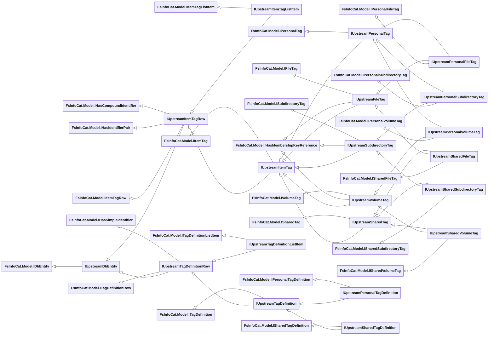
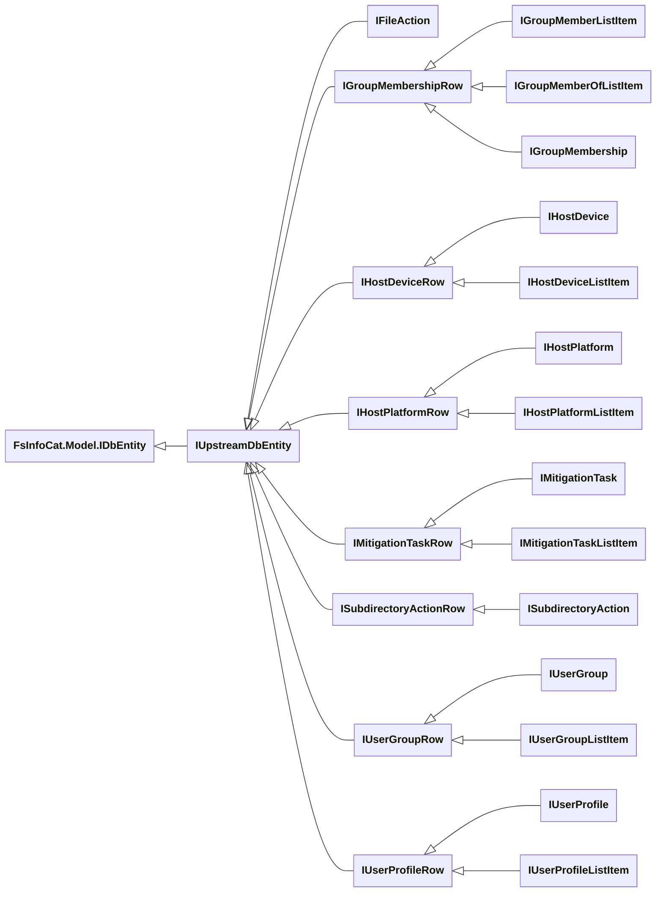
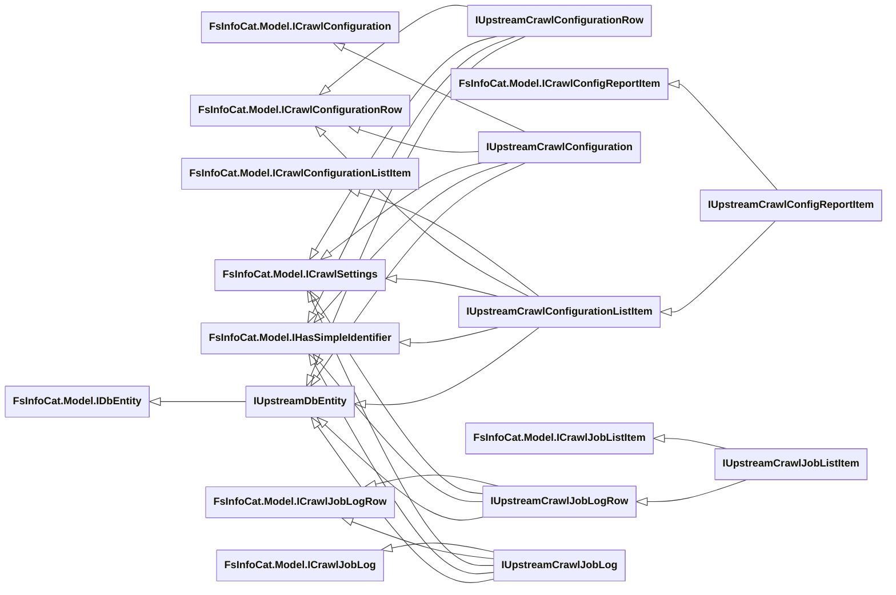
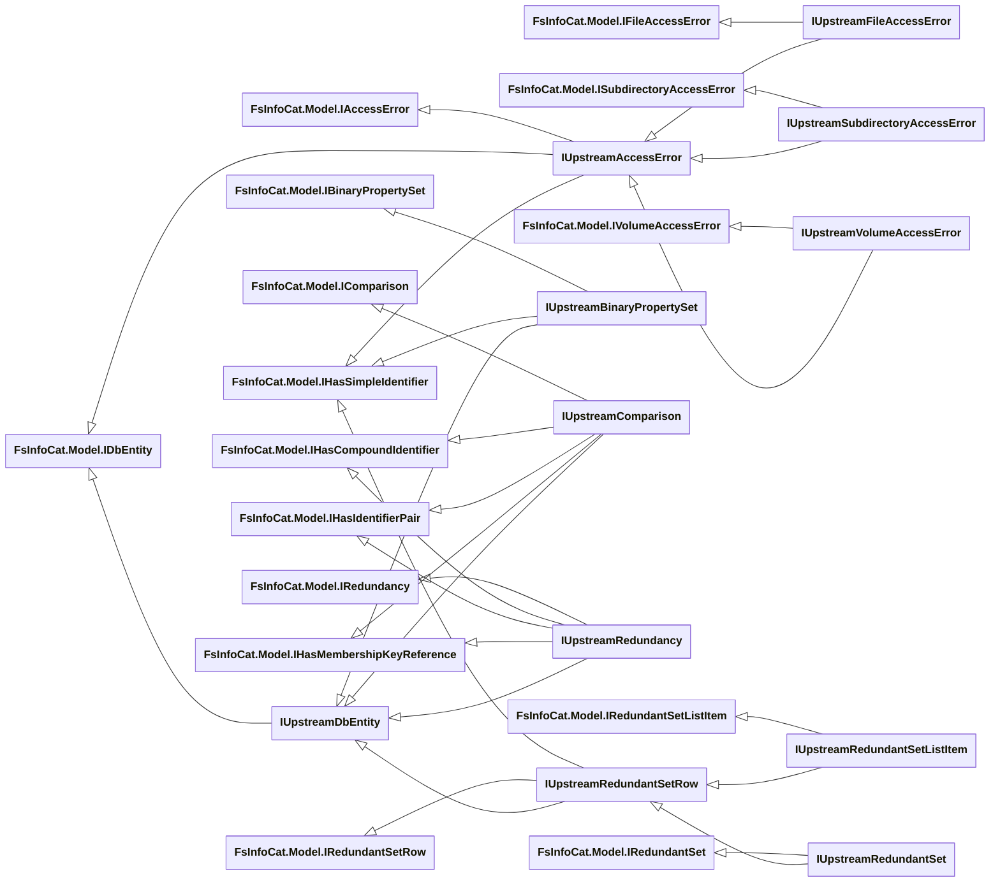

# Upstream Entity Interfaces

- [File Properties Interfaces](#file-properties-interfaces)
- [Tag Interfaces](#tag-interfaces)
- [File System Interfaces](#file-system-interfaces)
- [Action, Membership and Task Interfaces](#action-membership-and-task-interfaces)
- [Crawl Interfaces](#crawl-interfaces)
- [Other Interfaces](#other-interfaces)

See Also:

- [Base Entity Interfaces](../Base-Entity-Interfaces.md)
- [Local Entity Interfaces](Local/Entity-Interfaces.md)

## File Properties Interfaces

- **[FsInfoCat.Model.IPropertiesRow](../Model/IPropertiesRow.cs)** : [FsInfoCat.Model.IDbEntity](../Model/IDbEntity.cs), [FsInfoCat.Model.IHasSimpleIdentifier](../Model/IHasSimpleIdentifier.cs)
  - **[IUpstreamPropertiesRow](Model/IUpstreamPropertiesRow.cs)** : [IUpstreamDbEntity](Model/IUpstreamDbEntity.cs)
    - **[IUpstreamPropertiesListItem](Model/IUpstreamPropertiesListItem.cs)** : [FsInfoCat.Model.IPropertiesListItem](../Model/IPropertiesListItem.cs)
    - **[IUpstreamPropertySet](Model/IUpstreamPropertySet.cs)** : [FsInfoCat.Model.IPropertySet](../Model/IPropertySet.cs)
- **[FsInfoCat.Model.ISummaryProperties](../Model/ISummaryProperties.cs)**
  - **[FsInfoCat.Model.ISummaryPropertiesRow](../Model/ISummaryPropertiesRow.cs)** : [FsInfoCat.Model.IPropertiesRow](../Model/IPropertiesRow.cs)
    - **[IUpstreamSummaryPropertiesRow](Model/IUpstreamSummaryPropertiesRow.cs)** : [IUpstreamPropertiesRow](Model/IUpstreamPropertiesRow.cs)
      - **[IUpstreamSummaryPropertiesListItem](Model/IUpstreamSummaryPropertiesListItem.cs)** : [FsInfoCat.Model.ISummaryPropertiesListItem](../Model/ISummaryPropertiesListItem.cs), [FsInfoCat.Model.ISummaryPropertiesListItem](../Model/ISummaryPropertiesListItem.cs), [IUpstreamPropertiesListItem](Model/IUpstreamPropertiesListItem.cs)
      - **[IUpstreamSummaryPropertySet](Model/IUpstreamSummaryPropertySet.cs)** : [FsInfoCat.Model.ISummaryPropertySet](../Model/ISummaryPropertySet.cs), [IUpstreamPropertySet](Model/IUpstreamPropertySet.cs), [FsInfoCat.Model.ISummaryPropertySet](../Model/ISummaryPropertySet.cs)
- **[FsInfoCat.Model.IAudioProperties](../Model/IAudioProperties.cs)**
  - **[FsInfoCat.Model.IAudioPropertiesRow](../Model/IAudioPropertiesRow.cs)** : [FsInfoCat.Model.IPropertiesRow](../Model/IPropertiesRow.cs)
    - **[FsInfoCat.Model.IAudioPropertiesListItem](../Model/IAudioPropertiesListItem.cs)**
    - **[FsInfoCat.Model.IAudioPropertySet](../Model/IAudioPropertySet.cs)**
    - **[IUpstreamAudioPropertiesRow](Model/IUpstreamAudioPropertiesRow.cs)** : [IUpstreamPropertiesRow](Model/IUpstreamPropertiesRow.cs)
      - **[IUpstreamAudioPropertiesListItem](Model/IUpstreamAudioPropertiesListItem.cs)** : [FsInfoCat.Model.IAudioPropertiesListItem](../Model/IAudioPropertiesListItem.cs), [IUpstreamPropertiesListItem](Model/IUpstreamPropertiesListItem.cs)
      - **[IUpstreamAudioPropertySet](Model/IUpstreamAudioPropertySet.cs)** : [IUpstreamPropertySet](Model/IUpstreamPropertySet.cs), [FsInfoCat.Model.IAudioPropertySet](../Model/IAudioPropertySet.cs)
- **[FsInfoCat.Model.IDocumentProperties](../Model/IDocumentProperties.cs)**
  - **[FsInfoCat.Model.IDocumentPropertiesRow](../Model/IDocumentPropertiesRow.cs)** : [FsInfoCat.Model.IPropertiesRow](../Model/IPropertiesRow.cs)
    - **[FsInfoCat.Model.IDocumentPropertiesListItem](../Model/IDocumentPropertiesListItem.cs)**
    - **[FsInfoCat.Model.IDocumentPropertySet](../Model/IDocumentPropertySet.cs)**
    - **[IUpstreamDocumentPropertiesRow](Model/IUpstreamDocumentPropertiesRow.cs)** : [IUpstreamPropertiesRow](Model/IUpstreamPropertiesRow.cs)
      - **[IUpstreamDocumentPropertiesListItem](Model/IUpstreamDocumentPropertiesListItem.cs)** : [FsInfoCat.Model.IDocumentPropertiesListItem](../Model/IDocumentPropertiesListItem.cs), [IUpstreamPropertiesListItem](Model/IUpstreamPropertiesListItem.cs)
      - **[IUpstreamDocumentPropertySet](Model/IUpstreamDocumentPropertySet.cs)** : [IUpstreamPropertySet](Model/IUpstreamPropertySet.cs), [FsInfoCat.Model.IDocumentPropertySet](../Model/IDocumentPropertySet.cs)
- **[FsInfoCat.Model.IDRMProperties](../Model/IDRMProperties.cs)**
  - **[FsInfoCat.Model.IDRMPropertiesRow](../Model/IDRMPropertiesRow.cs)** : [FsInfoCat.Model.IPropertiesRow](../Model/IPropertiesRow.cs)
    - **[FsInfoCat.Model.IDRMPropertiesListItem](../Model/IDRMPropertiesListItem.cs)**
    - **[FsInfoCat.Model.IDRMPropertySet](../Model/IDRMPropertySet.cs)**
    - **[IUpstreamDRMPropertiesRow](Model/IUpstreamDRMPropertiesRow.cs)** : [IUpstreamPropertiesRow](Model/IUpstreamPropertiesRow.cs)
      - **[IUpstreamDRMPropertiesListItem](Model/IUpstreamDRMPropertiesListItem.cs)** : [FsInfoCat.Model.IDRMPropertiesListItem](../Model/IDRMPropertiesListItem.cs), [IUpstreamPropertiesListItem](Model/IUpstreamPropertiesListItem.cs)
      - **[IUpstreamDRMPropertySet](Model/IUpstreamDRMPropertySet.cs)** : [IUpstreamPropertySet](Model/IUpstreamPropertySet.cs), [FsInfoCat.Model.IDRMPropertySet](../Model/IDRMPropertySet.cs)
- **[FsInfoCat.Model.IGPSProperties](../Model/IGPSProperties.cs)**
  - **[FsInfoCat.Model.IGPSPropertiesRow](../Model/IGPSPropertiesRow.cs)** : [FsInfoCat.Model.IPropertiesRow](../Model/IPropertiesRow.cs)
    - **[FsInfoCat.Model.IGPSPropertiesListItem](../Model/IGPSPropertiesListItem.cs)**
    - **[FsInfoCat.Model.IGPSPropertySet](../Model/IGPSPropertySet.cs)**
    - **[IUpstreamGPSPropertiesRow](Model/IUpstreamGPSPropertiesRow.cs)** : [IUpstreamPropertiesRow](Model/IUpstreamPropertiesRow.cs)
      - **[IUpstreamGPSPropertiesListItem](Model/IUpstreamGPSPropertiesListItem.cs)** : [FsInfoCat.Model.IGPSPropertiesListItem](../Model/IGPSPropertiesListItem.cs), [IUpstreamPropertiesListItem](Model/IUpstreamPropertiesListItem.cs)
      - **[IUpstreamGPSPropertySet](Model/IUpstreamGPSPropertySet.cs)** : [IUpstreamPropertySet](Model/IUpstreamPropertySet.cs), [FsInfoCat.Model.IGPSPropertySet](../Model/IGPSPropertySet.cs)
- **[FsInfoCat.Model.IImageProperties](../Model/IImageProperties.cs)**
  - **[FsInfoCat.Model.IImagePropertiesRow](../Model/IImagePropertiesRow.cs)** : [FsInfoCat.Model.IPropertiesRow](../Model/IPropertiesRow.cs)
    - **[FsInfoCat.Model.IImagePropertiesListItem](../Model/IImagePropertiesListItem.cs)**
    - **[FsInfoCat.Model.IImagePropertySet](../Model/IImagePropertySet.cs)**
    - **[IUpstreamImagePropertiesRow](Model/IUpstreamImagePropertiesRow.cs)** :[IUpstreamPropertiesRow](Model/IUpstreamPropertiesRow.cs)
      - **[IUpstreamImagePropertiesListItem](Model/IUpstreamImagePropertiesListItem.cs)** : [FsInfoCat.Model.IImagePropertiesListItem](../Model/IImagePropertiesListItem.cs), [IUpstreamPropertiesListItem](Model/IUpstreamPropertiesListItem.cs)
      - **[IUpstreamImagePropertySet](Model/IUpstreamImagePropertySet.cs)** : [IUpstreamPropertySet](Model/IUpstreamPropertySet.cs), [FsInfoCat.Model.IImagePropertySet](../Model/IImagePropertySet.cs)
- **[FsInfoCat.Model.IMediaProperties](../Model/IMediaProperties.cs)**
  - **[FsInfoCat.Model.IMediaPropertiesRow](../Model/IMediaPropertiesRow.cs)** : [FsInfoCat.Model.IPropertiesRow](../Model/IPropertiesRow.cs)
    - **[FsInfoCat.Model.IMediaPropertiesListItem](../Model/IMediaPropertiesListItem.cs)**
    - **[FsInfoCat.Model.IMediaPropertySet](../Model/IMediaPropertySet.cs)**
    - **[IUpstreamMediaPropertiesRow](Model/IUpstreamMediaPropertiesRow.cs)** : [IUpstreamPropertiesRow](Model/IUpstreamPropertiesRow.cs)
      - **[IUpstreamMediaPropertiesListItem](Model/IUpstreamMediaPropertiesListItem.cs)** : [FsInfoCat.Model.IMediaPropertiesListItem](../Model/IMediaPropertiesListItem.cs), [IUpstreamMediaPropertiesRow](Model/IUpstreamMediaPropertiesRow.cs), [IUpstreamPropertiesListItem](Model/IUpstreamPropertiesListItem.cs)
      - **[IUpstreamMediaPropertySet](Model/IUpstreamMediaPropertySet.cs)** : [IUpstreamPropertySet](Model/IUpstreamPropertySet.cs), [FsInfoCat.Model.IMediaPropertySet](../Model/IMediaPropertySet.cs), [IUpstreamMediaPropertiesRow](Model/IUpstreamMediaPropertiesRow.cs)
- **[FsInfoCat.Model.IMusicProperties](../Model/IMusicProperties.cs)**
  - **[FsInfoCat.Model.IMusicPropertiesRow](../Model/IMusicPropertiesRow.cs)** : [FsInfoCat.Model.IPropertiesRow](../Model/IPropertiesRow.cs)
    - **[FsInfoCat.Model.IMusicPropertiesListItem](../Model/IMusicPropertiesListItem.cs)**
    - **[FsInfoCat.Model.IMusicPropertySet](../Model/IMusicPropertySet.cs)**
    - **[IUpstreamMusicPropertiesRow](Model/IUpstreamMusicPropertiesRow.cs)** : [IUpstreamPropertiesRow](Model/IUpstreamPropertiesRow.cs)
      - **[IUpstreamMusicPropertiesListItem](Model/IUpstreamMusicPropertiesListItem.cs)** : [FsInfoCat.Model.IMusicPropertiesListItem](../Model/IMusicPropertiesListItem.cs), [IUpstreamPropertiesListItem](Model/IUpstreamPropertiesListItem.cs)
      - **[IUpstreamMusicPropertySet](Model/IUpstreamMusicPropertySet.cs)** : [IUpstreamPropertySet](Model/IUpstreamPropertySet.cs), [FsInfoCat.Model.IMusicPropertySet](../Model/IMusicPropertySet.cs)
- **[FsInfoCat.Model.IPhotoProperties](../Model/IPhotoProperties.cs)**
  - **[FsInfoCat.Model.IPhotoPropertiesRow](../Model/IPhotoPropertiesRow.cs)** : [FsInfoCat.Model.IPropertiesRow](../Model/IPropertiesRow.cs)
    - **[FsInfoCat.Model.IPhotoPropertiesListItem](../Model/IPhotoPropertiesListItem.cs)**
    - **[FsInfoCat.Model.IPhotoPropertySet](../Model/IPhotoPropertySet.cs)**
    - **[IUpstreamPhotoPropertiesRow](Model/IUpstreamPhotoPropertiesRow.cs)** : [IUpstreamPropertiesRow](Model/IUpstreamPropertiesRow.cs)
      - **[IUpstreamPhotoPropertiesListItem](Model/IUpstreamPhotoPropertiesListItem.cs)** : [FsInfoCat.Model.IPhotoProperties](../Model/IPhotoProperties.cs), [FsInfoCat.Model.IPhotoPropertiesListItem](../Model/IPhotoPropertiesListItem.cs), [IUpstreamPropertiesListItem](Model/IUpstreamPropertiesListItem.cs)
      - **[IUpstreamPhotoPropertySet](Model/IUpstreamPhotoPropertySet.cs)** : [IUpstreamPropertySet](Model/IUpstreamPropertySet.cs), [FsInfoCat.Model.IPhotoPropertySet](../Model/IPhotoPropertySet.cs), [IUpstreamPhotoPropertiesRow](Model/IUpstreamPhotoPropertiesRow.cs)
- **[FsInfoCat.Model.IRecordedTVProperties](../Model/IRecordedTVProperties.cs)**
  - **[FsInfoCat.Model.IRecordedTVPropertiesRow](../Model/IRecordedTVPropertiesRow.cs)** : [FsInfoCat.Model.IPropertiesRow](../Model/IPropertiesRow.cs)
    - **[FsInfoCat.Model.IRecordedTVPropertiesListItem](../Model/IRecordedTVPropertiesListItem.cs)**
    - **[FsInfoCat.Model.IRecordedTVPropertySet](../Model/IRecordedTVPropertySet.cs)**
    - **[IUpstreamRecordedTVPropertiesRow](Model/IUpstreamRecordedTVPropertiesRow.cs)** : [IUpstreamPropertiesRow](Model/IUpstreamPropertiesRow.cs)
      - **[IUpstreamRecordedTVPropertiesListItem](Model/IUpstreamRecordedTVPropertiesListItem.cs)** : [FsInfoCat.Model.IRecordedTVPropertiesListItem](../Model/IRecordedTVPropertiesListItem.cs), [IUpstreamPropertiesListItem](Model/IUpstreamPropertiesListItem.cs)
      - **[IUpstreamRecordedTVPropertySet](Model/IUpstreamRecordedTVPropertySet.cs)** : [IUpstreamPropertySet](Model/IUpstreamPropertySet.cs), [FsInfoCat.Model.IRecordedTVPropertySet](../Model/IRecordedTVPropertySet.cs)
- **[FsInfoCat.Model.IVideoProperties](../Model/IVideoProperties.cs)**
  - **[FsInfoCat.Model.IVideoPropertiesRow](../Model/IVideoPropertiesRow.cs)** : [FsInfoCat.Model.IPropertiesRow](../Model/IPropertiesRow.cs)
    - **[FsInfoCat.Model.IVideoPropertiesListItem](../Model/IVideoPropertiesListItem.cs)**
    - **[FsInfoCat.Model.IVideoPropertySet](../Model/IVideoPropertySet.cs)**
    - **[IUpstreamVideoPropertiesRow](Model/IUpstreamVideoPropertiesRow.cs)** : [IUpstreamPropertiesRow](Model/IUpstreamPropertiesRow.cs)
      - **[IUpstreamVideoPropertiesListItem](Model/IUpstreamVideoPropertiesListItem.cs)** : [FsInfoCat.Model.IVideoPropertiesListItem](../Model/IVideoPropertiesListItem.cs), [IUpstreamPropertiesListItem](Model/IUpstreamPropertiesListItem.cs)
      - **[IUpstreamVideoPropertySet](Model/IUpstreamVideoPropertySet.cs)** : [IUpstreamPropertySet](Model/IUpstreamPropertySet.cs), [FsInfoCat.Model.IVideoPropertySet](../Model/IVideoPropertySet.cs)

## Tag Interfaces

- **[FsInfoCat.Model.IItemTagRow](../Model/IItemTagRow.cs)** : [FsInfoCat.Model.IDbEntity](../Model/IDbEntity.cs), [FsInfoCat.Model.IHasIdentifierPair](../Model/IHasCompoundIdentifier.cs)
  - **[IUpstreamItemTagRow](Model/IUpstreamItemTagRow.cs)** : [IUpstreamDbEntity](Model/IUpstreamDbEntity.cs)
    - **[IUpstreamItemTagListItem](Model/IUpstreamItemTagListItem.cs)** : [FsInfoCat.Model.IItemTagListItem](../Model/IItemTagListItem.cs)
    - **[IUpstreamItemTag](Model/IUpstreamItemTag.cs)** : [FsInfoCat.Model.IItemTag](../Model/IItemTag.cs)
      - **[IUpstreamSharedTag](Model/IUpstreamSharedTag.cs)** : [FsInfoCat.Model.ISharedTag](../Model/ISharedTag.cs)
        - **[IUpstreamSharedFileTag](Model/IUpstreamSharedFileTag.cs)** : [IUpstreamFileTag](Model/IUpstreamFileTag.cs), [FsInfoCat.Model.ISharedFileTag](../Model/ISharedFileTag.cs)
        - **[IUpstreamSharedSubdirectoryTag](Model/IUpstreamSharedSubdirectoryTag.cs)** : [IUpstreamSubdirectoryTag](Model/IUpstreamSubdirectoryTag.cs), [FsInfoCat.Model.ISharedSubdirectoryTag](../Model/ISharedSubdirectoryTag.cs)
        - **[IUpstreamSharedVolumeTag](Model/IUpstreamSharedVolumeTag.cs)** : [IUpstreamVolumeTag](Model/IUpstreamVolumeTag.cs), [FsInfoCat.Model.ISharedVolumeTag](../Model/ISharedVolumeTag.cs)
      - **[IUpstreamPersonalTag](Model/IUpstreamPersonalTag.cs)** : [FsInfoCat.Model.IPersonalTag](../Model/IPersonalTag.cs)
        - **[IUpstreamPersonalFileTag](Model/IUpstreamPersonalFileTag.cs)** : [IUpstreamFileTag](Model/IUpstreamFileTag.cs), [FsInfoCat.Model.IPersonalFileTag](../Model/IPersonalFileTag.cs)
        - **[IUpstreamPersonalSubdirectoryTag](Model/IUpstreamPersonalSubdirectoryTag.cs)** : [IUpstreamSubdirectoryTag](Model/IUpstreamSubdirectoryTag.cs), [FsInfoCat.Model.IPersonalSubdirectoryTag](../Model/IPersonalSubdirectoryTag.cs)
        - **[IUpstreamPersonalVolumeTag](Model/IUpstreamPersonalVolumeTag.cs)** : [IUpstreamVolumeTag](Model/IUpstreamVolumeTag.cs), [FsInfoCat.Model.IPersonalVolumeTag](../Model/IPersonalVolumeTag.cs)
      - **[IUpstreamFileTag](Model/IUpstreamFileTag.cs)** : [FsInfoCat.Model.IFileTag](../Model/IFileTag.cs), [FsInfoCat.Model.IHasMembershipKeyReference](../Model/IHasMembershipKeyReference.cs)
      - **[IUpstreamSubdirectoryTag](Model/IUpstreamSubdirectoryTag.cs)** : [FsInfoCat.Model.ISubdirectoryTag](../Model/ISubdirectoryTag.cs), [FsInfoCat.Model.IHasMembershipKeyReference](../Model/IHasMembershipKeyReference.cs)
      - **[IUpstreamVolumeTag](Model/IUpstreamVolumeTag.cs)** : [FsInfoCat.Model.IVolumeTag](../Model/IVolumeTag.cs), [FsInfoCat.Model.IHasMembershipKeyReference](../Model/IHasMembershipKeyReference.cs)
- **[FsInfoCat.Model.ITagDefinitionRow](../Model/ITagDefinitionRow.cs)** : [FsInfoCat.Model.IDbEntity](../Model/IDbEntity.cs), [FsInfoCat.Model.IHasSimpleIdentifier](../Model/IHasSimpleIdentifier.cs)
  - **[IUpstreamTagDefinitionRow](Model/IUpstreamTagDefinitionRow.cs)** : [IUpstreamDbEntity](Model/IUpstreamDbEntity.cs)
  - **[IUpstreamTagDefinitionListItem](Model/IUpstreamTagDefinitionListItem.cs)** : [FsInfoCat.Model.ITagDefinitionListItem](../Model/ITagDefinitionListItem.cs), [IUpstreamTagDefinitionRow](Model/IUpstreamTagDefinitionRow.cs)
  - **[IUpstreamTagDefinition](Model/IUpstreamTagDefinition.cs)** : [FsInfoCat.Model.ITagDefinition](../Model/ITagDefinition.cs), [IUpstreamTagDefinitionRow](Model/IUpstreamTagDefinitionRow.cs)
    - **[IUpstreamPersonalTagDefinition](Model/IUpstreamPersonalTagDefinition.cs)** : [FsInfoCat.Model.IPersonalTagDefinition](../Model/IPersonalTagDefinition.cs), [IUpstreamTagDefinition](Model/IUpstreamTagDefinition.cs)
    - **[IUpstreamSharedTagDefinition](Model/IUpstreamSharedTagDefinition.cs)** : [FsInfoCat.Model.ISharedTagDefinition](../Model/ISharedTagDefinition.cs), [IUpstreamTagDefinition](Model/IUpstreamTagDefinition.cs)

## File System Interfaces

- **[FsInfoCat.Model.IVolumeRow](../Model/IVolumeRow.cs)** : [FsInfoCat.Model.IDbEntity](../Model/IDbEntity.cs), [FsInfoCat.Model.IHasSimpleIdentifier](../Model/IHasSimpleIdentifier.cs)
  - **[IUpstreamVolumeRow](Model/IUpstreamVolumeRow.cs)** : [IUpstreamDbEntity](Model/IUpstreamDbEntity.cs)
    - **[IUpstreamVolumeListItem](Model/IUpstreamVolumeListItem.cs)** : [FsInfoCat.Model.IVolumeListItem](../Model/IVolumeListItem.cs)
      - **[IUpstreamVolumeListItemWithFileSystem](Model/IUpstreamVolumeListItemWithFileSystem.cs)** : [FsInfoCat.Model.IVolumeListItemWithFileSystem](../Model/IVolumeListItemWithFileSystem.cs)
    - **[IUpstreamVolume](Model/IUpstreamVolume.cs)** : [FsInfoCat.Model.IVolume](../Model/IVolume.cs)
- **[FsInfoCat.Model.IFileSystemProperties](../Model/IFileSystemProperties.cs)**
  - **[FsInfoCat.Model.IFileSystemRow](../Model/IFileSystemRow.cs)** : [FsInfoCat.Model.IDbEntity](../Model/IDbEntity.cs), [FsInfoCat.Model.IHasSimpleIdentifier](../Model/IHasSimpleIdentifier.cs)
    - **[IUpstreamFileSystemRow](Model/IUpstreamFileSystemRow.cs)** : [FsInfoCat.Model.IFileSystemRow](../Model/IFileSystemRow.cs), [IUpstreamDbEntity](Model/IUpstreamDbEntity.cs)
      - **[IUpstreamFileSystemListItem](Model/IUpstreamFileSystemListItem.cs)** : [FsInfoCat.Model.IFileSystemListItem](../Model/IFileSystemListItem.cs)
      - **[IUpstreamFileSystem](Model/IUpstreamFileSystem.cs)** : [FsInfoCat.Model.IFileSystem](../Model/IFileSystem.cs), [FsInfoCat.Model.IFileSystemRow](../Model/IFileSystemRow.cs), [IUpstreamDbEntity](Model/IUpstreamDbEntity.cs)
- **[FsInfoCat.Model.ISymbolicNameRow](../Model/ISymbolicNameRow.cs)** :[FsInfoCat.Model.IDbEntity](../Model/IDbEntity.cs),  [FsInfoCat.Model.IHasSimpleIdentifier](../Model/IHasSimpleIdentifier.cs)
  - **[IUpstreamSymbolicNameRow](Model/IUpstreamSymbolicNameRow.cs)** : [IUpstreamDbEntity](Model/IUpstreamDbEntity.cs)
    - **[IUpstreamSymbolicNameListItem](Model/IUpstreamSymbolicNameListItem.cs)** : [FsInfoCat.Model.ISymbolicNameListItem](../Model/ISymbolicNameListItem.cs)
    - **[IUpstreamSymbolicName](Model/IUpstreamSymbolicName.cs)** : [FsInfoCat.Model.ISymbolicName](../Model/ISymbolicName.cs)
- **[FsInfoCat.Model.IDbFsItemRow](../Model/IDbFsItemRow.cs)** : [FsInfoCat.Model.IDbEntity](../Model/IDbEntity.cs), [FsInfoCat.Model.IHasSimpleIdentifier](../Model/IHasSimpleIdentifier.cs)
  - **[IUpstreamDbFsItemRow](Model/IUpstreamDbFsItemRow.cs)** : [IUpstreamDbEntity](Model/IUpstreamDbEntity.cs)
    - **[IUpstreamDbFsItemListItem](Model/IUpstreamDbFsItemListItem.cs)** : [FsInfoCat.Model.IDbFsItemListItem](../Model/IDbFsItemListItem.cs)
      - **[IUpstreamDbFsItemListItemWithAncestorNames](Model/IUpstreamDbFsItemListItemWithAncestorNames.cs)** : [FsInfoCat.Model.IDbFsItemAncestorName](../Model/IDbFsItemAncestorName.cs), [FsInfoCat.Model.IDbFsItemListItemWithAncestorNames](../Model/IDbFsItemListItemWithAncestorNames.cs), [IUpstreamDbFsItemListItem](Model/IUpstreamDbFsItemListItem.cs)
    - **[IUpstreamDbFsItem](Model/IUpstreamDbFsItem.cs)** : [FsInfoCat.Model.IDbFsItem](../Model/IDbFsItem.cs)
    - **[IUpstreamFileRow](Model/IUpstreamFileRow.cs)** : [FsInfoCat.Model.IFileRow](../Model/IFileRow.cs)
      - **[IUpstreamFileListItemWithBinaryProperties](Model/IUpstreamFileListItemWithBinaryProperties.cs)** : [FsInfoCat.Model.IFileListItemWithBinaryProperties](../Model/IFileListItemWithBinaryProperties.cs), [IUpstreamDbFsItemListItem](Model/IUpstreamDbFsItemListItem.cs)
      - **[IUpstreamFileListItemWithAncestorNames](Model/IUpstreamFileListItemWithAncestorNames.cs)** : [FsInfoCat.Model.IDbFsItemAncestorName](../Model/IDbFsItemAncestorName.cs), [FsInfoCat.Model.IDbFsItemListItemWithAncestorNames](../Model/IDbFsItemListItemWithAncestorNames.cs), [FsInfoCat.Model.IFileAncestorName](../Model/IFileAncestorName.cs), [FsInfoCat.Model.IFileListItemWithAncestorNames](../Model/IFileListItemWithAncestorNames.cs), [IUpstreamDbFsItemListItem](Model/IUpstreamDbFsItemListItem.cs)
        - **[IUpstreamFileListItemWithBinaryPropertiesAndAncestorNames](Model/IUpstreamFileListItemWithBinaryPropertiesAndAncestorNames.cs)** : [FsInfoCat.Model.IFileListItemWithBinaryPropertiesAndAncestorNames](../Model/IFileListItemWithBinaryPropertiesAndAncestorNames.cs)
      - **[IUpstreamFile](Model/IUpstreamFile.cs)** : [FsInfoCat.Model.IFile](../Model/IFile.cs), [IUpstreamDbFsItem](Model/IUpstreamDbFsItem.cs)
    - **[IUpstreamSubdirectoryRow](Model/IUpstreamSubdirectoryRow.cs)** : [FsInfoCat.Model.ISubdirectoryRow](../Model/ISubdirectoryRow.cs)
      - **[IUpstreamSubdirectoryListItem](Model/IUpstreamSubdirectoryListItem.cs)** : [FsInfoCat.Model.ISubdirectoryListItem](../Model/ISubdirectoryListItem.cs), [FsInfoCat.Model.IDbFsItemListItem](../Model/IDbFsItemListItem.cs)
        - **[IUpstreamSubdirectoryListItemWithAncestorNames](Model/IUpstreamSubdirectoryListItemWithAncestorNames.cs)** : [FsInfoCat.Model.ISubdirectoryListItem](../Model/ISubdirectoryListItem.cs), [FsInfoCat.Model.ISubdirectoryAncestorName](../Model/ISubdirectoryAncestorName.cs), [FsInfoCat.Model.IDbFsItemAncestorName](../Model/IDbFsItemAncestorName.cs), [FsInfoCat.Model.IDbFsItemListItem](../Model/IDbFsItemListItem.cs), [FsInfoCat.Model.IDbFsItemListItemWithAncestorNames](../Model/IDbFsItemListItemWithAncestorNames.cs), [FsInfoCat.Model.ISubdirectoryListItemWithAncestorNames](../Model/ISubdirectoryListItemWithAncestorNames.cs)
      - **[IUpstreamSubdirectory](Model/IUpstreamSubdirectory.cs)** : [FsInfoCat.Model.ISubdirectory](../Model/ISubdirectory.cs), [FsInfoCat.Model.ISubdirectoryRow](../Model/ISubdirectoryRow.cs), [IUpstreamDbFsItem](Model/IUpstreamDbFsItem.cs)

## Action, Membership and Task Interfaces

- **[IFileAction](Model/IFileAction.cs)** : [IUpstreamDbEntity](Model/IUpstreamDbEntity.cs)
- **[IGroupMembershipRow](Model/IGroupMembershipRow.cs)** : [IUpstreamDbEntity](Model/IUpstreamDbEntity.cs)
  - **[IGroupMemberListItem](Model/IGroupMemberListItem.cs)** : [IGroupMembershipRow](Model/IGroupMembershipRow.cs)
  - **[IGroupMemberOfListItem](Model/IGroupMemberOfListItem.cs)** : [IGroupMembershipRow](Model/IGroupMembershipRow.cs)
  - **[IGroupMembership](Model/IGroupMembership.cs)** : [IGroupMembershipRow](Model/IGroupMembershipRow.cs)
- **[IHostDeviceRow](Model/IHostDeviceRow.cs)** : [IUpstreamDbEntity](Model/IUpstreamDbEntity.cs)
  - **[IHostDeviceListItem](Model/IHostDeviceListItem.cs)** : [IHostDeviceRow](Model/IHostDeviceRow.cs)
  - **[IHostDevice](Model/IHostDevice.cs)** : [IHostDeviceRow](Model/IHostDeviceRow.cs)
- **[IHostPlatformRow](Model/IHostPlatformRow.cs)** : [IUpstreamDbEntity](Model/IUpstreamDbEntity.cs)
  - **[IHostPlatformListItem](Model/IHostPlatformListItem.cs)** : [IHostPlatformRow](Model/IHostPlatformRow.cs)
  - **[IHostPlatform](Model/IHostPlatform.cs)** : [IHostPlatformRow](Model/IHostPlatformRow.cs)
- **[IMitigationTaskRow](Model/IMitigationTaskRow.cs)** : [IUpstreamDbEntity](Model/IUpstreamDbEntity.cs)
  - **[IMitigationTaskListItem](Model/IMitigationTaskListItem.cs)** : [IMitigationTaskRow](Model/IMitigationTaskRow.cs)
  - **[IMitigationTask](Model/IMitigationTask.cs)** : [IMitigationTaskRow](Model/IMitigationTaskRow.cs)
- **[ISubdirectoryActionRow](Model/ISubdirectoryActionRow.cs)** : [IUpstreamDbEntity](Model/IUpstreamDbEntity.cs)
  - **[ISubdirectoryAction](Model/ISubdirectoryAction.cs)** : [ISubdirectoryActionRow](Model/ISubdirectoryActionRow.cs)
- **[IUserGroupRow](Model/IUserGroupRow.cs)** : [IUpstreamDbEntity](Model/IUpstreamDbEntity.cs)
  - **[IUserGroupListItem](Model/IUserGroupListItem.cs)** : [IUserGroupRow](Model/IUserGroupRow.cs)
  - **[IUserGroup](Model/IUserGroup.cs)** : [IUserGroupRow](Model/IUserGroupRow.cs)
- **[IUserProfileRow](Model/IUserProfileRow.cs)** : [IUpstreamDbEntity](Model/IUpstreamDbEntity.cs)
  - **[IUserProfileListItem](Model/IUserProfileListItem.cs)** : [IUserProfileRow](Model/IUserProfileRow.cs)
  - **[IUserProfile](Model/IUserProfile.cs)** : [IUserProfileRow](Model/IUserProfileRow.cs)

## Crawl Interfaces

- **[FsInfoCat.Model.ICrawlSettings](../Model/ICrawlSettings.cs)**
  - **[FsInfoCat.Model.ICrawlConfigurationRow](../Model/ICrawlConfigurationRow.cs)** : [FsInfoCat.Model.IDbEntity](../Model/IDbEntity.cs), [FsInfoCat.Model.IHasSimpleIdentifier](../Model/IHasSimpleIdentifier.cs)
    - **[IUpstreamCrawlConfigurationRow](Model/IUpstreamCrawlConfigurationRow.cs)** : [IUpstreamDbEntity](Model/IUpstreamDbEntity.cs)
      - **[IUpstreamCrawlConfigurationListItem](Model/IUpstreamCrawlConfigurationListItem.cs)** : [FsInfoCat.Model.ICrawlConfigurationListItem](../Model/ICrawlConfigurationListItem.cs), [IUpstreamDbEntity](Model/IUpstreamDbEntity.cs)
        - **[IUpstreamCrawlConfigReportItem](Model/IUpstreamCrawlConfigReportItem.cs)** : [FsInfoCat.Model.ICrawlConfigReportItem](../Model/ICrawlConfigReportItem.cs)
      - **[IUpstreamCrawlConfiguration](Model/IUpstreamCrawlConfiguration.cs)** : [IUpstreamDbEntity](Model/IUpstreamDbEntity.cs)
  - **[FsInfoCat.Model.ICrawlJobLogRow](../Model/ICrawlJobLogRow.cs)** : [FsInfoCat.Model.IDbEntity](../Model/IDbEntity.cs), [FsInfoCat.Model.IHasSimpleIdentifier](../Model/IHasSimpleIdentifier.cs)
    - **[IUpstreamCrawlJobLogRow](Model/IUpstreamCrawlJobLogRow.cs)** : [IUpstreamDbEntity](Model/IUpstreamDbEntity.cs)
      - **[IUpstreamCrawlJobListItem](Model/IUpstreamCrawlJobListItem.cs)** : [FsInfoCat.Model.ICrawlJobListItem](../Model/ICrawlJobListItem.cs)
      - **[IUpstreamCrawlJobLog](Model/IUpstreamCrawlJobLog.cs)** : [FsInfoCat.Model.ICrawlJobLog](../Model/ICrawlJobLog.cs), [IUpstreamDbEntity](Model/IUpstreamDbEntity.cs)

## Other Interfaces

- **[FsInfoCat.Model.IDbEntity](../Model/IDbEntity.cs)**
  - **[IUpstreamDbEntity](Model/IUpstreamDbEntity.cs)**
    - **[FsInfoCat.Model.IAccessError](../Model/IAccessError.cs)** : [FsInfoCat.Model.IHasSimpleIdentifier](../Model/IHasSimpleIdentifier.cs)
      - **[IUpstreamAccessError](Model/IUpstreamAccessError.cs)**
        - **[IUpstreamFileAccessError](Model/IUpstreamFileAccessError.cs)** : [FsInfoCat.Model.IFileAccessError](../Model/IFileAccessError.cs), [IUpstreamAccessError](Model/IUpstreamAccessError.cs)
        - **[IUpstreamSubdirectoryAccessError](Model/IUpstreamSubdirectoryAccessError.cs)** : [FsInfoCat.Model.ISubdirectoryAccessError](../Model/ISubdirectoryAccessError.cs), [IUpstreamAccessError](Model/IUpstreamAccessError.cs)
        - **[IUpstreamVolumeAccessError](Model/IUpstreamVolumeAccessError.cs)** : [FsInfoCat.Model.IVolumeAccessError](../Model/IVolumeAccessError.cs), [IUpstreamAccessError](Model/IUpstreamAccessError.cs)
    - **[FsInfoCat.Model.IBinaryPropertySet](../Model/IBinaryPropertySet.cs)** : [FsInfoCat.Model.IHasSimpleIdentifier](../Model/IHasSimpleIdentifier.cs)
      - **[IUpstreamBinaryPropertySet](Model/IUpstreamBinaryPropertySet.cs)**
    - **[FsInfoCat.Model.IComparison](../Model/IComparison.cs)** : [FsInfoCat.Model.IHasMembershipKeyReference](../Model/IHasCompoundIdentifier.cs)
      - **[IUpstreamComparison](Model/IUpstreamComparison.cs)**
    - **[FsInfoCat.Model.IRedundancy](../Model/IRedundancy.cs)** : [FsInfoCat.Model.IHasMembershipKeyReference](../Model/IHasMembershipKeyReference.cs)
      - **[IUpstreamRedundancy](Model/IUpstreamRedundancy.cs)**
    - **[FsInfoCat.Model.IRedundantSetRow](../Model/IRedundantSetRow.cs)** : [FsInfoCat.Model.IHasSimpleIdentifier](../Model/IHasSimpleIdentifier.cs)
      - **[IUpstreamRedundantSetRow](Model/IUpstreamRedundantSetRow.cs)**
        - **[IUpstreamRedundantSetListItem](Model/IUpstreamRedundantSetListItem.cs)** : [FsInfoCat.Model.IRedundantSetListItem](../Model/IRedundantSetListItem.cs), [IUpstreamRedundantSetRow](Model/IUpstreamRedundantSetRow.cs)
        - **[IUpstreamRedundantSet](Model/IUpstreamRedundantSet.cs)** : [FsInfoCat.Model.IRedundantSet](../Model/IRedundantSet.cs), [IUpstreamRedundantSetRow](Model/IUpstreamRedundantSetRow.cs)
