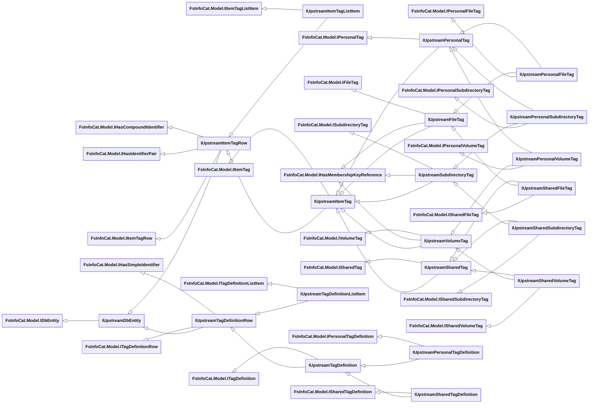

# Upstream Entity Interfaces

- [File Properties Interfaces](#file-properties-interfaces)
- [Tag Interfaces](#tag-interfaces)
- [File System Interfaces](#file-system-interfaces)
- [Action, Membership and Task Interfaces](#action-membership-and-task-interfaces)
- [Crawl Interfaces](#crawl-interfaces)
- [Other Interfaces](#other-interfaces)

See Also:

- [Base Entity Interfaces](../Base-Entity-Interfaces.md)
- [Local Entity Interfaces](./Local/Entity-Interfaces.md)

## File Properties Interfaces

## Tag Interfaces

## File System Interfaces

## Action, Membership and Task Interfaces

## Crawl Interfaces

## Other Interfaces

